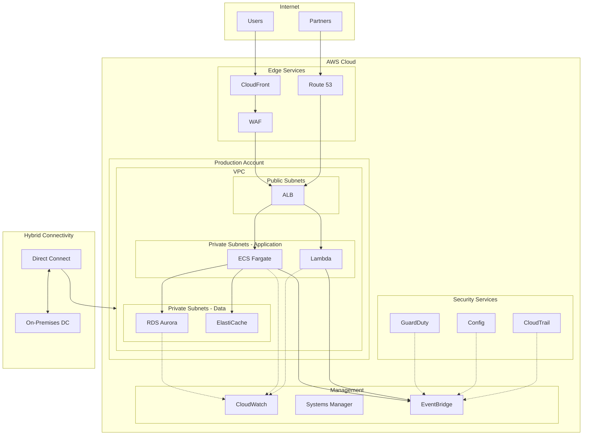

# Case Study 1: FinTech Enterprise Datacenter Migration to AWS

## Executive Summary

**Company:** FinTech Solutions Inc.  
**Industry:** Financial Services / Digital Payments  
**Challenge:** Migrate 450+ physical servers from on-premises datacenters to AWS within 18 months  
**Results:** 40% reduction in infrastructure costs, 99.99% availability, compliance with PCI DSS Level 1

---

## Initial Situation

### Business Context
FinTech Solutions Inc., a leading digital payments company processing over 2 million transactions daily, faced significant challenges with their on-premises infrastructure:

- **Capacity Limitations:** Physical datacenters at 85% utilization
- **High Costs:** $2.8M annually in hardware maintenance and datacenter leases
- **Slow Provisioning:** 6-8 weeks to deploy new environments
- **Disaster Recovery:** Complex and expensive DR site with 4-hour RTO
- **Compliance:** Increasing difficulty maintaining PCI DSS compliance

### Technical Environment

| Component | Details |
|-----------|---------|
| **Physical Servers** | 450+ (mix of virtual and bare metal) |
| **Databases** | Oracle RAC, SQL Server, MongoDB clusters |
| **Storage** | 500TB SAN with EMC VMAX arrays |
| **Network** | Dual 10Gbps links, Cisco ASA firewalls |
| **Applications** | 120+ microservices, 8 monolithic legacy systems |
| **Monitoring** | Nagios, Splunk, custom scripts |

### Business Drivers for Migration

1. **Cost Optimization:** Reduce capital expenditure by 35%
2. **Agility:** Deploy new features in hours, not weeks
3. **Scalability:** Handle 300% growth during peak seasons
4. **Innovation:** Enable adoption of cloud-native technologies
5. **Compliance:** Simplify PCI DSS and SOC 2 audits

---

## Migration Strategy

### Phase 1: Assessment and Planning (Months 1-3)

#### Discovery Phase
Using AWS Application Discovery Service and manual analysis:

- **Inventory:** 450 servers, 320 applications, 45 databases
- **Dependencies:** Mapped 2,800+ inter-service dependencies
- **Performance Baselines:** CPU, memory, I/O patterns over 90 days
- **Compliance Requirements:** PCI DSS, SOC 2 Type II, ISO 27001

#### Migration Strategy: 7Rs Framework

| Strategy | Percentage | Applications |
|----------|------------|--------------|
| **Retire** | 15% | 48 legacy applications |
| **Retain** | 10% | 32 apps (regulatory requirements) |
| **Rehost** | 45% | 144 applications (lift-and-shift) |
| **Replatform** | 20% | 64 apps (minor optimizations) |
| **Refactor** | 8% | 26 apps (cloud-native rewrite) |
| **Repurchase** | 2% | 6 apps (SaaS alternatives) |

### Phase 2: Foundation (Months 2-4)

#### AWS Landing Zone Implementation

**Multi-Account Strategy:**
```
Root Account
├── Production OU
│   ├── Production Workloads
│   ├── PCI DSS Scope Isolation
│   └── Shared Services
├── Staging OU
│   ├── Pre-production
│   └── Integration Testing
├── Development OU
│   ├── Dev Environments
│   └── Sandbox
└── Security OU
    ├── Security Tools
    ├── Log Archive
    └── Audit
```

**Network Architecture:**
- **Hub-and-Spoke Model:** Transit Gateway connecting VPCs
- **VPC Peering:** Direct connectivity for high-throughput workloads
- **DNS:** Route 53 with private hosted zones
- **Security:** AWS Network Firewall, VPC Flow Logs

#### Security and Compliance Foundation

**IAM Architecture:**
- AWS Organizations with Service Control Policies (SCPs)
- Identity Federation with existing Active Directory
- Role-based access with least privilege principle
- Cross-account access patterns for shared services

**Security Controls:**
- AWS Config for compliance monitoring
- GuardDuty for threat detection
- Security Hub for centralized findings
- Macie for data discovery and protection
- CloudTrail for audit logging

**PCI DSS Compliance:**
- Isolated CDE (Cardholder Data Environment) VPC
- Network segmentation with security groups and NACLs
- Encryption in transit (TLS 1.2+) and at rest (AES-256)
- Quarterly vulnerability scans with Inspector
- AWS Artifact for compliance reports

### Phase 3: Migration Execution (Months 4-15)

#### Wave 1: Non-Critical Development Environments (Months 4-6)

**Approach:** Lift-and-shift using AWS Application Migration Service (MGN)

```yaml
Migration Wave 1:
  environments:
    - Development
    - Testing
    - Staging
  applications: 45
  servers: 120
  strategy: Rehost
  tools:
    - AWS MGN (CloudEndure)
    - AWS SMS (Server Migration Service)
    - AWS Database Migration Service
```

**Key Activities:**
1. Install MGN agents on source servers
2. Configure replication settings (RPO: 15 minutes)
3. Test failover procedures
4. Execute cutover during maintenance windows
5. Validate application functionality

**Results Wave 1:**
- 98% successful migration rate
- Average downtime: 2 hours per application
- Zero data loss incidents
- Lessons learned for subsequent waves

#### Wave 2: Production Non-PCI Workloads (Months 7-10)

**Approach:** Replatform with optimization opportunities

**Example: E-commerce Platform Migration**

Before (On-Premises):
```
┌─────────────────────────────────────┐
│  Load Balancer (F5 BIG-IP)         │
└──────────────┬──────────────────────┘
               │
    ┌──────────┴──────────┐
    │                     │
┌───▼───┐            ┌───▼───┐
│Web Tier│            │Web Tier│
│(8 VMs) │            │(8 VMs) │
└───┬───┘            └───┬───┘
    │                     │
┌───▼─────────────────────▼───┐
│    Application Tier (12 VMs) │
└─────────────┬───────────────┘
              │
    ┌─────────▼──────────┐
    │   Database Cluster   │
    │  (Oracle RAC 4-node)│
    └────────────────────┘
```

After (AWS Optimized):
```
┌──────────────────────────────────────┐
│  Application Load Balancer           │
│  (Auto Scaling, Health Checks)        │
└──────────────┬───────────────────────┘
               │
    ┌──────────┴──────────┐
    │                     │
┌───▼───┐            ┌───▼───┐
│Web    │            │Web    │
│Servers│            │Servers│
│(ECS    │            │(ECS    │
│Fargate)│            │Fargate)│
└───┬───┘            └───┬───┘
    │                     │
┌───▼─────────────────────▼───┐
│    Application (ECS Fargate)  │
│    (Auto-scaling 10-50 tasks) │
└─────────────┬───────────────┘
              │
    ┌─────────▼──────────┐
    │   Amazon RDS        │
    │  (Multi-AZ MySQL)   │
    │  Read Replicas      │
    └─────────────────────┘
```

**Optimizations Applied:**
- Containerization with Amazon ECS
- Auto-scaling based on CPU/memory metrics
- RDS Multi-AZ for database high availability
- ElastiCache for session management
- CloudFront for static content delivery

**Performance Improvements:**
- Page load time: 2.3s → 0.8s (65% improvement)
- Database query time: 150ms → 45ms (70% improvement)
- Concurrent users supported: 5,000 → 25,000
- Infrastructure cost: $45K/month → $28K/month

#### Wave 3: PCI DSS Workloads (Months 11-13)

**Approach:** Refactor with security-first architecture

**PCI Compliant Architecture:**
```
┌─────────────────────────────────────────────────────────────┐
│                        WAF Layer                           │
│              AWS WAF + AWS Shield Advanced                  │
└────────────────────────┬────────────────────────────────────┘
                         │
┌────────────────────────▼────────────────────────────────────┐
│                    CloudFront Distribution                   │
│         (DDoS Protection, Geo-blocking, Caching)              │
└────────────────────────┬────────────────────────────────────┘
                         │
┌────────────────────────▼────────────────────────────────────┐
│                 Application Load Balancer                    │
│            (SSL Termination, Header Injection)                 │
└────┬───────────────────────────────────────────┬───────────┘
     │                                           │
     ▼                                           ▼
┌────────────┐                          ┌────────────┐
│   Public   │                          │  Public    │
│    VPC     │                          │   VPC      │
│ (Non-CDE)  │                          │ (Non-CDE)  │
└────┬───────┘                          └─────┬──────┘
     │                                        │
     │    ┌────────────────────────────────┐   │
     │    │   Transit Gateway (Isolated)   │   │
     │    │  (PCI DSS Network Segmentation)│   │
     │    └──────────────┬─────────────────┘   │
     │                   │                     │
     ▼                   ▼                     ▼
┌────────────┐    ┌────────────┐       ┌────────────┐
│   CDE      │    │    CDE     │       │    CDE     │
│    VPC     │    │    VPC     │       │    VPC     │
│ (Isolated) │    │ (Isolated) │       │ (Isolated) │
│┌──────────┐│    │┌──────────┐│       │┌──────────┐│
││App Tier  ││    ││App Tier  ││       ││App Tier  ││
││(Private) ││    ││(Private) ││       ││(Private) ││
│└────┬─────┘│    │└────┬─────┘│       │└────┬─────┘│
│     │      │    │     │      │       │     │      │
│┌────▼─────┐│    │┌────▼─────┐│       │┌────▼─────┐│
││ Database ││    ││ Database ││       ││ Database ││
││ (RDS     ││    ││ (RDS     ││       ││ (RDS     ││
││Encrypted)││    ││Encrypted)││       ││Encrypted)││
│└──────────┘│    │└──────────┘│       │└──────────┘│
└────────────┘    └────────────┘       └────────────┘
```

**Security Controls Implemented:**
1. **Network Segmentation:** Complete isolation of CDE VPC
2. **Encryption:** All data encrypted in transit and at rest
3. **Access Control:** MFA required for all administrative access
4. **Monitoring:** Real-time alerting with CloudWatch and GuardDuty
5. **Vulnerability Management:** Automated patching with Systems Manager
6. **Logging:** Complete audit trail with CloudTrail and Config

**Compliance Validation:**
- QSA (Qualified Security Assessor) audit: Passed
- Penetration testing: No critical vulnerabilities
- Vulnerability scan: 100% compliance
- Network segmentation test: Verified isolation

#### Wave 4: Legacy Modernization (Months 14-15)

**Approach:** Refactor critical monolithic applications

**Case: Core Banking System Modernization**

Original Architecture:
- Monolithic Java application (500K+ lines)
- Oracle database with complex stored procedures
- Tight coupling between modules
- 2-week deployment cycles

Modernized Architecture:
```
┌──────────────────────────────────────────────────────────────┐
│                      API Gateway                             │
│           (Throttling, Caching, Authorization)               │
└──────┬─────────────────┬─────────────────┬─────────────────┘
       │                 │                 │
       ▼                 ▼                 ▼
┌──────────────┐ ┌──────────────┐ ┌──────────────┐
│   Accounts   │ │  Transactions │ │    Cards     │
│  Microservice│ │ Microservice  │ │ Microservice │
│  (Lambda)    │ │  (Lambda)     │ │  (Lambda)    │
└──────┬───────┘ └──────┬───────┘ └──────┬───────┘
       │                 │                 │
       └──────────┬──────┴─────────────────┘
                  │
       ┌──────────▼──────────┐
       │  EventBridge        │
       │  (Event Bus)        │
       └──────────┬──────────┘
                  │
       ┌──────────┼──────────┐
       │          │          │
       ▼          ▼          ▼
┌──────────┐ ┌──────────┐ ┌──────────┐
│ DynamoDB │ │  Amazon  │ │   SQS    │
│ (Tables) │ │   S3     │ │ (Queues) │
└──────────┘ └──────────┘ └──────────┘
```

**Technology Stack:**
- **API Layer:** API Gateway with Lambda authorizers
- **Compute:** AWS Lambda with provisioned concurrency
- **Database:** DynamoDB for NoSQL, RDS Aurora for relational
- **Events:** EventBridge for asynchronous communication
- **Storage:** S3 for documents and audit logs
- **Monitoring:** X-Ray for distributed tracing

**Outcomes:**
- Deployment frequency: 2 weeks → 2 hours
- Time to market for new features: 3 months → 2 weeks
- System availability: 99.5% → 99.99%
- Cost per transaction: $0.015 → $0.004

---

## Technical Implementation Details

### Database Migration Strategy

#### Oracle to Aurora PostgreSQL Migration

**Phase 1: Schema Conversion**
```sql
-- Using AWS Schema Conversion Tool (SCT)
-- Original Oracle Table
CREATE TABLE TRANSACTIONS (
    TXN_ID NUMBER(19) PRIMARY KEY,
    ACCOUNT_ID VARCHAR2(50) NOT NULL,
    AMOUNT NUMBER(15,2),
    TXN_DATE TIMESTAMP DEFAULT CURRENT_TIMESTAMP,
    STATUS VARCHAR2(20) DEFAULT 'PENDING'
);

-- Converted to PostgreSQL
CREATE TABLE transactions (
    txn_id BIGINT PRIMARY KEY GENERATED ALWAYS AS IDENTITY,
    account_id VARCHAR(50) NOT NULL,
    amount DECIMAL(15,2),
    txn_date TIMESTAMP DEFAULT CURRENT_TIMESTAMP,
    status VARCHAR(20) DEFAULT 'PENDING'
);

-- Index optimization
CREATE INDEX idx_transactions_account_date 
ON transactions(account_id, txn_date DESC);
```

**Phase 2: Data Migration**
```bash
# Using AWS DMS
aws dms create-replication-task \
    --replication-task-identifier oracle-to-aurora \
    --source-endpoint-arn arn:aws:dms:us-east-1:ACCOUNT:endpoint:oracle-source \
    --target-endpoint-arn arn:aws:dms:us-east-1:ACCOUNT:endpoint:aurora-target \
    --migration-type full-load-and-cdc \
    --table-mappings '{
        "rules": [{
            "rule-type": "selection",
            "rule-id": "1",
            "rule-name": "1",
            "object-locator": {
                "schema-name": "FINANCE",
                "table-name": "%"
            },
            "rule-action": "include"
        }]
    }'
```

**Phase 3: Validation**
- Row count validation: 100% match
- Checksum validation: Passed
- Application testing: All test cases passed
- Performance testing: 20% faster query execution

### Networking Implementation

#### Direct Connect Configuration

```hcl
# Terraform configuration
data "aws_dx_gateway" "main" {
  name = "fintech-dx-gateway"
}

resource "aws_dx_connection" "primary" {
  name      = "fintech-dx-primary"
  location  = "EqDC2"
  bandwidth = "10Gbps"
}

resource "aws_dx_private_virtual_interface" "finance" {
  connection_id    = aws_dx_connection.primary.id
  name             = "finance-vif"
  vlan             = 4094
  address_family   = "ipv4"
  amazon_address   = "169.254.0.1/30"
  customer_address = "169.254.0.2/30"
  dx_gateway_id    = data.aws_dx_gateway.main.id
}
```

**Direct Connect Benefits:**
- Consistent network performance: <1ms latency
- Reduced data transfer costs: 60% savings
- Private connectivity: No internet traversal
- Dedicated bandwidth: 10Gbps symmetric

### Security Implementation

#### Secrets Management with AWS Secrets Manager

```python
import boto3
from botocore.exceptions import ClientError

def get_database_secret():
    secret_name = "fintech/prod/database/credentials"
    region_name = "us-east-1"
    
    session = boto3.session.Session()
    client = session.client(
        service_name='secretsmanager',
        region_name=region_name
    )
    
    try:
        get_secret_value_response = client.get_secret_value(
            SecretId=secret_name
        )
    except ClientError as e:
        raise e
    
    import json
    secret = json.loads(get_secret_value_response['SecretString'])
    return secret

# Usage
db_credentials = get_database_secret()
connection_string = f"postgresql://{db_credentials['username']}:{db_credentials['password']}@{db_credentials['host']}:{db_credentials['port']}/{db_credentials['dbname']}"
```

#### Automated Security Scanning

```yaml
# AWS Config Rules
ConfigRules:
  - s3-bucket-ssl-requests-only
  - rds-storage-encrypted
  - ec2-ebs-encryption-by-default
  - vpc-default-security-group-closed
  - iam-password-policy
  - root-account-mfa-enabled
  - cloudtrail-enabled
  - guardduty-enabled-centralized
```

---

## Results and Outcomes

### Financial Results

| Metric | Before | After | Improvement |
|--------|--------|-------|-------------|
| **Total Infrastructure Cost** | $2.8M/year | $1.7M/year | 40% savings |
| **Datacenter Lease** | $480K/year | $0 | 100% eliminated |
| **Hardware Maintenance** | $720K/year | $120K/year (Reserved) | 83% savings |
| **Operational Staff** | 45 FTE | 28 FTE | 38% reduction |
| **Power & Cooling** | $180K/year | $0 | 100% eliminated |
| **New Environment Cost** | $15K | $200 | 99% reduction |
| **Disaster Recovery Cost** | $320K/year | $85K/year | 73% savings |

**3-Year Total Cost of Ownership (TCO):**
- On-Premises: $10.8M
- AWS Cloud: $6.2M
- **Net Savings: $4.6M (43%)**

### Performance Results

| Metric | Before | After | Improvement |
|--------|--------|-------|-------------|
| **Deployment Time** | 6-8 weeks | 2-4 hours | 99% faster |
| **Auto-Scaling Response** | Manual | 2 minutes | Automatic |
| **Database Queries** | 150ms avg | 45ms avg | 70% faster |
| **Application Response** | 2.3s avg | 0.8s avg | 65% faster |
| **Availability** | 99.5% | 99.99% | 4x better |
| **Peak Transaction Capacity** | 2,000 TPS | 8,000 TPS | 300% increase |

### Operational Excellence

**Monitoring and Observability:**
- CloudWatch dashboards for 450+ metrics
- X-Ray tracing for 120+ microservices
- CloudWatch Logs Insights for log analysis
- Custom alarms for proactive incident response
- Mean Time To Detection (MTTD): 15 minutes → 2 minutes
- Mean Time To Resolution (MTTR): 4 hours → 30 minutes

**Automation Achievements:**
- 100% infrastructure as code (Terraform)
- CI/CD pipelines for all applications
- Automated testing in deployment pipelines
- Self-healing infrastructure with auto-scaling
- Automated backup and disaster recovery testing

### Compliance and Security

**Compliance Status:**
- PCI DSS Level 1: Certified
- SOC 2 Type II: Certified
- ISO 27001: Certified
- GDPR: Compliant
- Annual audit findings: 47 → 3 (94% reduction)

**Security Metrics:**
- Security incidents: 12/year → 2/year (83% reduction)
- Vulnerability remediation time: 30 days → 3 days
- Patching compliance: 65% → 98%
- MFA adoption: 45% → 100%

---

## Lessons Learned

### Success Factors

1. **Executive Sponsorship:** CEO and CIO provided strong support and resources
2. **Cross-Functional Teams:** Migration teams included business, security, and IT stakeholders
3. **Phased Approach:** Wave-based migration allowed learning and optimization
4. **Training Investment:** 120+ staff completed AWS certifications
5. **Automation First:** Infrastructure as code from day one
6. **Compliance by Design:** Security and compliance integrated into migration

### Challenges Encountered

1. **Skills Gap:** Initial lack of AWS expertise required external training
   - *Solution:* AWS Training and Certification program for 200+ employees

2. **Legacy Application Dependencies:** Complex interdependencies delayed some migrations
   - *Solution:* Dependency mapping tools and staged migration approach

3. **Data Sensitivity:** PCI DSS requirements added complexity
   - *Solution:* Dedicated compliance team and automated compliance validation

4. **Cultural Resistance:** Some teams reluctant to change established practices
   - *Solution:* Change management program with early wins and success stories

5. **Network Latency:** Initial Direct Connect setup had routing issues
   - *Solution:* Network optimization and traffic engineering

### Best Practices

1. **Start with Non-Critical Workloads:** Build confidence and expertise
2. **Invest in Landing Zone:** Solid foundation prevents rework
3. **Automate Everything:** Infrastructure as code, CI/CD, testing
4. **Security First:** Integrate compliance from the beginning
5. **Train Continuously:** AWS skills are critical for success
6. **Monitor and Optimize:** Cost and performance optimization is ongoing
7. **Document Rigorously:** Runbooks and architecture decisions
8. **Test Disaster Recovery:** Regular DR drills validate capabilities

---

## Architecture Diagram



---

## Conclusion

The FinTech Solutions datacenter migration to AWS represents a successful enterprise cloud transformation. Over 18 months, the company migrated 450+ servers, modernized 120 applications, and achieved significant improvements in cost, performance, and agility.

**Key Achievements:**
- 40% infrastructure cost reduction ($4.6M over 3 years)
- 99.99% availability with automated disaster recovery
- PCI DSS Level 1 compliance maintained throughout
- 300% increase in transaction processing capacity
- 99% reduction in new environment provisioning time

The migration established FinTech Solutions as a cloud-native organization, enabling continued innovation and competitive advantage in the rapidly evolving digital payments market.

---

*Last Updated: April 2025*  
*AWS Well-Architected Framework Version: 2025*
