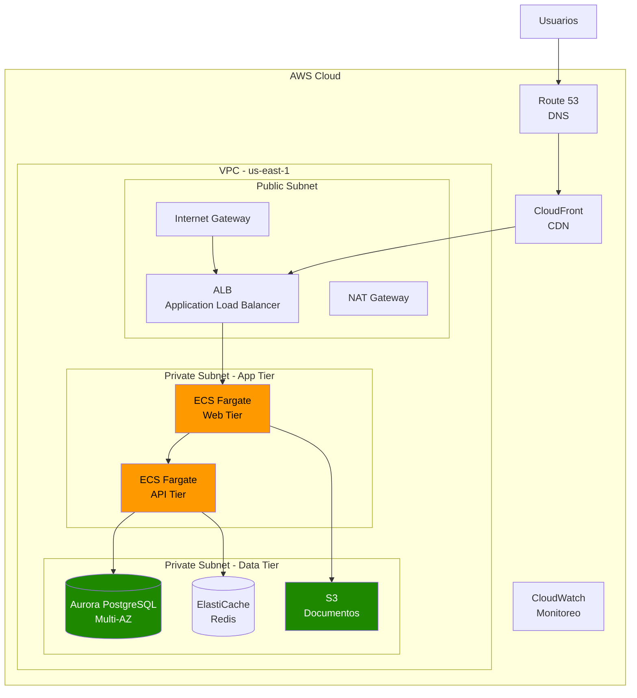

# Capítulo 1: Fundamentos de AWS y Computación en la Nube

## Escenario Real: Legacy Corp - De Data Center a Cloud

> **Empresa ficticia para ilustrar decisiones reales de migración**

Legacy Corp es una empresa de manufactura con 25 años de operación. Tienen 3 data centers propios, 200 servidores físicos, y un equipo de 15 personas en TI. Su infraestructura actual les cuesta $120,000 mensuales entre electricidad, mantenimiento, hardware depreciado y salarios. Este capítulo sigue su migración a AWS paso a paso.

---

## Fase 1: Evaluación - ¿Migrar o No?

### El Problema Actual de Legacy Corp

```
┌─────────────────────────────────────────────────────────────────┐
│                    INFRAESTRUCTURA ON-PREMISES                   │
├─────────────────────────────────────────────────────────────────┤
│  Costos Mensuales:                                                │
│  ├── Electricidad y refrigeración:        $18,000               │
│  ├── Mantenimiento hardware (contratos):  $25,000               │
│  ├── Renovación hardware (prorrateado):   $35,000               │
│  ├── Licenciamiento software:             $22,000               │
│  ├── Equipo de operaciones (15 personas): $50,000               │
│  └── Backup off-site (cinta):             $8,000                │
│                                                                   │
│  TOTAL: $158,000/mes = $1.9M/año                                │
└─────────────────────────────────────────────────────────────────┘
```

**Problemas identificados:**
- Provisión de capacidad para picos estacionales (ociosa 70% del tiempo)
- Tiempo de aprovisionamiento: 3-6 meses para nuevos servidores
- Crecimiento limitado por espacio físico en data centers
- Incidentes de hardware: 4-6 eventos críticos por año
- Sin capacidad de desastre recovery efectiva

---

## Decision Tree: ¿Cuándo Migrar Qué?

```
┌─────────────────────────────────────────────────────────────────────┐
│                    ¿QUÉ MIGRAR PRIMERO?                               │
└─────────────────────────────────────────────────────────────────────┘

¿La carga es predecible y crítica para el negocio?
│
├── SÍ ───────────────────────────────────────────────────────────────┐
│                                                                     │
│   ¿Tiene dependencias complejas con otros sistemas?                 │
│   │                                                                 │
│   ├── SÍ ──► Fase 2: Replatforming (optimizar en la nube)         │
│   │   • ERP, sistemas legacy con integraciones legacy              │
│   │   • Bases de datos relacionales con stored procedures          │
│   │                                                                 │
│   └── NO ──► Fase 1: Rehosting (lift-and-shift)                    │
│       • Aplicaciones web estándar                                  │
│       • Servidores de archivos                                     │
│       • Workloads de propósito general                            │
│                                                                     │
└── NO ───────────────────────────────────────────────────────────────┐
                                                                      │
    ¿Es una nueva aplicación o reescritura mayor?                     │
    │                                                                 │
    ├── SÍ ──► Fase 3: Refactor (cloud-native)                        │
    │   • Microservicios desde el diseño                             │
    │   • Serverless-first                                           │
    │   • APIs REST con escalado automático                          │
    │                                                                 │
    └── NO ──► Evaluar retención on-premises o híbrido              │
        • Datos con requisitos de soberanía estrictos                │
        • Latencia crítica (<5ms) a sistemas locales                   │
```

### Matriz de Decisión por Workload

| Workload | Estrategia | Prioridad | Tiempo Estimado | Ahorro Potencial |
|----------|-----------|-----------|-----------------|------------------|
| File Servers (NAS) | Rehost → S3/EFS | Alta | 2-4 semanas | 60% |
| Web Applications | Replatform → ECS/ALB | Alta | 4-8 semanas | 45% |
| Databases | Replatform → RDS/Aurora | Media | 8-12 semanas | 35% |
| Legacy ERP | Retain → Outposts/Híbrido | Baja | 6+ meses | 20% |
| Dev/Test Environments | Refactor → Serverless | Alta | 2-3 semanas | 80% |
| Batch Processing | Refactor → Lambda/Step Functions | Media | 4-6 semanas | 70% |

---

## Fase 2: Análisis de Costos - On-Premises vs Cloud

### Costos Reales Comparados

**Legacy Corp - Escenario Actual (Mensual):**

| Categoría | On-Premises | AWS Equivalente | Ahorro |
|-----------|-------------|-----------------|--------|
| 50 servidores web (medio) | $45,000 | $12,000 | 73% |
| 10 servidores bases de datos | $28,000 | $8,500 | 70% |
| Almacenamiento 100TB | $18,000 | $2,300 (S3 Standard) | 87% |
| Backup y DR (cinta + offsite) | $12,000 | $1,800 | 85% |
| Redundancia/Alta disponibilidad | $35,000 (2do DC) | $0 (incluido en Multi-AZ) | 100% |
| Equipo operaciones | $50,000 | $20,000* | 60% |
| Licenciamiento | $22,000 | $8,000 (BYOL) | 64% |
| **TOTAL** | **$210,000** | **$52,600** | **75%** |

*Equipo redimensionado hacia DevOps y desarrollo

### Calculadora de ROI

```
┌─────────────────────────────────────────────────────────────────────┐
│                    CÁLCULO DE ROI - LEGACY CORP                       │
├─────────────────────────────────────────────────────────────────────┤
│                                                                     │
│  COSTOS DE MIGRACIÓN (Una vez):                                     │
│  ├── Evaluación y planificación:          $25,000                  │
│  ├── Licenciamiento de herramientas:       $15,000                  │
│  ├── Migración de datos (AWS DMS):         $8,000                   │
│  ├── Capacitación del equipo (20 personas): $20,000                 │
│  ├── Ejecución de migración (consultoría): $40,000                  │
│  └── Optimización post-migración:          $12,000                  │
│                                                                     │
│  TOTAL INVERSIÓN: $120,000                                          │
│                                                                     │
│  AHORRO MENSUAL: $210,000 - $52,600 = $157,400                      │
│                                                                     │
│  PERÍODO DE RECUPERACIÓN: $120,000 ÷ $157,400 = 0.76 meses          │
│                                                                     │
│  ROI AÑO 1: ($157,400 × 12 - $120,000) ÷ $120,000 = 1,474%         │
│  AHORRO AÑO 1: $1,768,800                                            │
│                                                                     │
└─────────────────────────────────────────────────────────────────────┘
```

---

## Fase 3: Modelo de Responsabilidad Compartida en Práctica

### Diagrama de Responsabilidades

```
┌─────────────────────────────────────────────────────────────────────┐
│                    MODELO DE RESPONSABILIDAD COMPARTIDA               │
└─────────────────────────────────────────────────────────────────────┘

AWS (Seguridad "DE" la nube)          CLIENTE (Seguridad "EN" la nube)
┌─────────────────────────┐          ┌─────────────────────────────┐
│ • Infraestructura física │          │ • Configuración de red      │
│ • Edificios de DC       │          │ • Security Groups           │
│ • Hardware de red       │          │ • IAM roles y policies      │
│ • Virtualización (hypervisor)│      │ • Encriptación de datos     │
│ • Servicios managed     │          │ • Parcheo del SO            │
│ • Disponibilidad AZs    │          │ • Seguridad de aplicaciones │
└─────────────────────────┘          │ • Datos y accesos           │
                                     └─────────────────────────────┘

EJEMPLOS PRÁCTICOS:

❌ ERROR COMÚN: "AWS es responsable de la seguridad de mis datos"
   ✓ REALIDAD: AWS protege los discos físicos; TÚ decides quién accede

❌ ERROR COMÚN: "Mi instancia EC2 está segura porque AWS la gestiona"
   ✓ REALIDAD: TÚ debes parchear el SO, configurar firewall, rotar credenciales
```

### Responsabilidades por Servicio

| Servicio | AWS Administra | Cliente Administra |
|----------|----------------|-------------------|
| **EC2** | Hardware, red física, hypervisor | SO, parches, aplicaciones, datos, networking lógica |
| **RDS** | Hardware, OS de base de datos, parches DB, backups automáticos | Esquemas, índices, usuarios DB, datos, networking |
| **Lambda** | Todo el runtime, patching, scaling | Código, permisos IAM, variables de entorno |
| **S3** | Infraestructura de almacenamiento, durabilidad | Buckets, políticas de acceso, encriptación, lifecycle |

---

## Fase 4: Well-Architected Framework en Práctica

### Los 6 Pilares Aplicados a Legacy Corp

```
┌─────────────────────────────────────────────────────────────────────┐
│     WELL-ARCHITECTED FRAMEWORK - CHECKLIST PARA LEGACY CORP          │
└─────────────────────────────────────────────────────────────────────┘

┌──────────────────────┐
│ 1. EXCELENCIA        │  ┌─────────────────────────────────────────┐
│    OPERATIVA         │  │ • Implementar Infrastructure as Code    │
│                      │  │ • CloudWatch dashboards para métricas   │
│                      │  │ • Runbooks automatizados para incidentes  │
│                      │  │ • Pipeline CI/CD para todos los deploys │
└──────────────────────┘  └─────────────────────────────────────────┘

┌──────────────────────┐
│ 2. SEGURIDAD         │  ┌─────────────────────────────────────────┐
│                      │  │ • Enable CloudTrail en todas las regiones│
│                      │  │ • MFA obligatorio para root y admins    │
│                      │  │ • Encriptación en reposo y tránsito     │
│                      │  │ • Security Groups: deny-by-default      │
└──────────────────────┘  └─────────────────────────────────────────┘

┌──────────────────────┐
│ 3. FIABILIDAD        │  ┌─────────────────────────────────────────┐
│                      │  │ • Multi-AZ obligatorio para producción  │
│                      │  │ • Backups automáticos con 30 días retention│
│                      │  │ • Health checks y auto-recovery         │
│                      │  │ • Chaos engineering (simulación de fallos)│
└──────────────────────┘  └─────────────────────────────────────────┘

┌──────────────────────┐
│ 4. EFICIENCIA        │  ┌─────────────────────────────────────────┐
│    DE RENDIMIENTO    │  │ • Auto Scaling basado en métricas reales│
│                      │  │ • Usar Spot Instances para cargas tolerantes│
│                      │  │ • CloudFront para contenido estático  │
│                      │  │ • RDS Performance Insights para queries │
└──────────────────────┘  └─────────────────────────────────────────┘

┌──────────────────────┐
│ 5. OPTIMIZACIÓN      │  ┌─────────────────────────────────────────┐
│    DE COSTOS         │  │ • Reserved Instances para baseline    │
│                      │  │ • Savings Plans para cargas variables   │
│                      │  │ • Lifecycle policies en S3            │
│                      │  │ • Tagging obligatorio para chargeback │
└──────────────────────┘  └─────────────────────────────────────────┘

┌──────────────────────┐
│ 6. SOSTENIBILIDAD    │  ┌─────────────────────────────────────────┐
│                      │  │ • Elegir regiones con energía renovable │
│                      │  │ • Eliminar recursos no utilizados       │
│                      │  │ • Graviton (ARM) = mejor rendimiento/W  │
│                      │  │ • Serverless para reducir consumo ocioso│
└──────────────────────┘  └─────────────────────────────────────────┘
```

---

## Fase 5: Arquitectura Target para Legacy Corp

### Arquitectura Post-Migración



### Comparativa Arquitectura Antes/Después

| Aspecto | On-Premises (Antes) | AWS (Después) | Beneficio |
|---------|---------------------|---------------|-----------|
| **Aprovisionamiento** | 3-6 meses | 5 minutos | 99% más rápido |
| **Escalabilidad** | Capacidad fija | Auto Scaling ilimitado | Escalar sin límites |
| **Alta disponibilidad** | 2 data centers ($70k/mes) | Multi-AZ nativo | 100% ahorro en DR |
| **Backup** | Cintas físicas, 24h RPO | Snapshots automáticos, 15m RPO | 96% mejor RPO |
| **Monitoreo** | Herramientas separadas | CloudWatch unificado | Visibilidad total |
| **Despliegue** | Manual, riesgo alto | CI/CD automatizado | 0 downtime deploys |

---

## Plantillas de Migración

### Template CloudFormation: VPC Base Segura

```yaml
AWSTemplateFormatVersion: '2010-09-09'
Description: 'VPC Base Segura - Legacy Corp Migration'

Parameters:
  EnvironmentName:
    Type: String
    Default: Production
    AllowedValues: [Development, Staging, Production]
  VpcCidr:
    Type: String
    Default: 10.0.0.0/16

Resources:
  VPC:
    Type: AWS::EC2::VPC
    Properties:
      CidrBlock: !Ref VpcCidr
      EnableDnsHostnames: true
      EnableDnsSupport: true
      Tags:
        - Key: Name
          Value: !Ref EnvironmentName
        - Key: Project
          Value: LegacyCorp-Migration
        - Key: CostCenter
          Value: IT-Infrastructure

  InternetGateway:
    Type: AWS::EC2::InternetGateway
    Properties:
      Tags:
        - Key: Name
          Value: !Ref EnvironmentName

  InternetGatewayAttachment:
    Type: AWS::EC2::VPCGatewayAttachment
    Properties:
      InternetGatewayId: !Ref InternetGateway
      VpcId: !Ref VPC

  # Subnets públicas
  PublicSubnet1:
    Type: AWS::EC2::Subnet
    Properties:
      VpcId: !Ref VPC
      AvailabilityZone: !Select [0, !GetAZs '']
      CidrBlock: 10.0.1.0/24
      MapPublicIpOnLaunch: true
      Tags:
        - Key: Name
          Value: !Sub ${EnvironmentName}-Public-1a
        - Key: Type
          Value: Public

  PublicSubnet2:
    Type: AWS::EC2::Subnet
    Properties:
      VpcId: !Ref VPC
      AvailabilityZone: !Select [1, !GetAZs '']
      CidrBlock: 10.0.2.0/24
      MapPublicIpOnLaunch: true
      Tags:
        - Key: Name
          Value: !Sub ${EnvironmentName}-Public-1b
        - Key: Type
          Value: Public

  # Subnets privadas
  PrivateSubnet1:
    Type: AWS::EC2::Subnet
    Properties:
      VpcId: !Ref VPC
      AvailabilityZone: !Select [0, !GetAZs '']
      CidrBlock: 10.0.3.0/24
      MapPublicIpOnLaunch: false
      Tags:
        - Key: Name
          Value: !Sub ${EnvironmentName}-Private-1a
        - Key: Type
          Value: Private

  PrivateSubnet2:
    Type: AWS::EC2::Subnet
    Properties:
      VpcId: !Ref VPC
      AvailabilityZone: !Select [1, !GetAZs '']
      CidrBlock: 10.0.4.0/24
      MapPublicIpOnLaunch: false
      Tags:
        - Key: Name
          Value: !Sub ${EnvironmentName}-Private-1b
        - Key: Type
          Value: Private

  # NAT Gateway para acceso saliente desde privadas
  NatGateway1EIP:
    Type: AWS::EC2::EIP
    DependsOn: InternetGatewayAttachment
    Properties:
      Domain: vpc

  NatGateway1:
    Type: AWS::EC2::NatGateway
    Properties:
      AllocationId: !GetAtt NatGateway1EIP.AllocationId
      SubnetId: !Ref PublicSubnet1

  # Tablas de ruta
  PublicRouteTable:
    Type: AWS::EC2::RouteTable
    Properties:
      VpcId: !Ref VPC

  PublicRoute:
    Type: AWS::EC2::Route
    DependsOn: InternetGatewayAttachment
    Properties:
      RouteTableId: !Ref PublicRouteTable
      DestinationCidrBlock: 0.0.0.0/0
      GatewayId: !Ref InternetGateway

  PrivateRouteTable1:
    Type: AWS::EC2::RouteTable
    Properties:
      VpcId: !Ref VPC

  PrivateRoute1:
    Type: AWS::EC2::Route
    Properties:
      RouteTableId: !Ref PrivateRouteTable1
      DestinationCidrBlock: 0.0.0.0/0
      NatGatewayId: !Ref NatGateway1

  # Security Group base - deny by default
  DefaultSecurityGroup:
    Type: AWS::EC2::SecurityGroup
    Properties:
      GroupName: !Sub ${EnvironmentName}-base-sg
      GroupDescription: Security Group restrictivo por defecto
      VpcId: !Ref VPC
      SecurityGroupIngress:
        - IpProtocol: tcp
          FromPort: 443
          ToPort: 443
          CidrIp: 0.0.0.0/0
          Description: HTTPS inbound only
      SecurityGroupEgress:
        - IpProtocol: -1
          CidrIp: 0.0.0.0/0
          Description: Allow all outbound

Outputs:
  VPCId:
    Description: ID de la VPC
    Value: !Ref VPC
    Export:
      Name: !Sub ${EnvironmentName}-VPCID

  PublicSubnets:
    Description: Subnets públicas
    Value: !Join [',', [!Ref PublicSubnet1, !Ref PublicSubnet2]]

  PrivateSubnets:
    Description: Subnets privadas
    Value: !Join [',', [!Ref PrivateSubnet1, !Ref PrivateSubnet2]]
```

---

## Anti-Patrones de Migración y Cómo Evitarlos

### ❌ Anti-Patrón 1: "Lift-and-Shift Sin Cambios"

**El problema:** Migrar VMs exactamente igual, sin optimizar

```
Antes: 10 servidores físicos (24 cores, 128GB RAM cada uno)
         ↓
Después: 10 instancias m5.4xlarge ($560/cada = $5,600/mes)
         
Problema: 90% de utilización de CPU era por mantenimiento del SO,
          antivirus, backups. En AWS todo eso es managed.
          
Solución: Right-sizing + contenedores
         
Después optimizado:
- 4 instancias m5.xlarge con ECS Fargate ($560/mes)
- Ahorro: 90%
```

### ❌ Anti-Patrón 2: "Olvidar el Data Transfer"

**El problema:** No planificar costos de transferencia de datos

```
Escenario: Aplicación con 10TB de transferencia mensual

❌ MALA arquitectura:
   - ALB en us-east-1
   - RDS en us-west-2 (porque "estaba disponible")
   - Costo transferencia: $10,000/mes
   
✓ BUENA arquitectura:
   - Todos los servicios en la misma región
   - VPC endpoints para S3/DynamoDB
   - Costo transferencia: $0 (dentro de la región)
```

### ❌ Anti-Patrón 3: "IAM Over-Privilegiado"

**El problema:** Usar root para todo o dar acceso excesivo

```json
// ❌ MAL - Acceso total
{
  "Version": "2012-10-17",
  "Statement": [{
    "Effect": "Allow",
    "Action": "*",
    "Resource": "*"
  }]
}

// ✓ BIEN - Principio de mínimo privilegio
{
  "Version": "2012-10-17",
  "Statement": [{
    "Effect": "Allow",
    "Action": [
      "s3:GetObject",
      "s3:PutObject"
    ],
    "Resource": "arn:aws:s3:::legacycorp-documents/*",
    "Condition": {
      "StringEquals": {
        "s3:x-amz-acl": "bucket-owner-full-control"
      }
    }
  }]
}
```

---

## Checklist de Implementación

Antes de completar la migración:

- [ ] Crear Organization y cuentas separadas (prod, dev, shared)
- [ ] Configurar AWS Control Tower o Organizations SCPs
- [ ] Habilitar CloudTrail en todas las regiones y cuentas
- [ ] Configurar AWS Config para compliance
- [ ] Establecer tagging obligatorio en todos los recursos
- [ ] Crear VPC con subnets públicas/privadas multi-AZ
- [ ] Configurar Direct Connect o VPN para conectividad híbrida
- [ ] Establecer roles IAM con mínimo privilegio
- [ ] Configurar AWS Secrets Manager para credenciales
- [ ] Habilitar MFA para root y usuarios administrativos
- [ ] Configurar CloudWatch Logs y métricas personalizadas
- [ ] Establecer AWS Budgets con alertas
- [ ] Documentar runbooks para operaciones comunes
- [ ] Crear plan de DR y probarlo
- [ ] Capacitar al equipo en servicios AWS utilizados

---

## Troubleshooting de Migración

### Mi aplicación es más lenta en AWS

**Síntoma:** Latencia mayor que on-premises

**Causas comunes:**
1. **Wrong instance size:** CPU/memory insuficiente
   ```bash
   # Verificar uso de recursos
   aws cloudwatch get-metric-statistics \
     --namespace AWS/EC2 \
     --metric-name CPUUtilization \
     --dimensions Name=InstanceId,Value=i-1234567890 \
     --start-time 2024-01-01T00:00:00Z \
     --end-time 2024-01-31T23:59:59Z \
     --period 3600 \
     --statistics Average
   ```

2. **Network latency:** App y DB en diferentes AZs
   - Solución: Colocar en la misma AZ o usar placement groups

3. **EBS sin optimizar:** Usando gp2 en lugar de gp3/io2
   - Solución: Migrar a gp3 (mejor IOPS por menos costo)

### Mis costos son más altos de lo esperado

**Diagnóstico rápido:**
```bash
# Ver recursos más costosos
aws ce get-cost-and-usage \
  --time-period Start=2024-01-01,End=2024-01-31 \
  --granularity MONTHLY \
  --metrics BlendedCost \
  --group-by Type=DIMENSION,Key=SERVICE
```

**Soluciones comunes:**
- Identificar recursos ociosos con AWS Compute Optimizer
- Revisar data transfer costs (normalmente el 30% de la factura)
- Usar Spot Instances para cargas tolerantes
- Implementar S3 lifecycle policies

---

## Ejercicio Práctico

**Escenario:** Eres el arquitecto de soluciones de Legacy Corp. Tu CEO quiere:

1. Reducir costos en 50% en 6 meses
2. Migrar 50 servidores de aplicaciones
3. Mantener 99.9% uptime (actualmente 97%)
4. Preparar capacidad para expansión a 2 países más

**Preguntas:**

1. ¿Qué estrategia de migración usarías para cada tipo de servidor?
   - 20 servidores web (IIS/.NET)
   - 10 servidores de aplicación (Java/Tomcat)
   - 5 bases de datos SQL Server
   - 10 servidores de archivo (Windows File Server)
   - 5 servidores de batch procesamiento

2. ¿Cómo estructurarías las cuentas de AWS?

3. ¿Qué herramientas usarías para la migración?

4. Diseña un plan de rollback en caso de fallo.

---

## Recursos Adicionales

### Herramientas de Migración

| Herramienta | Propósito | Costo |
|-------------|-----------|-------|
| **AWS Migration Evaluator** | Análisis de inventario on-premises | Gratuito |
| **AWS Application Migration Service (MGN)** | Migración de servidores (rehost) | Gratuito (solo se paga recursos AWS) |
| **AWS Database Migration Service (DMS)** | Migración de bases de datos | Gratuito (solo se paga recursos AWS) |
| **AWS DataSync** | Transferencia de datos online | $0.0125 por GB |
| **AWS Snowball** | Transferencia offline de grandes volúmenes | ~$300 por dispositivo |

### Documentación Recomendada

- [AWS Cloud Adoption Framework](https://aws.amazon.com/professional-services/CAF/)
- [AWS Well-Architected Framework](https://aws.amazon.com/architecture/well-architected/)
- [AWS Migration Hub](https://aws.amazon.com/migration-hub/)

---

## Navegación

[Índice](../README.md) | [Capítulo 2: Servicios de Cómputo](./c2-servicios-de-computo-en-aws.md) →
