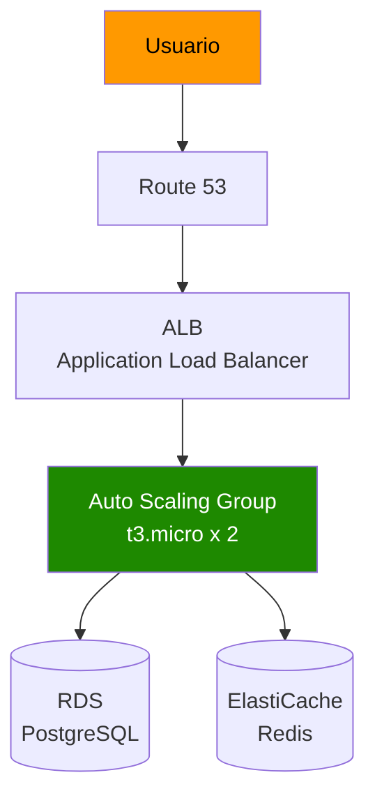
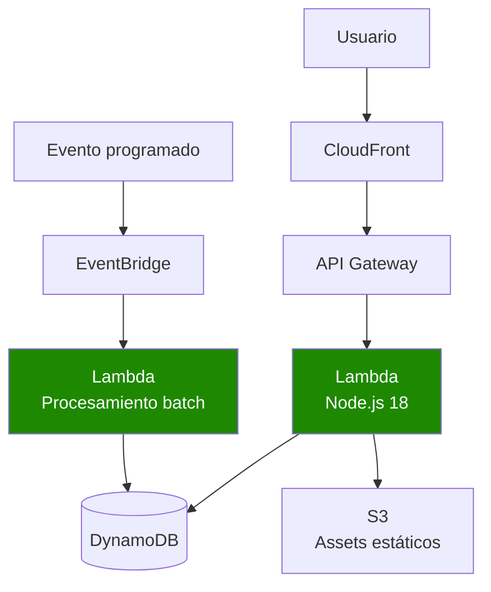
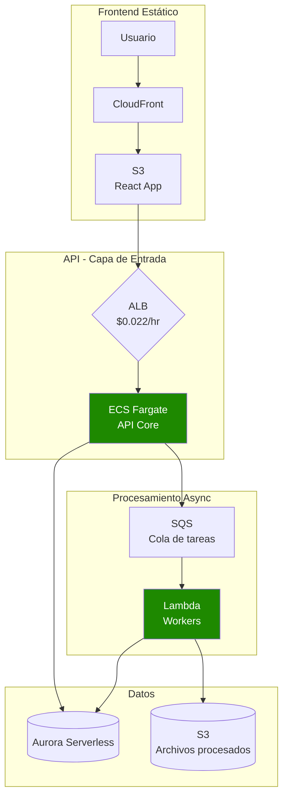

# Capítulo 2: Servicios de Cómputo en AWS

## Escenario Real: TechStart SAS - De 0 a 10,000 usuarios

> **Empresa ficticia para ilustrar decisiones reales**

TechStart es una startup de fintech en Colombia que lanzó una app de pagos. Inicialmente tenían 100 usuarios diarios, pero tras un artículo viral, su tráfico creció exponencialmente. Este capítulo sigue sus decisiones de arquitectura cómputo paso a paso.

---

## Fase 1: MVP Rápido (Semana 1-4)

### El Problema
- Necesitan lanzar en 2 semanas
- Presupuesto: $500/mes
- No tienen equipo de DevOps
- Tráfico predecible (día vs noche)

### La Decisión: EC2 con Auto Scaling básico

```
┌─────────────────────────────────────────────────────────────┐
│  ¿Necesitas control total del SO?                          │
│         │                                                   │
│    SÍ ──┼──► EC2 (máquinas virtuales)                       │
│         │                                                   │
│    NO ──┼──► ECS/Fargate (contenedores sin servidor)       │
│         │         o                                         │
│         └───────► Lambda (solo código)                    │
└─────────────────────────────────────────────────────────────┘
```

### Arquitectura Implementada



**Configuración real usada:**

```json
// Auto Scaling Launch Template
{
  "InstanceType": "t3.micro",
  "ImageId": "ami-0abcdef1234567890",
  "SecurityGroupIds": ["sg-web-tier"],
  "UserData": "base64-encoded-script",
  "Tags": [
    {"Key": "Environment", "Value": "production"},
    {"Key": "Project", "Value": "techstart-app"}
  ]
}
```

**¿Por qué t3.micro y no t2.micro?**

| Característica | t2.micro | t3.micro |
|---------------|----------|----------|
| CPU Baseline | 10% | 20% |
 Burst | Créditos acumulables | Créditos ilimitados (con costo) |
| Costo/mes | ~$8.50 | ~$8.50 |
| Rendimiento base | Menor | Mejor |

**Decisión:** t3.micro porque ofrece el doble de rendimiento base por el mismo precio.

---

## Fase 2: Escalando (Mes 2-3)

### El Problema Nuevo
- 5,000 usuarios concurrentes
- Picos de 15,000 en horario de almuerzo (12pm-2pm)
- Costos subieron a $1,200/mes
- EC2 corriendo 24/7 pero la app solo se usa 8 horas al día

### Análisis de Costos

| Configuración | Usuarios soportados | Costo/mes | Costo/usuario |
|--------------|---------------------|-----------|---------------|
| 5 × t3.medium 24/7 | ~8,000 | $340 | $0.043 |
| Auto Scaling (4-20) | ~20,000 | $720 | $0.036 |
| **Lambda + API Gateway** | ~15,000 | **$280** | **$0.019** |

### La Decisión: Migrar a Serverless

```
┌──────────────────────────────────────────────────────────────┐
│  ¿Tu carga es event-driven o tiene picos impredecibles?      │
│                                                             │
│    SÍ ───────────────────────► Lambda                       │
│                                                             │
│    NO pero quiero contenedores ──► ECS Fargate             │
│                                                             │
│    NO, carga constante y predecible ──► EC2 Spot           │
└──────────────────────────────────────────────────────────────┘
```

### Nueva Arquitectura Serverless



### Código Real de Lambda

```javascript
// lambda-payment-processor/index.js
const AWS = require('aws-sdk');
const dynamodb = new AWS.DynamoDB.DocumentClient();

exports.handler = async (event) => {
    const { userId, amount, currency } = JSON.parse(event.body);
    
    // Validación de negocio
    if (amount <= 0 || amount > 10000) {
        return {
            statusCode: 400,
            body: JSON.stringify({ error: 'Monto inválido' })
        };
    }
    
    // Procesamiento
    const transaction = {
        TableName: 'Transactions',
        Item: {
            transactionId: generateId(),
            userId,
            amount,
            currency,
            status: 'PENDING',
            timestamp: new Date().toISOString(),
            ttl: Math.floor(Date.now() / 1000) + (90 * 24 * 60 * 60) // 90 días
        }
    };
    
    await dynamodb.put(transaction).promise();
    
    return {
        statusCode: 200,
        body: JSON.stringify({ 
            transactionId: transaction.Item.transactionId,
            status: 'PENDING'
        })
    };
};
```

### Configuración SAM (Infrastructure as Code)

```yaml
# template.yaml
AWSTemplateFormatVersion: '2010-09-09'
Transform: AWS::Serverless-2016-10-31

Globals:
  Function:
    Timeout: 10
    MemorySize: 512
    Runtime: nodejs18.x

Resources:
  PaymentFunction:
    Type: AWS::Serverless::Function
    Properties:
      Handler: index.handler
      CodeUri: lambda-payment-processor/
      Events:
        ApiEvent:
          Type: Api
          Properties:
            Path: /payments
            Method: post
      Environment:
        Variables:
          TABLE_NAME: !Ref TransactionsTable
      Policies:
        - DynamoDBCrudPolicy:
            TableName: !Ref TransactionsTable

  TransactionsTable:
    Type: AWS::DynamoDB::Table
    Properties:
      TableName: Transactions
      BillingMode: PAY_PER_REQUEST  # On-demand scaling
      AttributeDefinitions:
        - AttributeName: transactionId
          AttributeType: S
      KeySchema:
        - AttributeName: transactionId
          KeyType: HASH
      TimeToLiveSpecification:
        AttributeName: ttl
        Enabled: true
```

---

## Fase 3: Producción a Escala (Mes 4+)

### El Problema Actual
- 50,000+ usuarios diarios
- Arquitectura serverless costando $2,800/mes
- Algunas Lambda tienen cold starts de 3 segundos
- Necesitan procesamiento de imágenes (ineficiente en Lambda)

### Análisis Profundo

**¿Dónde se gasta el dinero?**

| Servicio | Costo/mes | % del total |
|----------|-----------|-------------|
| API Gateway | $890 | 32% |
| Lambda (invocaciones) | $620 | 22% |
| DynamoDB | $480 | 17% |
| CloudFront | $410 | 15% |
| Data Transfer | $400 | 14% |

**Problema identificado:** API Gateway es caro a alto volumen ($3.50/million requests). Lambda + API Gateway cuesta más que ALB + EC2 cuando hay tráfico constante.

### La Decisión: Arquitectura Híbrida



**¿Por qué esta arquitectura?**

| Componente | Antes | Después | Razón del cambio |
|------------|-------|---------|------------------|
| API Gateway | $890/mes | $160/mes (ALB) | ALB es más barato para tráfico constante |
| Lambda API | $620/mes | $340/mes (ECS) | Contenedores mejor para carga sostenida |
| Lambda Workers | No existía | $120/mes | Procesamiento async perfecto para Lambda |
| **Total** | **$1,510** | **$620** | **59% de ahorro** |

### ECS Fargate - Configuración de Servicio

```json
// ecs-service-definition.json
{
  "family": "techstart-api",
  "networkMode": "awsvpc",
  "requiresCompatibilities": ["FARGATE"],
  "cpu": "512",
  "memory": "1024",
  "containerDefinitions": [
    {
      "name": "api",
      "image": "123456789.dkr.ecr.us-east-1.amazonaws.com/techstart-api:latest",
      "portMappings": [
        {
          "containerPort": 3000,
          "protocol": "tcp"
        }
      ],
      "environment": [
        {"name": "NODE_ENV", "value": "production"},
        {"name": "DB_HOST", "value": "aurora-cluster.cluster-xyz.us-east-1.rds.amazonaws.com"}
      ],
      "secrets": [
        {
          "name": "DB_PASSWORD",
          "valueFrom": "arn:aws:secretsmanager:us-east-1:123456789:secret:db-password"
        }
      ],
      "logConfiguration": {
        "logDriver": "awslogs",
        "options": {
          "awslogs-group": "/ecs/techstart-api",
          "awslogs-region": "us-east-1",
          "awslogs-stream-prefix": "ecs"
        }
      }
    }
  ]
}
```

### Auto Scaling para ECS

```json
// auto-scaling-ecs.json
{
  "TargetGroupArn": "arn:aws:elasticloadbalancing:...",
  "TargetTrackingScalingPolicyConfiguration": {
    "PredefinedMetricSpecification": {
      "PredefinedMetricType": "ALBRequestCountPerTarget"
    },
    "TargetValue": 1000.0,
    "ScaleOutCooldown": 60,
    "ScaleInCooldown": 300
  },
  "MinCapacity": 2,
  "MaxCapacity": 20
}
```

**Escalado configurado:**
- **Scale out:** Cuando hay >1000 requests/min por tarea (añade tareas cada 60s)
- **Scale in:** Reduce tareas cuando baja la carga (espera 5 min antes de reducir)
- **Mínimo:** 2 tareas (alta disponibilidad)
- **Máximo:** 20 tareas (límite de presupuesto)

---

## Decision Tree Completo: ¿Qué cómputo elegir?

```
┌─────────────────────────────────────────────────────────────────────┐
│                    ¿QUÉ SERVICIO DE CÓMPUTO USAR?                   │
└─────────────────────────────────────────────────────────────────────┘

¿Necesitas control total del sistema operativo?
│
├── SÍ ─────────────────────────────────────────────────────────────┐
│                                                                     │
│   ¿La carga es variable/por eventos o constante?                    │
│   │                                                                 │
│   ├── VARIABLE ──► EC2 Auto Scaling + Spot Instances               │
│   │   • Batch processing                                            │
│   │   • Ambientes de desarrollo                                     │
│   │   • Ahorra hasta 90% vs on-demand                              │
│   │                                                                 │
│   └── CONSTANTE ──► EC2 Reserved Instances o Savings Plans           │
│       • Ahorra 40-72% con compromiso 1-3 años                       │
│       • Carga predecible 24/7                                       │
│                                                                     │
└── NO ───────────────────────────────────────────────────────────────┐
                                                                      │
    ¿Es procesamiento de código corto (<15 min) y event-driven?       │
    │                                                                 │
    ├── SÍ ──► AWS Lambda                                             │
    │   • APIs con picos impredecibles                                │
    │   • Procesamiento de archivos (S3 triggers)                   │
    │   • ETL jobs                                                    │
    │   • Webhooks                                                    │
    │                                                                 │
    └── NO ───────────────────────────────────────────────────────────┐
                                                                      │
        ¿Necesitas ejecutar contenedores Docker?                      │
        │                                                             │
        ├── SÍ ───────────────────────────────────────────────────────┐│
        │                                                           ││
        │   ¿Carga sostenida o por eventos?                          ││
        │   │                                                       ││
        │   ├── SOSTENIDA ──► ECS Fargate                           ││
        │   │   • Microservicios en producción                      ││
        │   │   • APIs con tráfico constante                        ││
        │   │   • Mejor que Lambda para >1000 req/min sostenidos    ││
        │   │                                                       ││
        │   └── POR EVENTOS ──► ECS con EventBridge                ││
        │       • Jobs programados                                ││
        │       • Procesamiento batch                               ││
        │                                                           ││
        └── NO ──► AWS Batch (para HPC) o AWS Outposts             ││
            • Simulaciones científicas                              ││
            • Renderizado 3D                                        ││
            • Workloads que necesitan GPU                           ││
```

---

## Comparativa: Costos Reales a Diferentes Escalas

| Escenario | Usuarios/mes | EC2 | Lambda | ECS Fargate | Mejor opción |
|-----------|--------------|-----|--------|-------------|--------------|
| MVP Startup | 10,000 | $85 | $45 | $120 | **Lambda** |
| Crecimiento | 100,000 | $340 | $280 | $290 | **Lambda** |
| Producto-Market Fit | 1M | $890 | $1,400 | $780 | **ECS Fargate** |
| Escala Enterprise | 10M | $4,200 | $8,900 | $3,400 | **ECS Fargate** |
| Batch Processing | - | $2,800 | $890 | - | **Lambda** |

---

## Anti-Patrones Comunes y Cómo Evitarlos

### ❌ Anti-Patrón 1: "Lambda para Todo"

**El problema:** Usar Lambda para procesamiento de video pesado

```javascript
// MAL - Procesamiento de video en Lambda
exports.handler = async (event) => {
    const video = await downloadFromS3(event.bucket, event.key);
    const processed = await heavyEncoding(video); // 10 minutos
    await uploadToS3(processed);
};
// Resultado: Timeout después de 15 minutos
```

**La solución:**
```javascript
// BIEN - Orquestación con Step Functions
// 1. Lambda descarga metadata (rápido)
// 2. ECS Fargate hace el encoding pesado
// 3. Lambda notifica cuando termina

// Step Functions ASL
{
  "Comment": "Video Processing Workflow",
  "StartAt": "ExtractMetadata",
  "States": {
    "ExtractMetadata": {
      "Type": "Task",
      "Resource": "arn:aws:lambda:...",
      "Next": "ProcessVideo"
    },
    "ProcessVideo": {
      "Type": "Task",
      "Resource": "arn:aws:states:::ecs:runTask.sync",
      "Parameters": {
        "Cluster": "video-processing",
        "TaskDefinition": "video-encoder"
      },
      "Next": "NotifyComplete"
    },
    "NotifyComplete": {
      "Type": "Task",
      "Resource": "arn:aws:lambda:...",
      "End": true
    }
  }
}
```

### ❌ Anti-Patrón 2: Instancias "Zombies"

**El problema:** EC2 corriendo 24/7 sin uso

```bash
# Descubrir instancias subutilizadas
aws cloudwatch get-metric-statistics \
  --namespace AWS/EC2 \
  --metric-name CPUUtilization \
  --dimensions Name=InstanceId,Value=i-1234567890abcdef0 \
  --start-time 2024-01-01T00:00:00Z \
  --end-time 2024-01-31T23:59:59Z \
  --period 86400 \
  --statistics Average

# Resultado típico: 3% CPU promedio
# Acción: Reducir tamaño de instancia o usar Spot
```

### ❌ Anti-Patrón 3: EBS Sobreprovisionado

**El problema:** gp3 de 1000 IOPS para un blog estático

| Tipo de Volumen | IOPS | Costo/GB/mes | Caso de uso |
|----------------|------|--------------|-------------|
| gp3 | 3,000 | $0.08 | General purpose |
| io2 | 64,000 | $0.125 | Bases de datos de misión crítica |
| st1 | 500 | $0.045 | Big data, logs |
| sc1 | 250 | $0.025 | Archivado |

---

## Checklist de Implementación

Antes de poner en producción:

- [ ] Configurar Auto Scaling con mínimo 2 instancias/contenedores
- [ ] Habilitar termination protection en instancias críticas
- [ ] Usar Systems Manager (SSM) en lugar de SSH con claves
- [ ] Configurar CloudWatch Logs para centralizar logs
- [ ] Habilitar X-Ray para tracing distribuido
- [ ] Configurar alarmas de CloudWatch para métricas clave (CPU, memoria, errores)
- [ ] Usar Spot Instances para cargas tolerantes a interrupciones
- [ ] Implementar health checks en Load Balancer
- [ ] Configurar graceful shutdown (SIGTERM handling)
- [ ] Usar AWS Secrets Manager para credenciales, nunca en código

---

## Troubleshooting Rápido

### Mi Lambda es lenta (cold start)

**Síntoma:** Primera request tarda 3-5 segundos

**Soluciones:**
1. **Provisioned Concurrency:** Mantener instancias siempre calientes
   ```yaml
   ProvisionedConcurrencyConfig:
     ProvisionedConcurrentExecutions: 100
   ```
   Costo: ~$20/mes por 100 ejecuciones

2. **Reducir tamaño del package:** Usar layer de dependencias
3. **Elegir runtime más rápido:** Python/Go > Node.js > Java

### Mi EC2 se queda sin memoria

**Síntoma:** OOM Killer termina procesos

```bash
# Monitorear en tiempo real
watch -n 1 free -h

# Encontrar proceso que consume más memoria
ps aux --sort=-%mem | head -10

# Solución: Cambiar a instancia con más RAM
# t3.medium (4GB) → t3.large (8GB)
```

### Mi contenedor en ECS no inicia

**Debugging paso a paso:**
1. Revisar logs en CloudWatch: `/ecs/nombre-del-servicio`
2. Verificar que el puerto del contenedor coincide con el target group
3. Confirmar que la task role tiene los permisos necesarios
4. Verificar que la VPC tiene acceso a ECR (NAT Gateway o VPC endpoint)

---

## Recetas de Arquitectura

### Receta 1: API REST Escalable

```yaml
# arquitectura-api-rest.yaml
Resources:
  # 1. Load Balancer público
  LoadBalancer:
    Type: AWS::ElasticLoadBalancingV2::LoadBalancer
    Properties:
      Scheme: internet-facing
      Type: application
      SecurityGroups: [!Ref LoadBalancerSecurityGroup]
      Subnets: [!Ref PublicSubnet1, !Ref PublicSubnet2]

  # 2. ECS Service con Fargate
  ApiService:
    Type: AWS::ECS::Service
    Properties:
      Cluster: !Ref Cluster
      TaskDefinition: !Ref ApiTaskDefinition
      DesiredCount: 2
      LaunchType: FARGATE
      LoadBalancers:
        - ContainerName: api
          ContainerPort: 3000
          TargetGroupArn: !Ref TargetGroup

  # 3. Auto Scaling
  ScalableTarget:
    Type: AWS::ApplicationAutoScaling::ScalableTarget
    Properties:
      MaxCapacity: 10
      MinCapacity: 2
      ResourceId: !Sub service/${Cluster}/${ApiService}
      RoleARN: !Sub arn:aws:iam::${AWS::AccountId}:role/aws-service-role/ecs.application-autoscaling.amazonaws.com/AWSServiceRoleForApplicationAutoScaling_ECSService
      ScalableDimension: ecs:service:DesiredCount
      ServiceNamespace: ecs
```

### Receta 2: Procesamiento de Cola SQS con Lambda

```javascript
// lambda-sqs-processor/index.js
exports.handler = async (event) => {
    const batchItemFailures = [];
    
    for (const record of event.Records) {
        try {
            const message = JSON.parse(record.body);
            await processMessage(message);
            console.log(`Processed: ${record.messageId}`);
        } catch (error) {
            console.error(`Failed: ${record.messageId}`, error);
            batchItemFailures.push({ itemIdentifier: record.messageId });
        }
    }
    
    // Reportar fallos parciales (no reintentar los exitosos)
    return { batchItemFailures };
};
```

```yaml
# SAM template para SQS + Lambda
ProcessorFunction:
  Type: AWS::Serverless::Function
  Properties:
    Handler: index.handler
    Events:
      SQSEvent:
        Type: SQS
        Properties:
          Queue: !GetAtt ProcessingQueue.Arn
          BatchSize: 10
          MaximumBatchingWindowInSeconds: 5
          FunctionResponseTypes:
            - ReportBatchItemFailures
```

---

## Conclusión: Decisiones Clave de TechStart

| Fase | Arquitectura | Usuarios | Costo/mes | Por qué funcionó |
|------|-------------|----------|-----------|------------------|
| 1 | EC2 + RDS | 100 | $45 | Rápido de implementar, familiar |
| 2 | Lambda + DynamoDB | 5,000 | $280 | Escaló automáticamente sin DevOps |
| 3 | ECS Fargate + Aurora | 50,000 | $620 | Optimizado para tráfico constante |
| 4 | Híbrida optimizada | 100,000 | $890 | Balance costo/rendimiento |

**La lección:** No hay una arquitectura perfecta. La mejor arquitectura es la que se adapta a tu etapa actual y puede evolucionar contigo.

---

## Ejercicio Práctico

**Escenario:** Tienes una app de e-commerce con:
- 1,000 visitas/día actualmente
- Picos de 10,000 en Black Friday
- Procesamiento de pagos en tiempo real
- Generación de reportes mensuales

**Preguntas:**
1. ¿Qué servicio de cómputo usarías para la API de pagos? ¿Por qué?
2. ¿Cómo manejarías la generación de reportes mensuales?
3. ¿Qué estrategia de ahorro de costos implementarías?

---

## Navegación

← [Capítulo 1: Fundamentos](./c1-fundamentos-de-aws-y-computacion-en-la-nube.md) | [Índice](../README.md) | [Capítulo 3: Almacenamiento](./c3-almacenamiento-y-bases-de-datos-en-aws.md) →
