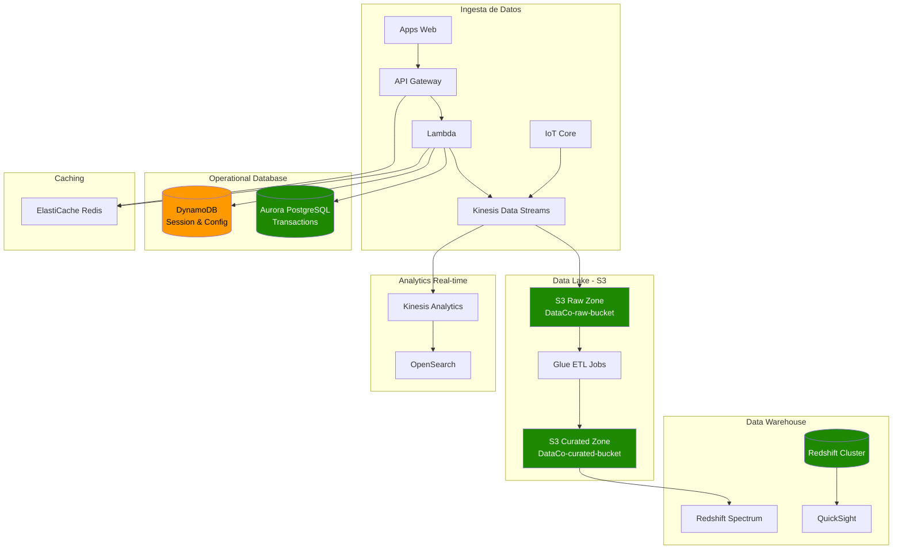

# Capítulo 3: Almacenamiento y Bases de Datos en AWS

## Escenario Real: DataCo - Construyendo un Data Platform Moderno

> **Empresa ficticia para ilustrar decisiones reales de arquitectura de datos**

DataCo es una empresa de análisis de datos que procesa 5TB de información diaria proveniente de sensores IoT, logs de aplicaciones y transacciones financieras. Necesitan construir una plataforma que escale de terabytes a petabytes, mantenga costos controlados y permita análisis en tiempo real. Este capítulo documenta sus decisiones técnicas.

---

## Fase 1: Elegir el Almacenamiento Adecuado

### Comparativa S3 vs EBS vs EFS

```
┌─────────────────────────────────────────────────────────────────────┐
│               ¿QUÉ ALMACENAMIENTO USAR?                               │
└─────────────────────────────────────────────────────────────────────┘

¿Necesitas compartir archivos entre múltiples servidores?
│
├── SÍ ───────────────────────────────────────────────────────────────┐
│                                                                     │
│   ¿Son archivos de uso general (documentos, home directories)?      │
│   │                                                                 │
│   ├── SÍ ──► Amazon EFS (NFS gestionado)                          │
│   │   • Cientos de instancias pueden montar simultáneamente      │
│   │   • Expande automáticamente sin provisioning                   │
│   │   • Precio: $0.30/GB-mes (Standard)                            │
│   │                                                                 │
│   └── NO ──► Amazon FSx (Windows/SMB o Lustre)                      │
│       • Compatibilidad con Active Directory                        │
│       • High performance computing (Lustre)                        │
│                                                                     │
└── NO ───────────────────────────────────────────────────────────────┐
                                                                      │
    ¿Necesitas almacenamiento en bloque para una instancia?           │
    │                                                                 │
    ├── SÍ ──► Amazon EBS                                            │
    │   • Un solo volumen por instancia (normalmente)               │
    │   • Tipos: gp3, io2, st1, sc1                                   │
    │   • Precio: $0.08-$0.125/GB-mes                                 │
    │   • Backup: Snapshots incrementales                            │
    │                                                                 │
    └── NO ──► Amazon S3 (Almacenamiento de objetos)                  │
        • Acceso vía HTTP/HTTPS                                        │
        • 11 nueves de durabilidad                                     │
        • Precio: $0.023/GB-mes (Standard)                           │
        • Múltiples clases de almacenamiento                           │
```

### Tabla Comparativa Detallada

| Característica | S3 | EBS | EFS |
|----------------|-----|-----|-----|
| **Modelo de datos** | Objetos | Bloques | Archivos (NFS) |
| **Acceso** | HTTP/REST | SCSI/NVMe | NFS v4.1 |
| **Durabilidad** | 99.999999999% | 99.8-99.9% | 99.9% |
| **Límite de tamaño** | Ilimitado | 64TB por volumen | Ilimitado |
| **Acceso concurrente** | Millones | 1 instancia | Miles de instancias |
| **Latencia** | Milisegundos | Microsegundos | Milisegundos |
| **Costo/GB/mes** | $0.023 | $0.08-$0.125 | $0.30 |
| **Caso de uso típico** | Data lakes, backups | Bases de datos, OS | Shared storage, CI/CD |

---

## Fase 2: Decision Tree - ¿Qué Base de Datos Usar?

```
┌─────────────────────────────────────────────────────────────────────┐
│              ¿QUÉ BASE DE DATOS USAR EN AWS?                          │
└─────────────────────────────────────────────────────────────────────┘

¿Necesitas consultas complejas JOIN y ACID estricto?
│
├── SÍ ───────────────────────────────────────────────────────────────┐
│                                                                     │
│   ¿Rendimiento crítico para el negocio (>100k IOPS)?               │
│   │                                                                 │
│   ├── SÍ ──► Amazon Aurora                                         │
│   │   • MySQL/PostgreSQL compatible                                 │
│   │   • Hasta 128TB, 6 réplicas automáticas                        │
│   │   • 5x más rápido que MySQL estándar                           │
│   │   • $0.10/GB almacenamiento + $0.02/million requests         │
│   │                                                                 │
│   └── NO ──► Amazon RDS                                            │
│       • MySQL, PostgreSQL, MariaDB, Oracle, SQL Server             │
│       • Managed backups, patching, Multi-AZ                        │
│       • Desde $15/mes (db.t3.micro)                                │
│                                                                     │
└── NO ───────────────────────────────────────────────────────────────┐
                                                                      │
    ¿Necesitas escalado automático sin gestión de servidores?         │
    │                                                                 │
    ├── SÍ ──► Amazon DynamoDB                                        │
    │   • NoSQL clave-valor y documentos                              │
    │   • Latencia consistente <10ms                                 │
    │   • Millones de requests/segundo                               │
    │   • On-demand: $1.25/million write, $0.25/million read       │
    │                                                                 │
    └── NO ───────────────────────────────────────────────────────────┐
                                                                      │
        ¿Datos semi-estructurados (JSON) sin esquema fijo?            │
        │                                                             │
        ├── SÍ ──► Amazon DocumentDB (compatible MongoDB)             │
        │                                                             │
        └── NO ───────────────────────────────────────────────────────┐
                                                                      │
            ¿Relaciones complejas (grafos, redes sociales)?             │
            │                                                         │
            ├── SÍ ──► Amazon Neptune (Gremlin, SPARQL)                │
            │                                                         │
            └── NO ───────────────────────────────────────────────────┐
                                                                      │
                ¿Análisis de datos masivo (petabytes)?                │
                │                                                     │
                ├── SÍ ──► Amazon Redshift                            │
                │   • Data warehouse columnar                         │
                │   • Consultas SQL sobre S3 (Spectrum)               │
                │                                                     │
                └── NO ──► Reconsiderar requisitos                   │
```

---

## Fase 3: Arquitectura de DataCo - Data Platform Completa

### Diagrama de Arquitectura



### DataCo - Costos por GB Almacenado

| Capa de Almacenamiento | Servicio | Costo/GB/mes | Uso en DataCo |
|------------------------|----------|--------------|---------------|
| **Hot (acceso frecuente)** | S3 Standard | $0.023 | Últimos 30 días de datos |
| **Warm (acceso ocasional)** | S3 Intelligent-Tiering | $0.0125-0.023 | 30-90 días |
| **Cool (archivado)** | S3 Glacier Instant Retrieval | $0.004 | 90-365 días |
| **Cold (backup)** | S3 Glacier Deep Archive | $0.00099 | >1 año, compliance |
| **Database transaccional** | Aurora PostgreSQL | $0.10 | Datos operativos |
| **Data warehouse** | Redshift | $0.25 | Datos analíticos |
| **Cache** | ElastiCache | $0.0125 | Sesiones y queries frecuentes |

**Optimización de costos:**
```python
# Lifecycle Policy para S3 (automáticamente mueve datos entre tiers)
{
    "Rules": [
        {
            "ID": "MoveToIA",
            "Status": "Enabled",
            "Transition": {
                "Days": 30,
                "StorageClass": "STANDARD_IA"
            }
        },
        {
            "ID": "MoveToGlacier",
            "Status": "Enabled",
            "Transition": {
                "Days": 90,
                "StorageClass": "GLACIER_IR"
            }
        },
        {
            "ID": "DeleteOld",
            "Status": "Enabled",
            "Expiration": {
                "Days": 2555  # 7 años para compliance
            }
        }
    ]
}
```

---

## Fase 4: Implementación Práctica

### DynamoDB - Tabla de Configuración con Auto-Scaling

```yaml
# template.yaml - CloudFormation/SAM
AWSTemplateFormatVersion: '2010-09-09'
Transform: AWS::Serverless-2016-10-31

Resources:
  DataCoConfigTable:
    Type: AWS::DynamoDB::Table
    Properties:
      TableName: DataCo-Configuration
      BillingMode: PROVISIONED  # O PAY_PER_REQUEST
      ProvisionedThroughput:
        ReadCapacityUnits: 5
        WriteCapacityUnits: 5
      AttributeDefinitions:
        - AttributeName: PK
          AttributeType: S
        - AttributeName: SK
          AttributeType: S
      KeySchema:
        - AttributeName: PK
          KeyType: HASH
        - AttributeName: SK
          KeyType: RANGE
      StreamSpecification:
        StreamViewType: NEW_AND_OLD_IMAGES
      PointInTimeRecoverySpecification:
        PointInTimeRecoveryEnabled: true
      SSESpecification:
        SSEEnabled: true
        SSEType: KMS
        KMSMasterKeyId: alias/aws/dynamodb
      
      # Global Secondary Index para consultas por tipo
      GlobalSecondaryIndexes:
        - IndexName: GSI1
          KeySchema:
            - AttributeName: GSI1PK
              KeyType: HASH
            - AttributeName: GSI1SK
              KeyType: RANGE
          Projection:
            ProjectionType: ALL
          ProvisionedThroughput:
            ReadCapacityUnits: 5
            WriteCapacityUnits: 5

  # Auto Scaling para la tabla
  TableReadScalingPolicy:
    Type: AWS::ApplicationAutoScaling::ScalableTarget
    Properties:
      MaxCapacity: 1000
      MinCapacity: 5
      ResourceId: !Sub table/${DataCoConfigTable}
      RoleARN: !Sub arn:aws:iam::${AWS::AccountId}:role/aws-service-role/dynamodb.application-autoscaling.amazonaws.com/AWSServiceRoleForApplicationAutoScaling_DynamoDBTable
      ScalableDimension: dynamodb:table:ReadCapacityUnits
      ServiceNamespace: dynamodb

  TableReadScalingPolicyTarget:
    Type: AWS::ApplicationAutoScaling::ScalingPolicy
    Properties:
      PolicyName: TableReadScalingPolicy
      PolicyType: TargetTrackingScaling
      ResourceId: !Sub table/${DataCoConfigTable}
      ScalableDimension: dynamodb:table:ReadCapacityUnits
      ServiceNamespace: dynamodb
      TargetTrackingScalingPolicyConfiguration:
        TargetValue: 70.0
        ScaleInCooldown: 60
        ScaleOutCooldown: 60
```

### Aurora PostgreSQL - Configuración Multi-AZ

```yaml
  AuroraCluster:
    Type: AWS::RDS::DBCluster
    Properties:
      Engine: aurora-postgresql
      EngineVersion: "15.4"
      DBClusterIdentifier: dataco-production
      MasterUsername: dataco_admin
      MasterUserPassword: '{{resolve:secretsmanager:dataco-db-password:SecretString:password}}'
      DatabaseName: dataco_production
      BackupRetentionPeriod: 35
      PreferredBackupWindow: "03:00-04:00"
      EnableHttpEndpoint: true  # Data API para Lambda
      DeletionProtection: true
      EnableCloudwatchLogsExports:
        - postgresql
      VpcSecurityGroupIds:
        - !Ref DatabaseSecurityGroup
      DBSubnetGroupName: !Ref DBSubnetGroup
      Tags:
        - Key: Environment
          Value: production
        - Key: Project
          Value: DataCo

  AuroraPrimaryInstance:
    Type: AWS::RDS::DBInstance
    Properties:
      DBClusterIdentifier: !Ref AuroraCluster
      DBInstanceIdentifier: dataco-primary
      DBInstanceClass: db.r6g.xlarge
      Engine: aurora-postgresql
      PubliclyAccessible: false
      MonitoringInterval: 60
      EnablePerformanceInsights: true
      PerformanceInsightsRetentionPeriod: 7
      AutoMinorVersionUpgrade: true

  AuroraReplicaInstance:
    Type: AWS::RDS::DBInstance
    Properties:
      DBClusterIdentifier: !Ref AuroraCluster
      DBInstanceIdentifier: dataco-replica
      DBInstanceClass: db.r6g.large
      Engine: aurora-postgresql
      PubliclyAccessible: false
```

### S3 - Bucket de Data Lake con Partitioning

```python
# ETL Job con Glue/PySpark para particionar datos
import boto3
from pyspark.context import SparkContext
from awsglue.context import GlueContext
from awsglue.job import Job
from datetime import datetime

sc = SparkContext()
glueContext = GlueContext(sc)
spark = glueContext.spark_session

# Leer datos raw
df = spark.read.json("s3://dataco-raw-bucket/iot-sensors/")

# Agregar columnas de partición
df_partitioned = df \
    .withColumn("year", year(col("timestamp"))) \
    .withColumn("month", month(col("timestamp"))) \
    .withColumn("day", dayofmonth(col("timestamp"))) \
    .withColumn("hour", hour(col("timestamp")))

# Escribir con particionamiento Hive-style
(df_partitioned
    .write
    .mode("append")
    .partitionBy("year", "month", "day", "hour")
    .parquet("s3://dataco-curated-bucket/sensors/"))

# Estructura resultante:
# s3://dataco-curated-bucket/sensors/
#   year=2024/
#     month=01/
#       day=15/
#         hour=14/
#           part-00001.parquet
```

---

## Fase 5: Estrategias de Backup y Disaster Recovery

### Comparativa de Estrategias

| Estrategia | RTO | RPO | Costo | Complejidad |
|------------|-----|-----|-------|-------------|
| **Snapshots + Cross-Region** | 1-4 horas | 24 horas | Bajo | Baja |
| **Read Replica** | <1 hora | Segundos | Medio | Media |
| **Multi-AZ (sincrónico)** | <1 minuto | ~0 | Medio | Baja |
| **Global Tables (DynamoDB)** | <1 minuto | ~0 | Alto | Media |
| **Aurora Global DB** | <1 minuto | ~1 segundo | Alto | Media |

### Configuración de Backup para DataCo

```yaml
  # Backup Plan con AWS Backup
  DataCoBackupPlan:
    Type: AWS::Backup::BackupPlan
    Properties:
      BackupPlan:
        BackupPlanName: DataCo-Critical-Resources
        BackupPlanRule:
          - RuleName: Daily-Backups
            TargetBackupVault: !Ref DataCoBackupVault
            ScheduleExpression: cron(0 5 ? * * *)  # 5 AM UTC daily
            StartWindowMinutes: 60
            CompletionWindowMinutes: 120
            Lifecycle:
              DeleteAfterDays: 35
              MoveToColdStorageAfterDays: 30
            RecoveryPointTags:
              BackupType: Daily
              
          - RuleName: Weekly-Backups
            TargetBackupVault: !Ref DataCoBackupVault
            ScheduleExpression: cron(0 5 ? * 1 *)  # Lunes 5 AM UTC
            Lifecycle:
              DeleteAfterDays: 365
            RecoveryPointTags:
              BackupType: Weekly

  BackupSelection:
    Type: AWS::Backup::BackupSelection
    Properties:
      BackupPlanId: !Ref DataCoBackupPlan
      BackupSelection:
        SelectionName: DataCo-Resources
        IamRoleArn: !GetAtt BackupRole.Arn
        Resources:
          - !Sub arn:aws:rds:${AWS::Region}:${AWS::AccountId}:db:dataco-*
          - !Sub arn:aws:dynamodb:${AWS::Region}:${AWS::AccountId}:table/DataCo-*
          - !Sub arn:aws:ec2:${AWS::Region}:${AWS::AccountId}:volume/vol-*

  # DynamoDB Global Tables para DR
  GlobalTable:
    Type: AWS::DynamoDB::GlobalTable
    Properties:
      TableName: DataCo-GlobalConfig
      AttributeDefinitions:
        - AttributeName: PK
          AttributeType: S
      KeySchema:
        - AttributeName: PK
          KeyType: HASH
      BillingMode: PAY_PER_REQUEST
      StreamSpecification:
        StreamViewType: NEW_AND_OLD_IMAGES
      Replicas:
        - Region: us-east-1
          PointInTimeRecoverySpecification:
            PointInTimeRecoveryEnabled: true
        - Region: us-west-2
          PointInTimeRecoverySpecification:
            PointInTimeRecoveryEnabled: true
```

### Script de Restauración de Aurora

```bash
#!/bin/bash
# restore-aurora.sh - Restauración point-in-time

SOURCE_CLUSTER="dataco-production"
RESTORE_TIME="2024-01-15T10:30:00Z"
NEW_CLUSTER_ID="dataco-production-restored"

# Restaurar a un momento específico
aws rds restore-db-cluster-to-point-in-time \
    --source-db-cluster-identifier $SOURCE_CLUSTER \
    --restore-to-time $RESTORE_TIME \
    --db-cluster-identifier $NEW_CLUSTER_ID \
    --restore-type RESTORE_TO_POINT_IN_TIME

# Crear instancia en el cluster restaurado
aws rds create-db-instance \
    --db-cluster-identifier $NEW_CLUSTER_ID \
    --db-instance-identifier ${NEW_CLUSTER_ID}-instance \
    --db-instance-class db.r6g.large \
    --engine aurora-postgresql

echo "Restauración completada. Endpoint: $(aws rds describe-db-clusters \
    --db-cluster-identifier $NEW_CLUSTER_ID \
    --query 'DBClusters[0].Endpoint' --output text)"
```

---

## Anti-Patrones de Almacenamiento

### ❌ Anti-Patrón 1: "Un Solo Bucket para Todo"

```
❌ MALA PRÁCTICA:
   s3://dataco-bucket/
   ├── app1/
   ├── app2/
   ├── backups/
   ├── logs/
   └── temp/
   
Problemas:
- No se pueden aplicar lifecycle policies específicas
- Riesgo de borrado accidental afecta todo
- No se puede costear por proyecto

✓ BUENA PRÁCTICA:
   s3://dataco-raw-prod/ (lifecycle: 30d → IA, 90d → Glacier)
   s3://dataco-curated-prod/ (lifecycle: 90d → IA)
   s3://dataco-backups-prod/ (lifecycle: 1yr → Deep Archive)
   s3://dataco-logs-prod/ (lifecycle: 30d → delete)
```

### ❌ Anti-Patrón 2: "DynamoDB Scan para Todo"

```python
# ❌ MAL - Scan escanea toda la tabla
# Costo: $1.25 por millón de items escaneados
response = dynamodb.scan(
    TableName='DataCo-Orders',
    FilterExpression='status = :status',
    ExpressionAttributeValues={':status': {'S': 'PENDING'}}
)
# Si tienes 100M items: $125 por consulta!

# ✓ BIEN - Query usando la clave de partición
response = dynamodb.query(
    TableName='DataCo-Orders',
    KeyConditionExpression='PK = :pk AND begins_with(SK, :sk)',
    ExpressionAttributeValues={
        ':pk': {'S': 'USER#123'},
        ':sk': {'S': 'ORDER#'}
    }
)
# Costo: $1.25 por millón de items RETORNADOS
# Solo pides lo que necesitas
```

### ❌ Anti-Patrón 3: "Aurora Serverless para Carga Constante"

```
Escenario: Aplicación con 1000 requests/minuto constantes

❌ MALA DECISIÓN: Aurora Serverless v2
   Costo: ~$0.12/ACU-hour
   Mínimo: 0.5 ACU = $43/mes base
   Pico: 16 ACU = $1,382/mes
   Promedio: 8 ACU = $691/mes
   
✓ BUENA DECISIÓN: Aurora Provisioned (db.r6g.large)
   Costo: $263/mes (instancia) + $100 (storage) = $363/mes
   
Ahorro: 47%
```

---

## Checklist de Implementación

Antes de poner en producción:

- [ ] Habilitar encryption at rest en todos los servicios
- [ ] Configurar Point-in-Time Recovery (PITR) para DynamoDB
- [ ] Implementar backup automatizado con AWS Backup
- [ ] Crear lifecycle policies en S3 para optimizar costos
- [ ] Configurar réplicas de lectura para bases de datos
- [ ] Implementar Global Tables o Aurora Global para multi-región
- [ ] Habilitar Performance Insights en RDS/Aurora
- [ ] Configurar VPC endpoints para S3 y DynamoDB (ahorro en data transfer)
- [ ] Implementar retry logic con exponential backoff en aplicaciones
- [ ] Establecer monitoreo con CloudWatch para throttling y latencia
- [ ] Crear runbooks para failover y restauración
- [ ] Documentar esquemas de particionamiento y keys de DynamoDB

---

## Troubleshooting Rápido

### Mi query en DynamoDB está muy lenta

**Síntoma:** Latencia >100ms en reads simples

**Causas y soluciones:**
```bash
# 1. Verificar throttling
aws cloudwatch get-metric-statistics \
  --namespace AWS/DynamoDB \
  --metric-name ThrottledRequests \
  --dimensions Name=TableName,Value=DataCo-Config \
  --start-time $(date -u -v-1H +%Y-%m-%dT%H:%M:%SZ) \
  --end-time $(date -u +%Y-%m-%dT%H:%M:%SZ) \
  --period 60 \
  --statistics Sum

# Solución: Aumentar RCU o usar on-demand
```

### Mis costos de S3 están creciendo inesperadamente

**Diagnóstico:**
```bash
# Identificar buckets más costosos
aws ce get-cost-and-usage \
  --time-period Start=2024-01-01,End=2024-01-31 \
  --granularity MONTHLY \
  --metrics BlendedCost \
  --group-by Type=TAG,Key=Bucket

# Verificar lifecycle policies
aws s3api get-bucket-lifecycle-configuration \
  --bucket dataco-raw-prod
```

### Aurora está saturada

```sql
-- Identificar queries lentas
SELECT * FROM pg_stat_statements
ORDER BY total_time DESC
LIMIT 10;

-- Verificar uso de índices
EXPLAIN (ANALYZE, BUFFERS)
SELECT * FROM orders WHERE customer_id = '123';

-- Solución: Crear índices faltantes
CREATE INDEX CONCURRENTLY idx_orders_customer 
ON orders(customer_id);
```

---

## Ejercicio Práctico

**Escenario:** DataCo quiere expandir su plataforma:

1. **Nuevo requisito:** Almacenar 2PB de datos históricos de sensores (acceso raro)
2. **Nuevo requisito:** Dashboard en tiempo real con métricas de sensores (latencia <50ms)
3. **Nuevo requisito:** Compliance HIPAA para datos de clientes
4. **Nuevo requisito:** DR activo-activo en otra región

**Preguntas:**

1. ¿Qué servicio usarías para los 2PB de datos históricos? ¿Por qué?

2. Diseña una arquitectura para el dashboard en tiempo real usando:
   - DynamoDB
   - ElastiCache
   - Kinesis

3. ¿Qué configuraciones de seguridad son obligatorias para HIPAA?

4. Calcula los costos mensuales para:
   - 2PB en el servicio de archivo elegido
   - DynamoDB con 10,000 writes/segundo y 50,000 reads/segundo
   - Aurora PostgreSQL (Multi-AZ, 500GB storage)

---

## Recursos Adicionales

### Costos Reales - Calculadora de Escenarios

| Escenario | Configuración | Costo Mensual Estimado |
|-----------|---------------|------------------------|
| Startup MVP | DynamoDB On-Demand (1M writes/day) + S3 100GB | ~$45 |
| E-commerce mediano | RDS PostgreSQL Multi-AZ + ElastiCache + S3 1TB | ~$850 |
| Data Platform | Redshift 4 nodes + Aurora + S3 50TB | ~$4,200 |
| Enterprise IoT | DynamoDB + Kinesis + S3 500TB + Glacier | ~$8,500 |

### Herramientas Recomendadas

- **AWS Pricing Calculator:** Estimar costos antes de implementar
- **S3 Storage Lens:** Visibilidad de uso y optimización de S3
- **Trusted Advisor:** Recomendaciones de optimización
- **Compute Optimizer:** Right-sizing de instancias

---

## Navegación

← [Capítulo 2: Servicios de Cómputo](./c2-servicios-de-computo-en-aws.md) | [Índice](../README.md) | [Capítulo 4: Redes y CDN](./c4-redes-y-entrega-de-contenido-en-aws.md) →
