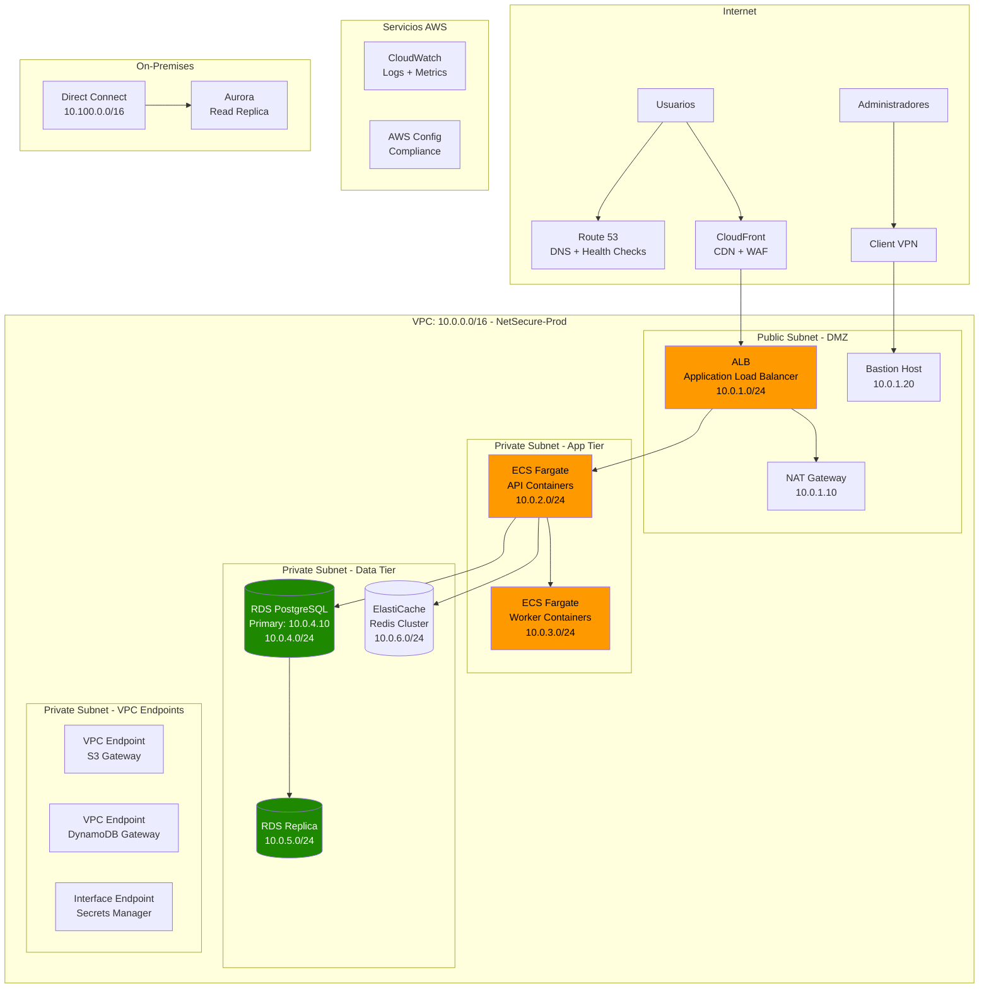

# Capítulo 4: Redes y Entrega de Contenido en AWS

## Escenario Real: NetSecure App - Diseñando una VPC Multi-Tier

> **Empresa ficticia para ilustrar decisiones reales de arquitectura de red**

NetSecure App es una fintech que procesa pagos y datos financieros sensibles. Necesitan una arquitectura de red que cumpla con PCI-DSS, soporte 100,000 usuarios concurrentes y permita expansión a múltiples regiones. Su aplicación tiene frontend (React), API (Node.js), workers (Python) y bases de datos (PostgreSQL + Redis).

---

## Fase 1: Diseño de VPC Multi-Tier

### Diagrama de Arquitectura de Red Completa



### Configuración IP de NetSecure App

| Componente | Subnet | CIDR | IPs Disponibles | Uso |
|------------|--------|------|-----------------|-----|
| **Public Subnet AZ1** | us-east-1a | 10.0.1.0/24 | 251 | ALB, NAT Gateway, Bastion |
| **Public Subnet AZ2** | us-east-1b | 10.0.11.0/24 | 251 | ALB (HA), NAT Gateway (HA) |
| **App Tier AZ1** | us-east-1a | 10.0.2.0/24 | 251 | ECS Fargate API |
| **App Tier AZ2** | us-east-1b | 10.0.12.0/24 | 251 | ECS Fargate API (HA) |
| **Workers AZ1** | us-east-1a | 10.0.3.0/24 | 251 | ECS Fargate Workers |
| **Workers AZ2** | us-east-1b | 10.0.13.0/24 | 251 | ECS Fargate Workers (HA) |
| **Data Tier AZ1** | us-east-1a | 10.0.4.0/24 | 251 | RDS Primary |
| **Data Tier AZ2** | us-east-1b | 10.0.5.0/24 | 251 | RDS Replica |
| **Cache Tier** | us-east-1a | 10.0.6.0/24 | 251 | ElastiCache Redis |
| **Reserved** | - | 10.0.7.0/24 - 10.0.10.0/24 | - | Crecimiento futuro |
| **Total VPC** | - | 10.0.0.0/16 | 65,534 | - |

---

## Fase 2: Subnets Públicas vs Privadas Explicadas

### Definiciones y Diferencias

```
┌─────────────────────────────────────────────────────────────────────┐
│               SUBNETS PÚBLICAS vs SUBNETS PRIVADAS                    │
└─────────────────────────────────────────────────────────────────────┘

SUBNETS PÚBLICAS
┌─────────────────────────────────────────┐
│ Características:                        │
│ • MapPublicIpOnLaunch: true             │
│ • Route table apunta a Internet Gateway   │
│ • Recursos pueden recibir tráfico       │
│   directo de Internet                    │
│ • SIEMPRE deben usar Security Groups    │
│                                         │
│ Casos de uso:                            │
│ ✓ Load Balancers públicos               │
│ ✓ Bastion hosts (jump boxes)            │
│ ✓ NAT Gateways                          │
│ ✓ VPN Gateways                          │
│                                         │
│ Ejemplo de Route Table:                  │
│ Destination       Target                  │
│ 10.0.0.0/16     local                   │
│ 0.0.0.0/0       igw-12345  ← Internet    │
└─────────────────────────────────────────┘

SUBNETS PRIVADAS
┌─────────────────────────────────────────┐
│ Características:                        │
│ • MapPublicIpOnLaunch: false            │
│ • Route table apunta a NAT Gateway      │
│ • NO pueden recibir tráfico directo     │
│   de Internet                            │
│ • Pueden salir a Internet (vía NAT GW)  │
│                                         │
│ Casos de uso:                            │
│ ✓ Bases de datos                        │
│ ✓ Servidores de aplicaciones            │
│ ✓ Microservicios                        │
│ ✓ Caché y colas                         │
│                                         │
│ Ejemplo de Route Table:                  │
│ Destination       Target                  │
│ 10.0.0.0/16     local                   │
│ 0.0.0.0/0       nat-12345  ← NAT GW    │
└─────────────────────────────────────────┘

IMPORTANTE: NAT Gateway es UNIDIRECCIONAL
• Private subnet → Internet: SÍ (vía NAT)
• Internet → Private subnet: NO
```

---

## Fase 3: Security Groups vs NACLs - Comparativa Práctica

### Diferencias Clave

```
┌─────────────────────────────────────────────────────────────────────┐
│           SECURITY GROUPS vs NETWORK ACLs                           │
└─────────────────────────────────────────────────────────────────────┘

                    SECURITY GROUPS
┌─────────────────────────────────────────────────────────────────┐
│ • Nivel: Instancia (ENI)                                         │
│ • Estado: STATEFUL (return traffic automático)                  │
│ • Comportamiento: DENY por defecto, solo ALLOW rules             │
│ • Aplicación: Evalúa todas las rules (permissive)               │
│ • Límites: 5 SGs por ENI, 60 rules inbound por SG                │
│                                                                 │
│ Ejemplo:                                                         │
│ Inbound:  TCP  443  0.0.0.0/0    ← HTTPS permitido              │
│ Inbound:  TCP  22   10.0.1.0/24  ← SSH solo desde subnet        │
│ Outbound: ALL     ALL   0.0.0.0/0  ← Todo permitido (por defecto)│
│                                                                 │
│ → No necesitas rule para respuesta HTTP/HTTPS                   │
└─────────────────────────────────────────────────────────────────┘

                       NACLs
┌─────────────────────────────────────────────────────────────────┐
│ • Nivel: Subnet                                                  │
│ • Estado: STATELESS (return traffic debe permitirse)           │
│ • Comportamiento: ALLOW y DENY rules posibles                   │
│ • Aplicación: Evalúa en orden (primera coincidencia gana)       │
│ • Límites: 20 rules por NACL (ampliable a 40)                   │
│                                                                 │
│ Ejemplo:                                                         │
│ Rule #    Type      Protocol   Source      Action               │
│ 100       SSH       TCP (22)   10.0.1.0/24  ALLOW               │
│ 200       HTTPS     TCP (443)  0.0.0.0/0    ALLOW               │
│ *         ALL       ALL        0.0.0.0/0     DENY  ← Implicit    │
│                                                                 │
│ → Para respuesta HTTPS necesitas rule outbound explícita        │
└─────────────────────────────────────────────────────────────────┘
```

### Configuración de Security Groups para NetSecure App

```yaml
# CloudFormation - Security Groups

  # SG para ALB público
  ALBSecurityGroup:
    Type: AWS::EC2::SecurityGroup
    Properties:
      GroupName: netsecure-alb-sg
      GroupDescription: ALB - Accept HTTPS from Internet
      VpcId: !Ref NetSecureVPC
      SecurityGroupIngress:
        - IpProtocol: tcp
          FromPort: 443
          ToPort: 443
          CidrIp: 0.0.0.0/0
          Description: HTTPS from Internet
      SecurityGroupEgress:
        - IpProtocol: -1
          CidrIp: 0.0.0.0/0
          Description: Allow all outbound

  # SG para API containers (referencia al ALB SG)
  APISecurityGroup:
    Type: AWS::EC2::SecurityGroup
    Properties:
      GroupName: netsecure-api-sg
      GroupDescription: API Tier - Accept from ALB only
      VpcId: !Ref NetSecureVPC
      SecurityGroupIngress:
        - IpProtocol: tcp
          FromPort: 3000
          ToPort: 3000
          SourceSecurityGroupId: !Ref ALBSecurityGroup
          Description: API port from ALB only
      SecurityGroupEgress:
        - IpProtocol: -1
          CidrIp: 0.0.0.0/0

  # SG para Base de Datos (referencia al API SG)
  DatabaseSecurityGroup:
    Type: AWS::EC2::SecurityGroup
    Properties:
      GroupName: netsecure-db-sg
      GroupDescription: Database - Accept from API only
      VpcId: !Ref NetSecureVPC
      SecurityGroupIngress:
        - IpProtocol: tcp
          FromPort: 5432
          ToPort: 5432
          SourceSecurityGroupId: !Ref APISecurityGroup
          Description: PostgreSQL from API only
        - IpProtocol: tcp
          FromPort: 5432
          ToPort: 5432
          CidrIp: 10.0.1.0/24  # Bastion subnet
          Description: PostgreSQL from Bastion
      SecurityGroupEgress:
        - IpProtocol: -1
          CidrIp: 0.0.0.0/0
```

---

## Fase 4: Configuración Paso a Paso de VPC

### CloudFormation Completo: VPC Multi-Tier

```yaml
AWSTemplateFormatVersion: '2010-09-09'
Description: 'NetSecure App - VPC Multi-Tier Production'

Parameters:
  EnvironmentName:
    Type: String
    Default: netsecure-prod
  VpcCidr:
    Type: String
    Default: 10.0.0.0/16

Resources:
  # ==================== VPC BASE ====================
  VPC:
    Type: AWS::EC2::VPC
    Properties:
      CidrBlock: !Ref VpcCidr
      EnableDnsHostnames: true
      EnableDnsSupport: true
      Tags:
        - Key: Name
          Value: !Ref EnvironmentName
        - Key: Project
          Value: NetSecure
        - Key: CostCenter
          Value: Infrastructure

  # Internet Gateway
  InternetGateway:
    Type: AWS::EC2::InternetGateway
    Properties:
      Tags:
        - Key: Name
          Value: !Ref EnvironmentName

  InternetGatewayAttachment:
    Type: AWS::EC2::VPCGatewayAttachment
    Properties:
      InternetGatewayId: !Ref InternetGateway
      VpcId: !Ref VPC

  # ==================== SUBNETS PÚBLICAS ====================
  PublicSubnet1:
    Type: AWS::EC2::Subnet
    Properties:
      VpcId: !Ref VPC
      AvailabilityZone: !Select [0, !GetAZs '']
      CidrBlock: 10.0.1.0/24
      MapPublicIpOnLaunch: true
      Tags:
        - Key: Name
          Value: !Sub ${EnvironmentName}-public-1a
        - Key: Type
          Value: Public

  PublicSubnet2:
    Type: AWS::EC2::Subnet
    Properties:
      VpcId: !Ref VPC
      AvailabilityZone: !Select [1, !GetAZs '']
      CidrBlock: 10.0.11.0/24
      MapPublicIpOnLaunch: true
      Tags:
        - Key: Name
          Value: !Sub ${EnvironmentName}-public-1b
        - Key: Type
          Value: Public

  # ==================== SUBNETS PRIVADAS - APP TIER ====================
  PrivateAppSubnet1:
    Type: AWS::EC2::Subnet
    Properties:
      VpcId: !Ref VPC
      AvailabilityZone: !Select [0, !GetAZs '']
      CidrBlock: 10.0.2.0/24
      MapPublicIpOnLaunch: false
      Tags:
        - Key: Name
          Value: !Sub ${EnvironmentName}-app-1a
        - Key: Type
          Value: Private

  PrivateAppSubnet2:
    Type: AWS::EC2::Subnet
    Properties:
      VpcId: !Ref VPC
      AvailabilityZone: !Select [1, !GetAZs '']
      CidrBlock: 10.0.12.0/24
      MapPublicIpOnLaunch: false
      Tags:
        - Key: Name
          Value: !Sub ${EnvironmentName}-app-1b
        - Key: Type
          Value: Private

  # ==================== SUBNETS PRIVADAS - DATA TIER ====================
  PrivateDataSubnet1:
    Type: AWS::EC2::Subnet
    Properties:
      VpcId: !Ref VPC
      AvailabilityZone: !Select [0, !GetAZs '']
      CidrBlock: 10.0.4.0/24
      MapPublicIpOnLaunch: false
      Tags:
        - Key: Name
          Value: !Sub ${EnvironmentName}-data-1a
        - Key: Type
          Value: Private

  PrivateDataSubnet2:
    Type: AWS::EC2::Subnet
    Properties:
      VpcId: !Ref VPC
      AvailabilityZone: !Select [1, !GetAZs '']
      CidrBlock: 10.0.5.0/24
      MapPublicIpOnLaunch: false
      Tags:
        - Key: Name
          Value: !Sub ${EnvironmentName}-data-1b
        - Key: Type
          Value: Private

  # ==================== NAT GATEWAYS ====================
  NatGateway1EIP:
    Type: AWS::EC2::EIP
    DependsOn: InternetGatewayAttachment
    Properties:
      Domain: vpc
      Tags:
        - Key: Name
          Value: !Sub ${EnvironmentName}-nat-1a

  NatGateway2EIP:
    Type: AWS::EC2::EIP
    DependsOn: InternetGatewayAttachment
    Properties:
      Domain: vpc
      Tags:
        - Key: Name
          Value: !Sub ${EnvironmentName}-nat-1b

  NatGateway1:
    Type: AWS::EC2::NatGateway
    Properties:
      AllocationId: !GetAtt NatGateway1EIP.AllocationId
      SubnetId: !Ref PublicSubnet1
      Tags:
        - Key: Name
          Value: !Sub ${EnvironmentName}-nat-1a

  NatGateway2:
    Type: AWS::EC2::NatGateway
    Properties:
      AllocationId: !GetAtt NatGateway2EIP.AllocationId
      SubnetId: !Ref PublicSubnet2
      Tags:
        - Key: Name
          Value: !Sub ${EnvironmentName}-nat-1b

  # ==================== ROUTE TABLES ====================
  # Tabla pública (con Internet Gateway)
  PublicRouteTable:
    Type: AWS::EC2::RouteTable
    Properties:
      VpcId: !Ref VPC
      Tags:
        - Key: Name
          Value: !Sub ${EnvironmentName}-public

  PublicRoute:
    Type: AWS::EC2::Route
    DependsOn: InternetGatewayAttachment
    Properties:
      RouteTableId: !Ref PublicRouteTable
      DestinationCidrBlock: 0.0.0.0/0
      GatewayId: !Ref InternetGateway

  PublicSubnet1RouteTableAssociation:
    Type: AWS::EC2::SubnetRouteTableAssociation
    Properties:
      SubnetId: !Ref PublicSubnet1
      RouteTableId: !Ref PublicRouteTable

  PublicSubnet2RouteTableAssociation:
    Type: AWS::EC2::SubnetRouteTableAssociation
    Properties:
      SubnetId: !Ref PublicSubnet2
      RouteTableId: !Ref PublicRouteTable

  # Tabla privada AZ1 (con NAT Gateway 1)
  PrivateRouteTable1:
    Type: AWS::EC2::RouteTable
    Properties:
      VpcId: !Ref VPC
      Tags:
        - Key: Name
          Value: !Sub ${EnvironmentName}-private-1a

  PrivateRoute1:
    Type: AWS::EC2::Route
    Properties:
      RouteTableId: !Ref PrivateRouteTable1
      DestinationCidrBlock: 0.0.0.0/0
      NatGatewayId: !Ref NatGateway1

  PrivateAppSubnet1RouteTableAssociation:
    Type: AWS::EC2::SubnetRouteTableAssociation
    Properties:
      SubnetId: !Ref PrivateAppSubnet1
      RouteTableId: !Ref PrivateRouteTable1

  PrivateDataSubnet1RouteTableAssociation:
    Type: AWS::EC2::SubnetRouteTableAssociation
    Properties:
      SubnetId: !Ref PrivateDataSubnet1
      RouteTableId: !Ref PrivateRouteTable1

  # Tabla privada AZ2 (con NAT Gateway 2)
  PrivateRouteTable2:
    Type: AWS::EC2::RouteTable
    Properties:
      VpcId: !Ref VPC
      Tags:
        - Key: Name
          Value: !Sub ${EnvironmentName}-private-1b

  PrivateRoute2:
    Type: AWS::EC2::Route
    Properties:
      RouteTableId: !Ref PrivateRouteTable2
      DestinationCidrBlock: 0.0.0.0/0
      NatGatewayId: !Ref NatGateway2

  PrivateAppSubnet2RouteTableAssociation:
    Type: AWS::EC2::SubnetRouteTableAssociation
    Properties:
      SubnetId: !Ref PrivateAppSubnet2
      RouteTableId: !Ref PrivateRouteTable2

  PrivateDataSubnet2RouteTableAssociation:
    Type: AWS::EC2::SubnetRouteTableAssociation
    Properties:
      SubnetId: !Ref PrivateDataSubnet2
      RouteTableId: !Ref PrivateRouteTable2

  # ==================== VPC ENDPOINTS ====================
  # Gateway endpoint para S3 (gratuito)
  S3VPCEndpoint:
    Type: AWS::EC2::VPCEndpoint
    Properties:
      VpcId: !Ref VPC
      ServiceName: !Sub com.amazonaws.${AWS::Region}.s3
      VpcEndpointType: Gateway
      RouteTableIds:
        - !Ref PrivateRouteTable1
        - !Ref PrivateRouteTable2
      PolicyDocument:
        Version: '2012-10-17'
        Statement:
          - Effect: Allow
            Principal: '*'
            Action:
              - 's3:GetObject'
              - 's3:PutObject'
            Resource:
              - !Sub 'arn:aws:s3:::netsecure-*'

  # Interface endpoint para Secrets Manager (costo por AZ)
  SecretsManagerVPCEndpoint:
    Type: AWS::EC2::VPCEndpoint
    Properties:
      VpcId: !Ref VPC
      ServiceName: !Sub com.amazonaws.${AWS::Region}.secretsmanager
      VpcEndpointType: Interface
      SubnetIds:
        - !Ref PrivateAppSubnet1
        - !Ref PrivateAppSubnet2
      SecurityGroupIds:
        - !Ref VPCEndpointSecurityGroup
      PrivateDnsEnabled: true

  VPCEndpointSecurityGroup:
    Type: AWS::EC2::SecurityGroup
    Properties:
      GroupName: !Sub ${EnvironmentName}-vpc-endpoint-sg
      GroupDescription: Security Group for VPC Endpoints
      VpcId: !Ref VPC
      SecurityGroupIngress:
        - IpProtocol: tcp
          FromPort: 443
          ToPort: 443
          CidrIp: 10.0.0.0/16
          Description: HTTPS from VPC

Outputs:
  VPCId:
    Description: VPC ID
    Value: !Ref VPC
    Export:
      Name: !Sub ${EnvironmentName}-vpc-id

  PublicSubnets:
    Description: Public subnets
    Value: !Join [',', [!Ref PublicSubnet1, !Ref PublicSubnet2]]

  PrivateAppSubnets:
    Description: Private app subnets
    Value: !Join [',', [!Ref PrivateAppSubnet1, !Ref PrivateAppSubnet2]]

  PrivateDataSubnets:
    Description: Private data subnets
    Value: !Join [',', [!Ref PrivateDataSubnet1, !Ref PrivateDataSubnet2]]
```

---

## Fase 5: Direct Connect vs VPN

### Comparativa de Conectividad Híbrida

```
┌─────────────────────────────────────────────────────────────────────┐
│              DIRECT CONNECT vs SITE-TO-SITE VPN                       │
└─────────────────────────────────────────────────────────────────────┘

SITE-TO-SITE VPN (IPSec)
┌─────────────────────────────────────────────────────────────────┐
│ • Costo: $0.05/hora por túnel (~$36/mes por conexión)          │
│ • Setup: Horas (solo configurar routers)                        │
│ • Ancho de banda: Hasta 1.25 Gbps                              │
│ • Latencia: Variable (pública Internet)                          │
│ • SLA: 99.95%                                                  │
│ • Cifrado: IPSec obligatorio                                     │
│ • Redundancia: Requiere 2 túneles                              │
│                                                                 │
│ Casos de uso:                                                    │
│ ✓ Conectividad rápida temporal                                 │
│ ✓ Backup de Direct Connect                                       │
│ ✓ Presupuesto limitado                                          │
│ ✓ No hay DC de AWS cercano                                      │
└─────────────────────────────────────────────────────────────────┘

DIRECT CONNECT
┌─────────────────────────────────────────────────────────────────┐
│ • Costo: $0.30/hora por puerto + $500-2,500/mes circuito       │
│ • Setup: Semanas (instalación física)                          │
│ • Ancho de banda: 50 Mbps - 100 Gbps                           │
│ • Latencia: Consistente y predecible                             │
│ • SLA: 99.99%                                                  │
│ • Cifrado: Opcional (MACsec disponible)                        │
│ • Redundancia: Requiere 2 ubicaciones                          │
│                                                                 │
│ Casos de uso:                                                    │
│ ✓ Transferencia masiva de datos                               │
│ ✓ Latencia crítica (<10ms)                                     │
│ ✓ Cumplimiento regulatorio                                      │
│ ✓ Reducción de costos de data transfer                          │
│ ✓ Producción 24/7                                               │
└─────────────────────────────────────────────────────────────────┘
```

### Configuración de VPN Site-to-Site

```yaml
  # Customer Gateway (tu router on-premises)
  CustomerGateway:
    Type: AWS::EC2::CustomerGateway
    Properties:
      Type: ipsec.1
      BgpAsn: 65000
      IpAddress: 203.0.113.1  # Tu IP pública
      Tags:
        - Key: Name
          Value: netsecure-office-router

  # Virtual Private Gateway
  VPNGateway:
    Type: AWS::EC2::VPNGateway
    Properties:
      Type: ipsec.1
      Tags:
        - Key: Name
          Value: netsecure-vgw

  VPNGatewayAttachment:
    Type: AWS::EC2::VPCGatewayAttachment
    Properties:
      VpcId: !Ref VPC
      VpnGatewayId: !Ref VPNGateway

  # VPN Connection
  VPNConnection:
    Type: AWS::EC2::VPNConnection
    Properties:
      Type: ipsec.1
      CustomerGatewayId: !Ref CustomerGateway
      VpnGatewayId: !Ref VPNGateway
      StaticRoutesOnly: false  # Usar BGP
      Tags:
        - Key: Name
          Value: netsecure-office-vpn
```

---

## Fase 6: CloudFront + WAF para Seguridad

### Arquitectura de CDN con Protección

```yaml
  # CloudFront Distribution
  CloudFrontDistribution:
    Type: AWS::CloudFront::Distribution
    Properties:
      DistributionConfig:
        Origins:
          - Id: ALBOrigin
            DomainName: !GetAtt ApplicationLoadBalancer.DNSName
            CustomOriginConfig:
              OriginProtocolPolicy: https-only
              OriginSSLProtocols:
                - TLSv1.2
        Enabled: true
        DefaultCacheBehavior:
          TargetOriginId: ALBOrigin
          ViewerProtocolPolicy: redirect-to-https
          AllowedMethods:
            - GET
            - HEAD
            - OPTIONS
            - PUT
            - POST
            - PATCH
            - DELETE
          CachedMethods:
            - GET
            - HEAD
            - OPTIONS
          ForwardedValues:
            QueryString: true
            Headers:
              - Origin
              - Access-Control-Request-Headers
              - Access-Control-Request-Method
            Cookies:
              Forward: none
          MinTTL: 0
          DefaultTTL: 0
          MaxTTL: 86400
          Compress: true
        PriceClass: PriceClass_100  # Norteamérica + Europa
        ViewerCertificate:
          CloudFrontDefaultCertificate: false
          AcmCertificateArn: !Ref SSLCertificate
          SslSupportMethod: sni-only
          MinimumProtocolVersion: TLSv1.2_2021
        WebACLId: !GetAtt WebACL.Arn
        Logging:
          Bucket: !Sub ${CloudFrontLogsBucket}.s3.amazonaws.com
          Prefix: cdn/
          IncludeCookies: false

  # AWS WAF Web ACL
  WebACL:
    Type: AWS::WAFv2::WebACL
    Properties:
      Name: netsecure-waf
      Scope: CLOUDFRONT
      DefaultAction:
        Allow: {}
      VisibilityConfig:
        SampledRequestsEnabled: true
        CloudWatchMetricsEnabled: true
        MetricName: netsecure-waf-metrics
      Rules:
        # AWS Managed Rules - Core Rule Set
        - Name: AWSManagedRulesCommonRuleSet
          Priority: 0
          Statement:
            ManagedRuleGroupStatement:
              VendorName: AWS
              Name: AWSManagedRulesCommonRuleSet
          OverrideAction:
            None: {}
          VisibilityConfig:
            SampledRequestsEnabled: true
            CloudWatchMetricsEnabled: true
            MetricName: AWSManagedRulesCommonRuleSetMetric

        # Rate Limiting
        - Name: RateLimitRule
          Priority: 1
          Statement:
            RateBasedStatement:
              Limit: 2000
              AggregateKeyType: IP
          Action:
            Block: {}
          VisibilityConfig:
            SampledRequestsEnabled: true
            CloudWatchMetricsEnabled: true
            MetricName: RateLimitRuleMetric

        # Geo-blocking (si es necesario)
        - Name: GeoBlockRule
          Priority: 2
          Statement:
            GeoMatchStatement:
              CountryCodes:
                - KP  # North Korea
                - IR  # Iran
              MatchAction: Block
          Action:
            Block: {}
          VisibilityConfig:
            SampledRequestsEnabled: true
            CloudWatchMetricsEnabled: true
            MetricName: GeoBlockRuleMetric
```

---

## Checklist de Implementación de Red

Antes de poner en producción:

- [ ] Diseñar CIDR que no sobreponerse con on-premises u otras VPCs
- [ ] Crear subnets públicas y privadas en múltiples AZs (mínimo 2)
- [ ] Configurar NAT Gateway en cada AZ para alta disponibilidad
- [ ] Establecer Internet Gateway solo para subnets públicas
- [ ] Crear Security Groups con principio de mínimo privilegio
- [ ] Configurar NACLs como segunda capera de defensa
- [ ] Crear VPC Endpoints para S3 y DynamoDB (ahorro en NAT Gateway)
- [ ] Configurar Flow Logs para todas las subnets
- [ ] Establecer Bastion Host para acceso administrativo
- [ ] Configurar Client VPN o Site-to-Site VPN según necesidad
- [ ] Implementar CloudFront con WAF para protección
- [ ] Configurar Route 53 con health checks para failover
- [ ] Establecer Direct Connect para tráfico de producción híbrido
- [ ] Documentar diagrama de red y tabla de subnets
- [ ] Crear runbooks para troubleshooting de conectividad

---

## Troubleshooting de Redes

### No puedo conectarme a mi instancia en subnet privada

**Síntoma:** SSH/RDP timeout

**Checklist de diagnóstico:**

```bash
# 1. Verificar Security Group
aws ec2 describe-security-groups \
  --group-ids sg-12345 \
  --query 'SecurityGroups[0].IpPermissions'

# Debe tener:
# - Source: IP de tu bastion o CIDR de la subnet pública
# - Port: 22 (Linux) o 3389 (Windows)

# 2. Verificar NACL
aws ec2 describe-network-acls \
  --filters Name=vpc-id,Values=vpc-12345 \
  --query 'NetworkAcls[*].Entries'

# 3. Verificar route table de la subnet
aws ec2 describe-route-tables \
  --filters Name=association.subnet-id,Values=subnet-12345 \
  --query 'RouteTables[*].Routes'

# 4. Verificar que la instancia tiene IP privada
aws ec2 describe-instances \
  --instance-ids i-1234567890 \
  --query 'Reservations[0].Instances[0].PrivateIpAddress'
```

### Mi NAT Gateway está costando demasiado

**Análisis:**
```bash
# Verificar uso del NAT Gateway
aws cloudwatch get-metric-statistics \
  --namespace AWS/NATGateway \
  --metric-name BytesOutToDestination \
  --dimensions Name=NATGatewayId,Value=nat-12345 \
  --start-time $(date -u -v-7d +%Y-%m-%dT%H:%M:%SZ) \
  --end-time $(date -u +%Y-%m-%dT%H:%M:%SZ) \
  --period 86400 \
  --statistics Sum

# Solución: VPC Endpoints para evitar salir por NAT
```

### CloudFront no está sirviendo mi contenido

```bash
# Verificar configuración de origin
aws cloudfront get-distribution \
  --id E1234567890ABC \
  --query 'Distribution.DistributionConfig.Origins[0]'

# Invalidar caché si es necesario
aws cloudfront create-invalidation \
  --distribution-id E1234567890ABC \
  --paths "/*"
```

---

## Ejercicio Práctico

**Escenario:** NetSecure App quiere expandirse:

1. **Nuevo requisito:** Oficina en Europa necesita acceso low-latency a la aplicación
2. **Nuevo requisito:** Cumplimiento GDPR requiere datos de EU en EU
3. **Nuevo requisito:** Conectar con partner que usa Azure (multi-cloud)
4. **Nuevo requisito:** Reducir costos de data transfer (actualmente $3,000/mes)

**Preguntas:**

1. Diseña una arquitectura multi-región que incluya:
   - VPC en us-east-1 (principal)
   - VPC en eu-west-1 (DR + GDPR)
   - Conectividad entre VPCs
   - Route 53 para failover

2. ¿Qué servicio usarías para conectar con Azure?
   - Opciones: VPC Peering, Transit Gateway, PrivateLink

3. Calcula los costos mensuales para:
   - 2 NAT Gateways (uno por AZ)
   - 1 ALB
   - CloudFront con 10TB transferencia
   - Transit Gateway con 2 VPCs attachadas

4. Diseña un plan de failover de us-east-1 a eu-west-1.

---

## Recursos Adicionales

### Costos Estimados de Red

| Servicio | Costo Unitario | Ejemplo Mensual |
|----------|----------------|-----------------|
| **NAT Gateway** | $0.045/hr + $0.045/GB | 2 × $32.40 + 1TB × $45 = $110 |
| **ALB** | $0.0225/hr + $0.008/LCU | $16.20 + $20 = $36 |
| **CloudFront** | $0.085/GB (first 10TB) | 5TB × $85 = $425 |
| **Data Transfer** | $0.09/GB (outbound) | 2TB × $180 = $180 |
| **VPC Endpoint** | $0.01/hr per AZ | 2 endpoints × 2 AZ × $7.20 = $29 |
| **Transit Gateway** | $0.05/hr per attachment | 2 attachments × $36 = $72 |

### Documentación Recomendada

- [VPC Best Practices](https://docs.aws.amazon.com/vpc/latest/userguide/vpc-best-practices.html)
- [CloudFront Security Best Practices](https://docs.aws.amazon.com/AmazonCloudFront/latest/DeveloperGuide/security-best-practices.html)
- [AWS WAF Managed Rules](https://docs.aws.amazon.com/waf/latest/developerguide/aws-managed-rule-groups.html)
- [Direct Connect Documentation](https://docs.aws.amazon.com/directconnect/)

---

## Navegación

← [Capítulo 3: Almacenamiento y Bases de Datos](./c3-almacenamiento-y-bases-de-datos-en-aws.md) | [Índice](../README.md) | [Capítulo 5: Seguridad y Cumplimiento](./c5-seguridad-y-cumplimiento-en-aws.md) →
