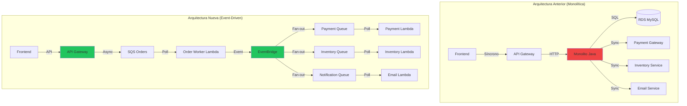
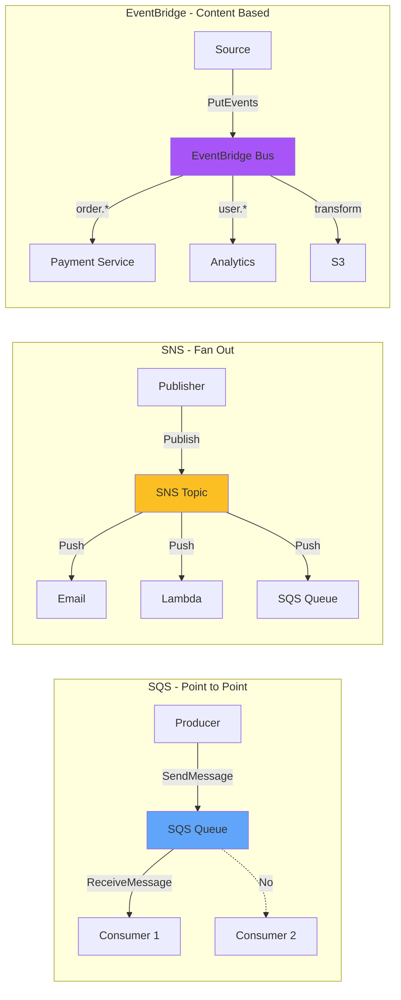
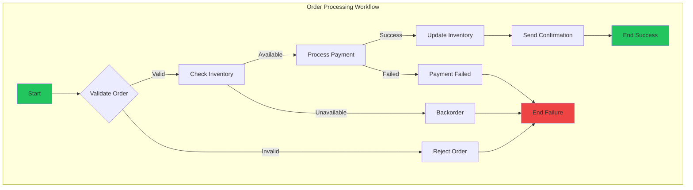
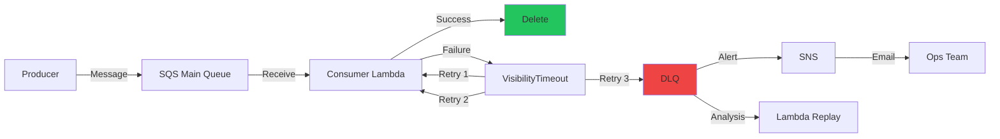
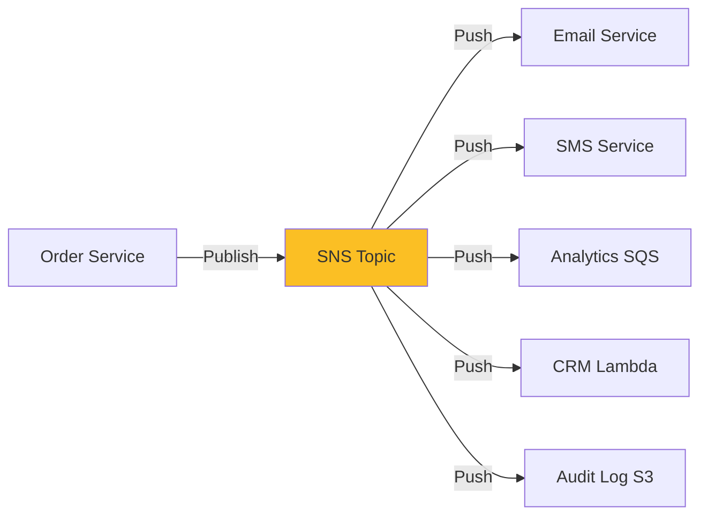
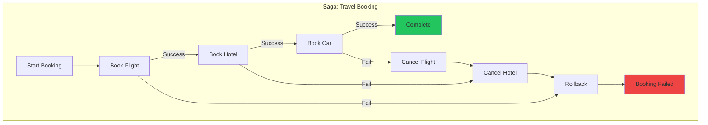

# Capítulo 6: Servicios de Integración y Orquestación en AWS

## Escenario Práctico: EventDriven Corp Refactoriza a Arquitectura Asíncrona

EventDriven Corp, una plataforma de e-commerce que procesa 10,000 pedidos diarios, sufría constantes timeouts y caídas durante picos de ventas (Black Friday, hot sales). Su arquitectura monolítica síncrona no escala. Este capítulo documenta la migración completa a arquitectura basada en eventos con código real que puedes implementar hoy.



---

## Diagnóstico Inicial: Métricas del Problema

EventDriven Corp midió su sistema actual antes de migrar:

| Métrica | Valor | Objetivo |
|---------|-------|----------|
| P99 Latency | 8.5 segundos | < 2 segundos |
| Timeout rate | 12% | < 0.1% |
| Throughput máximo | 500 req/min | 5000 req/min |
| Error rate durante picos | 23% | < 1% |
| Costo infraestructura | $12,000/mes | $8,000/mes |

**Problema raíz identificado:** Acoplamiento síncrono entre servicios causa cascada de fallos.

---

## SQS vs SNS vs EventBridge: Cuándo Usar Cada Uno

### Árbol de Decisiones

```
¿Necesitas encolar mensajes para procesamiento asíncrono?
│
├─ SÍ → ¿Requieres orden FIFO exacto?
│   │
│   ├─ SÍ → SQS FIFO Queue
│   │         └─ Throuphput: 300 msg/sec (burst 3,000)
│   │
│   └─ NO → ¿Necesitas DLQ automática?
│       │
│       ├─ SÍ → SQS Standard Queue
│       │         └─ Best effort ordering, at-least-once delivery
│       │
│       └─ NO → Reconsiderar arquitectura
│
└─ NO → ¿Necesitas notificar múltiples suscriptores?
    │
    ├─ SÍ → ¿Es fan-out simple o routing complejo?
    │   │
    │   ├─ Simple fan-out → SNS Topic
    │   │         └─ Email, SMS, Lambda, SQS, HTTP
    │   │
    │   └─ Routing basado en contenido → EventBridge
    │             └─ Reglas complejas, transformación, replay
    │
    └─ NO → Considerar Step Functions para orquestación
```

### Tabla Comparativa Detallada

| Característica | SQS | SNS | EventBridge |
|----------------|-----|-----|-------------|
| **Patrón** | Point-to-point | Pub/Sub | Event Bus |
| **Orden garantizado** | FIFO solo | No | No |
| **Delivery** | At-least-once | At-least-once | At-least-once |
| **Múltiples consumers** | No (competing consumers) | Sí (broadcast) | Sí (routing) |
| **Retención** | 14 días | N/A | 24h default |
| **Transformación** | No | No | Sí |
| **Scheduling** | No | No | Sí |
| **Cross-account** | Sí | Sí | Sí |
| **Precio** | $0.40/million | $0.50/million | $1.00/million |
| **Casos de uso** | Work queues, decoupling | Alerts, fan-out | EDA, SaaS integration |

### Diagrama de Arquitectura: SQS vs SNS vs EventBridge



---

## Implementación Paso a Paso: EventDriven Corp

### Fase 1: SQS - Colas de Pedidos

#### 1.1 Crear Colas SQS

```bash
# Crear cola principal de pedidos
aws sqs create-queue \
    --queue-name orders-processing \
    --attributes '{
        "VisibilityTimeout": "300",
        "MessageRetentionPeriod": "345600",
        "ReceiveMessageWaitTimeSeconds": "20",
        "RedrivePolicy": "{\\\"deadLetterTargetArn\\\":\\\"arn:aws:sqs:us-east-1:ACCOUNT:orders-dlq\\\",\\\"maxReceiveCount\\\":3}",
        "KmsMasterKeyId": "alias/aws/sqs"
    }'

# Crear DLQ (Dead Letter Queue)
aws sqs create-queue \
    --queue-name orders-dlq \
    --attributes '{
        "MessageRetentionPeriod": "1209600",
        "KmsMasterKeyId": "alias/aws/sqs"
    }'

# Crear cola FIFO para procesamiento ordenado (opcional)
aws sqs create-queue \
    --queue-name orders-processing.fifo \
    --attributes '{
        "FifoQueue": "true",
        "ContentBasedDeduplication": "true",
        "VisibilityTimeout": "300",
        "RedrivePolicy": "{\\\"deadLetterTargetArn\\\":\\\"arn:aws:sqs:us-east-1:ACCOUNT:orders-dlq.fifo\\\",\\\"maxReceiveCount\\\":3}"
    }'
```

#### 1.2 Productor de Mensajes (Node.js)

```javascript
// producers/orderProducer.js
const { SQSClient, SendMessageCommand } = require('@aws-sdk/client-sqs');

const sqsClient = new SQSClient({ region: 'us-east-1' });
const QUEUE_URL = process.env.ORDERS_QUEUE_URL;

class OrderProducer {
    async sendOrder(orderData) {
        const message = {
            orderId: orderData.orderId,
            customerId: orderData.customerId,
            items: orderData.items,
            total: orderData.total,
            timestamp: new Date().toISOString(),
            // Metadata para trazabilidad
            traceId: this.generateTraceId(),
            source: 'web-checkout'
        };

        const params = {
            QueueUrl: QUEUE_URL,
            MessageBody: JSON.stringify(message),
            MessageAttributes: {
                'orderType': {
                    DataType: 'String',
                    StringValue: orderData.items.length > 5 ? 'bulk' : 'standard'
                },
                'priority': {
                    DataType: 'String', 
                    StringValue: orderData.total > 1000 ? 'high' : 'normal'
                }
            }
        };

        // Para colas FIFO, agregar MessageGroupId
        if (QUEUE_URL.includes('.fifo')) {
            params.MessageGroupId = orderData.customerId;
            params.MessageDeduplicationId = orderData.orderId;
        }

        try {
            const result = await sqsClient.send(new SendMessageCommand(params));
            console.log(`Order ${orderData.orderId} sent: ${result.MessageId}`);
            return result.MessageId;
        } catch (error) {
            console.error('Failed to send order:', error);
            throw error;
        }
    }

    generateTraceId() {
        return `${Date.now()}-${Math.random().toString(36).substr(2, 9)}`;
    }

    // Batch send para alta throughput
    async sendOrdersBatch(orders) {
        const { SQSClient, SendMessageBatchCommand } = require('@aws-sdk/client-sqs');
        
        const entries = orders.map((order, index) => ({
            Id: index.toString(),
            MessageBody: JSON.stringify(order),
            MessageAttributes: {
                'orderType': {
                    DataType: 'String',
                    StringValue: 'batch'
                }
            }
        }));

        const params = {
            QueueUrl: QUEUE_URL,
            Entries: entries
        };

        const result = await sqsClient.send(new SendMessageBatchCommand(params));
        
        if (result.Failed && result.Failed.length > 0) {
            console.error('Failed messages:', result.Failed);
        }
        
        return result.Successful;
    }
}

module.exports = OrderProducer;
```

#### 1.3 Consumidor SQS (Python Lambda)

```python
# consumers/order_consumer.py
import json
import boto3
import logging
from decimal import Decimal

logger = logging.getLogger()
logger.setLevel(logging.INFO)

# Clientes AWS
sqs = boto3.client('sqs')
eventbridge = boto3.client('events')
dynamodb = boto3.resource('dynamodb')
orders_table = dynamodb.Table('orders')

QUEUE_URL = 'https://sqs.us-east-1.amazonaws.com/ACCOUNT/orders-processing'


def lambda_handler(event, context):
    """
    Procesa mensajes de SQS y enruta a EventBridge.
    """
    processed_orders = []
    failed_orders = []
    
    for record in event['Records']:
        try:
            # Parse message
            message = json.loads(record['body'])
            trace_id = message.get('traceId', 'unknown')
            
            logger.info(f"Processing order {message['orderId']}, trace: {trace_id}")
            
            # Validar orden
            if not validate_order(message):
                raise ValueError(f"Invalid order: {message['orderId']}")
            
            # Guardar en DynamoDB
            save_order_to_db(message)
            
            # Publicar evento para downstream services
            publish_order_created_event(message)
            
            processed_orders.append(message['orderId'])
            
        except Exception as e:
            logger.error(f"Failed to process order: {e}")
            failed_orders.append({
                'orderId': message.get('orderId', 'unknown'),
                'error': str(e),
                'receiptHandle': record['receiptHandle']
            })
    
    # Manejar fallos
    if failed_orders:
        logger.warning(f"Failed to process {len(failed_orders)} orders")
        # Los mensajes fallidos volverán a la cola (visibility timeout)
        # Después de 3 intentos, van a DLQ
    
    return {
        'statusCode': 200,
        'body': json.dumps({
            'processed': len(processed_orders),
            'failed': len(failed_orders)
        })
    }


def validate_order(order):
    """Valida estructura de orden."""
    required_fields = ['orderId', 'customerId', 'items', 'total']
    return all(field in order for field in required_fields)


def save_order_to_db(order):
    """Guarda orden en DynamoDB."""
    item = {
        'orderId': order['orderId'],
        'customerId': order['customerId'],
        'items': order['items'],
        'total': Decimal(str(order['total'])),
        'status': 'PENDING',
        'createdAt': order['timestamp'],
        'traceId': order.get('traceId', 'unknown')
    }
    
    orders_table.put_item(Item=item)


def publish_order_created_event(order):
    """Publica evento a EventBridge."""
    event = {
        'Source': 'order-service',
        'DetailType': 'order-created',
        'Detail': json.dumps(order),
        'EventBusName': 'eventdriven-events'
    }
    
    eventbridge.put_events(Entries=[event])
```

#### 1.4 CloudFormation: SQS + Lambda

```yaml
AWSTemplateFormatVersion: '2010-09-09'
Description: 'SQS Order Processing Stack'

Resources:
  # Main Queue
  OrdersQueue:
    Type: AWS::SQS::Queue
    Properties:
      QueueName: orders-processing
      VisibilityTimeout: 300
      MessageRetentionPeriod: 345600
      KmsMasterKeyId: alias/aws/sqs
      RedrivePolicy:
        deadLetterTargetArn: !GetAtt OrdersDLQ.Arn
        maxReceiveCount: 3

  # Dead Letter Queue
  OrdersDLQ:
    Type: AWS::SQS::Queue
    Properties:
      QueueName: orders-dlq
      MessageRetentionPeriod: 1209600
      KmsMasterKeyId: alias/aws/sqs

  # Lambda Function
  OrderProcessorFunction:
    Type: AWS::Lambda::Function
    Properties:
      FunctionName: order-processor
      Runtime: python3.11
      Handler: order_consumer.lambda_handler
      Code:
        ZipFile: |
          # Código inline (en producción usar S3)
          def lambda_handler(event, context):
              return {'statusCode': 200}
      Environment:
        Variables:
          QUEUE_URL: !Ref OrdersQueue
          TABLE_NAME: !Ref OrdersTable
      Timeout: 60
      MemorySize: 512
      Role: !GetAtt LambdaExecutionRole.Arn

  # Event Source Mapping (SQS -> Lambda)
  OrderProcessorMapping:
    Type: AWS::Lambda::EventSourceMapping
    Properties:
      EventSourceArn: !GetAtt OrdersQueue.Arn
      FunctionName: !Ref OrderProcessorFunction
      BatchSize: 10
      MaximumBatchingWindowInSeconds: 5
      FunctionResponseTypes:
        - ReportBatchItemFailures

  # DynamoDB Table
  OrdersTable:
    Type: AWS::DynamoDB::Table
    Properties:
      TableName: orders
      BillingMode: PAY_PER_REQUEST
      AttributeDefinitions:
        - AttributeName: orderId
          AttributeType: S
        - AttributeName: customerId
          AttributeType: S
      KeySchema:
        - AttributeName: orderId
          KeyType: HASH
      GlobalSecondaryIndexes:
        - IndexName: customer-index
          KeySchema:
            - AttributeName: customerId
              KeyType: HASH
          Projection:
            ProjectionType: ALL

  # IAM Role
  LambdaExecutionRole:
    Type: AWS::IAM::Role
    Properties:
      AssumeRolePolicyDocument:
        Version: '2012-10-17'
        Statement:
          - Effect: Allow
            Principal:
              Service: lambda.amazonaws.com
            Action: sts:AssumeRole
      ManagedPolicyArns:
        - arn:aws:iam::aws:policy/service-role/AWSLambdaBasicExecutionRole
      Policies:
        - PolicyName: SQSAccess
          PolicyDocument:
            Version: '2012-10-17'
            Statement:
              - Effect: Allow
                Action:
                  - sqs:ReceiveMessage
                  - sqs:DeleteMessage
                  - sqs:GetQueueAttributes
                Resource: !GetAtt OrdersQueue.Arn
              - Effect: Allow
                Action:
                  - dynamodb:PutItem
                  - dynamodb:GetItem
                Resource: !GetAtt OrdersTable.Arn
              - Effect: Allow
                Action:
                  - events:PutEvents
                Resource: '*'

Outputs:
  QueueUrl:
    Description: URL of the orders queue
    Value: !Ref OrdersQueue
  DLQUrl:
    Description: URL of the dead letter queue
    Value: !Ref OrdersDLQ
```

---

## Step Functions: Orquestación de Workflows

### Fase 2: Workflow de Procesamiento de Pedidos

EventDriven Corp implementó un workflow que orquesta múltiples servicios:



### Definición ASL (Amazon States Language)

```json
{
  "Comment": "Order Processing State Machine",
  "StartAt": "ValidateOrder",
  "States": {
    "ValidateOrder": {
      "Type": "Task",
      "Resource": "arn:aws:states:::lambda:invoke",
      "Parameters": {
        "FunctionName": "validate-order-function",
        "Payload": {
          "order.$": "$.order"
        }
      },
      "ResultPath": "$.validation",
      "Next": "IsOrderValid",
      "Catch": [
        {
          "ErrorEquals": ["States.ALL"],
          "Next": "RejectOrder",
          "ResultPath": "$.error"
        }
      ]
    },
    "IsOrderValid": {
      "Type": "Choice",
      "Choices": [
        {
          "Variable": "$.validation.Payload.isValid",
          "BooleanEquals": true,
          "Next": "CheckInventory"
        }
      ],
      "Default": "RejectOrder"
    },
    "CheckInventory": {
      "Type": "Task",
      "Resource": "arn:aws:states:::lambda:invoke",
      "Parameters": {
        "FunctionName": "check-inventory-function",
        "Payload": {
          "items.$": "$.order.items"
        }
      },
      "ResultPath": "$.inventory",
      "Next": "IsInventoryAvailable",
      "Retry": [
        {
          "ErrorEquals": ["Lambda.ServiceException", "Lambda.AWSLambdaException"],
          "IntervalSeconds": 2,
          "MaxAttempts": 3,
          "BackoffRate": 2
        }
      ]
    },
    "IsInventoryAvailable": {
      "Type": "Choice",
      "Choices": [
        {
          "Variable": "$.inventory.Payload.available",
          "BooleanEquals": true,
          "Next": "ProcessPayment"
        }
      ],
      "Default": "CreateBackorder"
    },
    "ProcessPayment": {
      "Type": "Task",
      "Resource": "arn:aws:states:::lambda:invoke",
      "Parameters": {
        "FunctionName": "process-payment-function",
        "Payload": {
          "amount.$": "$.order.total",
          "customerId.$": "$.order.customerId",
          "orderId.$": "$.order.orderId"
        }
      },
      "ResultPath": "$.payment",
      "Next": "IsPaymentSuccessful",
      "Catch": [
        {
          "ErrorEquals": ["PaymentFailed"],
          "Next": "HandlePaymentFailure"
        }
      ]
    },
    "IsPaymentSuccessful": {
      "Type": "Choice",
      "Choices": [
        {
          "Variable": "$.payment.Payload.status",
          "StringEquals": "SUCCESS",
          "Next": "ReserveInventory"
        }
      ],
      "Default": "HandlePaymentFailure"
    },
    "ReserveInventory": {
      "Type": "Task",
      "Resource": "arn:aws:states:::lambda:invoke",
      "Parameters": {
        "FunctionName": "reserve-inventory-function",
        "Payload": {
          "items.$": "$.order.items",
          "orderId.$": "$.order.orderId"
        }
      },
      "ResultPath": "$.reservation",
      "Next": "SendConfirmation"
    },
    "SendConfirmation": {
      "Type": "Parallel",
      "Branches": [
        {
          "StartAt": "EmailConfirmation",
          "States": {
            "EmailConfirmation": {
              "Type": "Task",
              "Resource": "arn:aws:states:::lambda:invoke",
              "Parameters": {
                "FunctionName": "send-email-function",
                "Payload": {
                  "template": "order-confirmation",
                  "customerId.$": "$.order.customerId",
                  "orderId.$": "$.order.orderId"
                }
              },
              "End": true
            }
          }
        },
        {
          "StartAt": "SMSNotification",
          "States": {
            "SMSNotification": {
              "Type": "Task",
              "Resource": "arn:aws:states:::lambda:invoke",
              "Parameters": {
                "FunctionName": "send-sms-function",
                "Payload": {
                  "message": "Your order has been confirmed!",
                  "customerId.$": "$.order.customerId"
                }
              },
              "End": true
            }
          }
        }
      ],
      "Next": "OrderSuccess"
    },
    "OrderSuccess": {
      "Type": "Succeed"
    },
    "RejectOrder": {
      "Type": "Task",
      "Resource": "arn:aws:states:::lambda:invoke",
      "Parameters": {
        "FunctionName": "log-rejection-function",
        "Payload": {
          "order.$": "$.order",
          "reason": "Validation failed"
        }
      },
      "Next": "OrderFailed"
    },
    "CreateBackorder": {
      "Type": "Task",
      "Resource": "arn:aws:states:::lambda:invoke",
      "Parameters": {
        "FunctionName": "create-backorder-function",
        "Payload": {
          "order.$": "$.order"
        }
      },
      "Next": "OrderFailed"
    },
    "HandlePaymentFailure": {
      "Type": "Task",
      "Resource": "arn:aws:states:::lambda:invoke",
      "Parameters": {
        "FunctionName": "payment-failure-handler",
        "Payload": {
          "order.$": "$.order",
          "error.$": "$.error"
        }
      },
      "Next": "OrderFailed"
    },
    "OrderFailed": {
      "Type": "Fail",
      "Error": "OrderProcessingFailed",
      "Cause": "Order could not be processed"
    }
  }
}
```

### CloudFormation: Step Functions

```yaml
AWSTemplateFormatVersion: '2010-09-09'
Description: 'Order Processing State Machine'

Resources:
  OrderStateMachine:
    Type: AWS::StepFunctions::StateMachine
    Properties:
      StateMachineName: order-processing-workflow
      RoleArn: !GetAtt StateMachineRole.Arn
      Type: STANDARD
      DefinitionString: !Sub |
        {
          "Comment": "Order Processing State Machine",
          "StartAt": "ValidateOrder",
          "States": {
            "ValidateOrder": {
              "Type": "Task",
              "Resource": "arn:aws:states:::lambda:invoke",
              "Parameters": {
                "FunctionName": "validate-order-function",
                "Payload": {
                  "order.$": "$.order"
                }
              },
              "ResultPath": "$.validation",
              "Next": "CheckResult"
            },
            "CheckResult": {
              "Type": "Choice",
              "Choices": [
                {
                  "Variable": "$.validation.Payload.isValid",
                  "BooleanEquals": true,
                  "Next": "ProcessOrder"
                }
              ],
              "Default": "OrderFailed"
            },
            "ProcessOrder": {
              "Type": "Succeed"
            },
            "OrderFailed": {
              "Type": "Fail",
              "Error": "OrderProcessingFailed"
            }
          }
        }
      LoggingConfiguration:
        Level: ALL
        IncludeExecutionData: true
        Destinations:
          - CloudWatchLogsLogGroup:
              LogGroupArn: !GetAtt StateMachineLogGroup.Arn

  StateMachineLogGroup:
    Type: AWS::Logs::LogGroup
    Properties:
      LogGroupName: /aws/stepfunctions/order-processing
      RetentionInDays: 30

  StateMachineRole:
    Type: AWS::IAM::Role
    Properties:
      AssumeRolePolicyDocument:
        Version: '2012-10-17'
        Statement:
          - Effect: Allow
            Principal:
              Service: states.amazonaws.com
            Action: sts:AssumeRole
      Policies:
        - PolicyName: LambdaInvoke
          PolicyDocument:
            Version: '2012-10-17'
            Statement:
              - Effect: Allow
                Action:
                  - lambda:InvokeFunction
                Resource: '*'
        - PolicyName: CloudWatchLogs
          PolicyDocument:
            Version: '2012-10-17'
            Statement:
              - Effect: Allow
                Action:
                  - logs:CreateLogDelivery
                  - logs:GetLogDelivery
                  - logs:UpdateLogDelivery
                  - logs:DeleteLogDelivery
                  - logs:ListLogDeliveries
                  - logs:PutResourcePolicy
                  - logs:DescribeResourcePolicies
                  - logs:DescribeLogGroups
                Resource: '*'

Outputs:
  StateMachineArn:
    Description: ARN of the state machine
    Value: !Ref OrderStateMachine
```

---

## Dead Letter Queues en Práctica

### Arquitectura DLQ de EventDriven Corp



### Implementación de DLQ

```bash
# Configuración de DLQ con CLI
aws sqs set-queue-attributes \
    --queue-url https://sqs.us-east-1.amazonaws.com/ACCOUNT/orders-processing \
    --attributes '{
        "RedrivePolicy": "{\\\"deadLetterTargetArn\\\":\\\"arn:aws:sqs:us-east-1:ACCOUNT:orders-dlq\\\",\\\"maxReceiveCount\\\":3}",
        "VisibilityTimeout": "300"
    }'

# Ver mensajes en DLQ
aws sqs receive-message \
    --queue-url https://sqs.us-east-1.amazonaws.com/ACCOUNT/orders-dlq \
    --attribute-names All \
    --message-attribute-names All \
    --max-number-of-messages 10
```

### Lambda para Reprocesar DLQ

```python
# dlq_reprocessor.py
import json
import boto3
from datetime import datetime

sqs = boto3.client('sqs')

DLQ_URL = 'https://sqs.us-east-1.amazonaws.com/ACCOUNT/orders-dlq'
MAIN_QUEUE_URL = 'https://sqs.us-east-1.amazonaws.com/ACCOUNT/orders-processing'


def lambda_handler(event, context):
    """
    Reprocesa mensajes de DLQ.
    Útil después de fixear un bug.
    """
    messages = []
    
    # Leer mensajes de DLQ (hasta 10)
    response = sqs.receive_message(
        QueueUrl=DLQ_URL,
        MaxNumberOfMessages=10,
        VisibilityTimeout=300,
        AttributeNames=['All']
    )
    
    if 'Messages' not in response:
        return {
            'statusCode': 200,
            'body': json.dumps('No messages in DLQ')
        }
    
    for message in response['Messages']:
        try:
            # Parse body original
            body = json.loads(message['Body'])
            
            # Agregar metadata de reprocesamiento
            if 'dlqMetadata' not in body:
                body['dlqMetadata'] = {
                    'originalTimestamp': message['Attributes']['SentTimestamp'],
                    'retryCount': 0
                }
            
            body['dlqMetadata']['retryCount'] += 1
            body['dlqMetadata']['reprocessedAt'] = datetime.utcnow().isoformat()
            
            # Reenviar a cola principal
            sqs.send_message(
                QueueUrl=MAIN_QUEUE_URL,
                MessageBody=json.dumps(body),
                MessageAttributes=message.get('MessageAttributes', {})
            )
            
            # Eliminar de DLQ
            sqs.delete_message(
                QueueUrl=DLQ_URL,
                ReceiptHandle=message['ReceiptHandle']
            )
            
            messages.append({
                'messageId': message['MessageId'],
                'status': 'reprocessed'
            })
            
        except Exception as e:
            print(f"Failed to reprocess message {message['MessageId']}: {e}")
            messages.append({
                'messageId': message['MessageId'],
                'status': 'failed',
                'error': str(e)
            })
    
    return {
        'statusCode': 200,
        'body': json.dumps({
            'reprocessed': len([m for m in messages if m['status'] == 'reprocessed']),
            'failed': len([m for m in messages if m['status'] == 'failed']),
            'messages': messages
        })
    }
```

---

## Patrones de Arquitectura

### Patrón 1: Fan-Out con SNS



```yaml
AWSTemplateFormatVersion: '2010-09-09'
Resources:
  OrderTopic:
    Type: AWS::SNS::Topic
    Properties:
      TopicName: orders-created
      DisplayName: Orders Created
      FifoTopic: false
      KmsMasterKeyId: alias/aws/sns

  # Suscripción Email
  EmailSubscription:
    Type: AWS::SNS::Subscription
    Properties:
      Protocol: email
      Endpoint: ops@eventdriven.com
      TopicArn: !Ref OrderTopic

  # Suscripción Lambda
  LambdaSubscription:
    Type: AWS::SNS::Subscription
    Properties:
      Protocol: lambda
      Endpoint: !GetAtt CRMSyncFunction.Arn
      TopicArn: !Ref OrderTopic
      FilterPolicy:
        orderType:
          - premium
          - enterprise

  # Suscripción SQS con DLQ
  SQSQueue:
    Type: AWS::SQS::Queue
    Properties:
      QueueName: orders-analytics

  SqsSubscription:
    Type: AWS::SNS::Subscription
    Properties:
      Protocol: sqs
      Endpoint: !GetAtt SQSQueue.Arn
      TopicArn: !Ref OrderTopic
      RawMessageDelivery: true
```

### Patrón 2: Saga Pattern con Step Functions



```json
{
  "Comment": "Travel Booking Saga",
  "StartAt": "BookFlight",
  "States": {
    "BookFlight": {
      "Type": "Task",
      "Resource": "arn:aws:states:::lambda:invoke",
      "Parameters": {
        "FunctionName": "book-flight-function"
      },
      "ResultPath": "$.flight",
      "Next": "BookHotel",
      "Catch": [
        {
          "ErrorEquals": ["States.ALL"],
          "Next": "BookingFailed",
          "ResultPath": "$.error"
        }
      ]
    },
    "BookHotel": {
      "Type": "Task",
      "Resource": "arn:aws:states:::lambda:invoke",
      "Parameters": {
        "FunctionName": "book-hotel-function"
      },
      "ResultPath": "$.hotel",
      "Next": "BookCar",
      "Catch": [
        {
          "ErrorEquals": ["States.ALL"],
          "Next": "CancelFlight",
          "ResultPath": "$.error"
        }
      ]
    },
    "BookCar": {
      "Type": "Task",
      "Resource": "arn:aws:states:::lambda:invoke",
      "Parameters": {
        "FunctionName": "book-car-function"
      },
      "ResultPath": "$.car",
      "Next": "BookingSuccess",
      "Catch": [
        {
          "ErrorEquals": ["States.ALL"],
          "Next": "CompensateHotelAndFlight",
          "ResultPath": "$.error"
        }
      ]
    },
    "CompensateHotelAndFlight": {
      "Type": "Parallel",
      "Branches": [
        {
          "StartAt": "CancelHotel",
          "States": {
            "CancelHotel": {
              "Type": "Task",
              "Resource": "arn:aws:states:::lambda:invoke",
              "Parameters": {
                "FunctionName": "cancel-hotel-function",
                "Payload": {
                  "reservationId.$": "$.hotel.reservationId"
                }
              },
              "End": true
            }
          }
        },
        {
          "StartAt": "CancelFlight",
          "States": {
            "CancelFlight": {
              "Type": "Task",
              "Resource": "arn:aws:states:::lambda:invoke",
              "Parameters": {
                "FunctionName": "cancel-flight-function",
                "Payload": {
                  "reservationId.$": "$.flight.reservationId"
                }
              },
              "End": true
            }
          }
        }
      ],
      "Next": "BookingFailed"
    },
    "CancelFlight": {
      "Type": "Task",
      "Resource": "arn:aws:states:::lambda:invoke",
      "Parameters": {
        "FunctionName": "cancel-flight-function"
      },
      "Next": "BookingFailed"
    },
    "BookingSuccess": {
      "Type": "Succeed"
    },
    "BookingFailed": {
      "Type": "Fail",
      "Error": "BookingFailed",
      "Cause": "Booking could not be completed"
    }
  }
}
```

### Patrón 3: Circuit Breaker

```python
# circuit_breaker.py
import json
import boto3
from datetime import datetime, timedelta

dynamodb = boto3.resource('dynamodb')
circuit_table = dynamodb.Table('circuit-breakers')

class CircuitBreaker:
    def __init__(self, service_name, failure_threshold=5, timeout=60):
        self.service_name = service_name
        self.failure_threshold = failure_threshold
        self.timeout = timeout
        self.state = self.get_state()
    
    def get_state(self):
        response = circuit_table.get_item(
            Key={'serviceName': self.service_name}
        )
        if 'Item' in response:
            return response['Item']
        return {
            'serviceName': self.service_name,
            'state': 'CLOSED',
            'failureCount': 0,
            'lastFailureTime': None
        }
    
    def can_execute(self):
        if self.state['state'] == 'OPEN':
            last_failure = self.state.get('lastFailureTime')
            if last_failure:
                last_failure = datetime.fromisoformat(last_failure)
                if datetime.utcnow() - last_failure > timedelta(seconds=self.timeout):
                    self.state['state'] = 'HALF_OPEN'
                    self.update_state()
                    return True
            return False
        return True
    
    def record_success(self):
        self.state['failureCount'] = 0
        self.state['state'] = 'CLOSED'
        self.update_state()
    
    def record_failure(self):
        self.state['failureCount'] += 1
        self.state['lastFailureTime'] = datetime.utcnow().isoformat()
        
        if self.state['failureCount'] >= self.failure_threshold:
            self.state['state'] = 'OPEN'
        
        self.update_state()
    
    def update_state(self):
        circuit_table.put_item(Item=self.state)


def lambda_handler(event, context):
    cb = CircuitBreaker('payment-service')
    
    if not cb.can_execute():
        return {
            'statusCode': 503,
            'body': json.dumps('Payment service unavailable')
        }
    
    try:
        # Call external service
        result = call_payment_service(event)
        cb.record_success()
        return result
    except Exception as e:
        cb.record_failure()
        return {
            'statusCode': 500,
            'body': json.dumps(f'Payment failed: {str(e)}')
        }
```

---

## EventBridge: Routing Avanzado

### Configuración de EventBus

```yaml
AWSTemplateFormatVersion: '2010-09-09'
Description: 'EventBridge Configuration'

Resources:
  EventBus:
    Type: AWS::Events::EventBus
    Properties:
      Name: eventdriven-events
      EventBusPolicy:
        Statement:
          - Sid: AllowCrossAccountAccess
            Effect: Allow
            Principal:
              AWS: !Sub 'arn:aws:iam::${AWS::AccountId}:root'
            Action: events:PutEvents
            Resource: !GetAtt EventBus.Arn

  # Rule: High Value Orders
  HighValueOrderRule:
    Type: AWS::Events::Rule
    Properties:
      Name: high-value-orders
      Description: Route orders > $1000 to priority processing
      EventBusName: !Ref EventBus
      EventPattern:
        source:
          - order-service
        detail-type:
          - order-created
        detail:
          total:
            - numeric:
                - '>'
                - 1000
      Targets:
        - Id: PriorityQueue
          Arn: !GetAtt PriorityQueue.Arn
          InputTransformer:
            InputPathsMap:
              orderId: "$.detail.orderId"
              total: "$.detail.total"
              customerId: "$.detail.customerId"
            InputTemplate: |
              {
                "orderId": <orderId>,
                "priority": "HIGH",
                "total": <total>,
                "requiresManualReview": true
              }

  # Rule: Failed Payments
  FailedPaymentRule:
    Type: AWS::Events::Rule
    Properties:
      Name: failed-payments
      EventBusName: !Ref EventBus
      EventPattern:
        source:
          - payment-service
        detail-type:
          - payment-failed
      Targets:
        - Id: DLQueue
          Arn: !GetAtt FailedPaymentQueue.Arn
        - Id: AlertLambda
          Arn: !GetAtt AlertFunction.Arn

  PriorityQueue:
    Type: AWS::SQS::Queue
    Properties:
      QueueName: priority-orders

  FailedPaymentQueue:
    Type: AWS::SQS::Queue
    Properties:
      QueueName: failed-payments

  AlertFunction:
    Type: AWS::Lambda::Function
    Properties:
      FunctionName: payment-alert
      Runtime: python3.11
      Handler: index.handler
      Code:
        ZipFile: |
          import boto3
          def handler(event, context):
              print("Payment failed alert:", event)
              return {'statusCode': 200}
      Role: !GetAtt LambdaRole.Arn

  LambdaRole:
    Type: AWS::IAM::Role
    Properties:
      AssumeRolePolicyDocument:
        Version: '2012-10-17'
        Statement:
          - Effect: Allow
            Principal:
              Service: lambda.amazonaws.com
            Action: sts:AssumeRole
      ManagedPolicyArns:
        - arn:aws:iam::aws:policy/service-role/AWSLambdaBasicExecutionRole
```

---

## Anti-Patrones y Soluciones

| Anti-Patrón | Problema | Solución |
|-------------|----------|----------|
| **SQS sin DLQ** | Mensajes fallidos reintentan infinitamente | Configurar RedrivePolicy con maxReceiveCount=3 |
| **SNS sin filtrado** | Todos los suscriptores reciben todo | Usar FilterPolicy en suscripciones |
| **Step Functions sin retry** | Fallos transitorios matan el workflow | Configurar Retry en tasks |
| **EventBridge sin dead letter** | Eventos perdidos en targets fallidos | Configurar DeadLetterConfig |
| **SQS polling continuo** | Costo innecesario | Usar long polling (WaitTimeSeconds=20) |
| **Mensajes sin idempotency** | Procesamiento duplicado | Implementar idempotency keys |
| **Step Functions Express para workflows largos** | Timeout después de 5 min | Usar Standard workflows |
| **SNS HTTP sin retry** | Webhooks perdidos | Implementar retry con backoff |

---

## Troubleshooting

### Problema: Lambda No Consume Mensajes SQS

```bash
# Diagnóstico
# 1. Verificar event source mapping
aws lambda list-event-source-mappings \
    --function-name order-processor

# 2. Verificar IAM permissions
aws iam simulate-principal-policy \
    --policy-source-arn arn:aws:iam::ACCOUNT:role/lambda-role \
    --action-names sqs:ReceiveMessage sqs:DeleteMessage

# 3. Verificar queue attributes
aws sqs get-queue-attributes \
    --queue-url https://sqs.us-east-1.amazonaws.com/ACCOUNT/orders-processing \
    --attribute-names All

# 4. Verificar CloudWatch Logs
aws logs tail /aws/lambda/order-processor --follow
```

### Problema: Step Functions Timeout

```bash
# Verificar ejecuciones fallidas
aws stepfunctions list-executions \
    --state-machine-arn arn:aws:states:us-east-1:ACCOUNT:stateMachine:order-workflow \
    --status-filter FAILED

# Ver detalle de ejecución fallida
aws stepfunctions get-execution-history \
    --execution-arn arn:aws:states:us-east-1:ACCOUNT:execution:order-workflow:run-id \
    --reverse-order
```

### Problema: EventBridge No Enruta Eventos

```bash
# Test event
aws events put-events --entries '{
    "Source": "test-service",
    "DetailType": "test-event",
    "Detail": "{\"test\": \"data\"}",
    "EventBusName": "eventdriven-events"
}'

# Verificar reglas
aws events list-rules --event-bus-name eventdriven-events

# Verificar targets
aws events list-targets-by-rule \
    --rule high-value-orders \
    --event-bus-name eventdriven-events
```

---

## Ejercicio Práctico: Implementa tu Pipeline

### Laboratorio: Pipeline de Procesamiento de Pedidos

**Objetivo:** Crear un pipeline completo usando SQS, Lambda y EventBridge.

**Duración:** 2 horas

#### Parte 1: Crear Colas SQS (20 min)

```bash
# Tarea 1.1: Crear cola principal y DLQ
aws sqs create-queue --queue-name lab-orders
aws sqs create-queue --queue-name lab-orders-dlq

# Obtener ARN de DLQ
DLQ_ARN=$(aws sqs get-queue-attributes \
    --queue-url https://sqs.us-east-1.amazonaws.com/ACCOUNT/lab-orders-dlq \
    --attribute-names QueueArn --query 'Attributes.QueueArn' --output text)

# Configurar redrive policy
aws sqs set-queue-attributes \
    --queue-url https://sqs.us-east-1.amazonaws.com/ACCOUNT/lab-orders \
    --attributes "{\"RedrivePolicy\":\"{\\\"deadLetterTargetArn\\\":\\\"$DLQ_ARN\\\",\\\"maxReceiveCount\\\":3}\"}"
```

#### Parte 2: Crear Lambda Consumer (30 min)

```python
# lab_consumer.py
import json
import boto3

def lambda_handler(event, context):
    for record in event['Records']:
        message = json.loads(record['body'])
        print(f"Processing: {message}")
        # Aquí iría la lógica de procesamiento
    return {'statusCode': 200}
```

```bash
# Empaquetar y deployar
zip lambda.zip lab_consumer.py
aws lambda create-function \
    --function-name lab-order-consumer \
    --runtime python3.11 \
    --role arn:aws:iam::ACCOUNT:role/lambda-role \
    --handler lab_consumer.lambda_handler \
    --zip-file fileb://lambda.zip
```

#### Parte 3: Conectar SQS a Lambda (20 min)

```bash
# Crear event source mapping
aws lambda create-event-source-mapping \
    --function-name lab-order-consumer \
    --event-source-arn $(aws sqs get-queue-attributes \
        --queue-url https://sqs.us-east-1.amazonaws.com/ACCOUNT/lab-orders \
        --attribute-names QueueArn --query 'Attributes.QueueArn' --output text) \
    --batch-size 10
```

#### Parte 4: Probar el Pipeline (20 min)

```bash
# Enviar mensajes de prueba
for i in {1..10}; do
    aws sqs send-message \
        --queue-url https://sqs.us-east-1.amazonaws.com/ACCOUNT/lab-orders \
        --message-body "{\"orderId\": \"ORDER-$i\", \"amount\": $((RANDOM % 1000))}"
done

# Verificar CloudWatch logs
aws logs tail /aws/lambda/lab-order-consumer
```

#### Parte 5: Crear EventBridge Rule (30 min)

```bash
# Crear EventBus
aws events create-event-bus --name lab-events

# Crear regla
aws events put-rule \
    --name high-value-rule \
    --event-bus lab-events \
    --event-pattern '{"source": ["order-service"], "detail": {"amount": [{"numeric": [">", 500]}]}}'

# Agregar target
aws events put-targets \
    --rule high-value-rule \
    --event-bus lab-events \
    --targets "Id=1,Arn=arn:aws:sns:us-east-1:ACCOUNT:lab-notifications"
```

### Criterios de Éxito

- [ ] SQS cola con DLQ configurada
- [ ] Lambda consumiendo mensajes automáticamente
- [ ] Mensajes de prueba procesados correctamente
- [ ] EventBridge rule filtrando eventos
- [ ] CloudWatch logs mostrando procesamiento

---

## Referencias Rápidas

### Límites de Servicios

| Servicio | Límite | Notas |
|----------|--------|-------|
| SQS Standard | Mensaje: 256KB | Usar S3 para payloads grandes |
| SQS FIFO | 300 msg/sec | Burst: 3,000 msg/sec |
| SNS | Mensaje: 256KB | 12.5M subscripciones por topic |
| EventBridge | Evento: 256KB | 500 eventos/sec por región (default) |
| Step Functions Standard | 1 año | 2,000 ejecuciones paralelas |
| Step Functions Express | 5 min | 100,000 ejecuciones paralelas |

### Costos Estimados

| Escenario | SQS | SNS | EventBridge | Step Functions |
|-----------|-----|-----|-------------|----------------|
| 1M requests/mes | $0.40 | $0.50 | $1.00 | $25 (Standard) |
| 100M requests/mes | $40 | $50 | $100 | $2,500 |
| 1B requests/mes | $400 | $500 | $1,000 | $25,000 |

### Recursos Adicionales

- [AWS SQS Developer Guide](https://docs.aws.amazon.com/AWSSimpleQueueService/latest/SQSDeveloperGuide/)
- [AWS SNS Developer Guide](https://docs.aws.amazon.com/sns/latest/dg/)
- [AWS EventBridge User Guide](https://docs.aws.amazon.com/eventbridge/latest/userguide/)
- [AWS Step Functions Developer Guide](https://docs.aws.amazon.com/step-functions/latest/dg/)
- [AWS Well-Architected: Serverless Applications Lens](https://docs.aws.amazon.com/wellarchitected/latest/serverless-applications-lens/)
