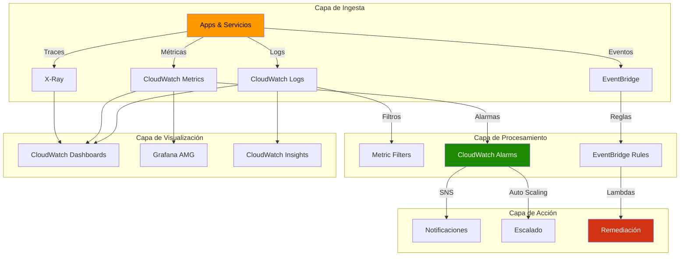
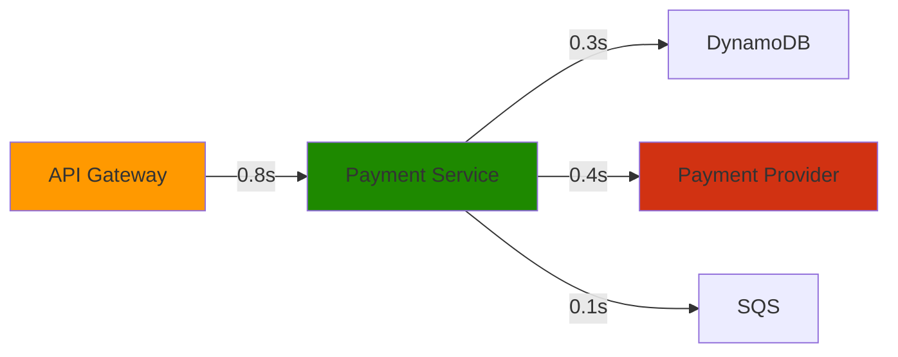

# Capítulo 7: Monitoreo y Gestión en AWS

## Escenario Real: OpsCorp - De "monitoréo manual" a observabilidad proactiva

> **Empresa ficticia para ilustrar decisiones reales**

OpsCorp es una empresa de e-commerce en Perú con 50 microservicios desplegados en ECS. Después de un incidente donde estuvieron 4 horas sin detectar que su sistema de pagos estaba caído (descubrieron por un tweet de cliente), deciden implementar una plataforma de observabilidad completa. Este capítulo sigue su transformación.

---

## Fase 1: Diagnóstico del Caos Actual (Semana 1)

### El Problema
- Logs dispersos en 50 contenedores diferentes
- No hay métricas centralizadas
- Alertas por email que nadie lee
- "Monitoreo" = revisar manualmente cada hora
- Cuando hay incidente: 30 min para identificar el servicio afectado

### Análisis de Madurez Actual

```
┌─────────────────────────────────────────────────────────────┐
│  Nivel de Madurez de Observabilidad                        │
│                                                             │
│  Nivel 1: Reactive ─────► ✅ OpsCorp actual                  │
│  Nivel 2: Proactive ────►                                  │
│  Nivel 3: Predictive ───►                                  │
│  Nivel 4: Autonomous ───►                                  │
└─────────────────────────────────────────────────────────────┘
```

**Métricas actuales (línea base):**
| Métrica | Valor | Objetivo |
|---------|-------|----------|
| MTTD (Mean Time To Detect) | 30 min | < 5 min |
| MTTR (Mean Time To Recover) | 2 horas | < 30 min |
| Alertas falsas/mes | 200 | < 20 |
| Cobertura de observabilidad | 15% | > 95% |

---

## Fase 2: Arquitectura de Observabilidad (Semana 2-3)

### Decisiones de Diseño

```
┌──────────────────────────────────────────────────────────────┐
│  ¿Qué tipo de métricas necesitas recopilar?                  │
│                                                               │
│  Infraestructura AWS ───────► CloudWatch nativo             │
│                                                               │
│  Contenedores/K8s ──────────► CloudWatch Container Insights │
│                         o AMP (Prometheus)                  │
│                                                               │
│  Aplicaciones custom ───────► CloudWatch Agent + SDK        │
│                         o AWS Distro for OpenTelemetry      │
│                                                               │
│  Tracing distribuido ───────► X-Ray                         │
│                         o OpenTelemetry + Jaeger/Zipkin     │
└──────────────────────────────────────────────────────────────┘
```

### Arquitectura Implementada



---

## Fase 3: Implementación Paso a Paso

### Paso 1: Configuración Base de CloudWatch

**CloudFormation - Configuración de Logs Centralizados:**

```yaml
AWSTemplateFormatVersion: '2010-09-09'
Description: 'OpsCorp - CloudWatch Observability Stack'

Parameters:
  Environment:
    Type: String
    Default: production
    AllowedValues: [development, staging, production]
  RetentionDays:
    Type: Number
    Default: 30
    Description: Días de retención de logs

Resources:
  # Grupos de Logs por Servicio
  PaymentServiceLogGroup:
    Type: AWS::Logs::LogGroup
    Properties:
      LogGroupName: !Sub '/opscorp/${Environment}/payment-service'
      RetentionInDays: !Ref RetentionDays
      KmsKeyId: !GetAtt LogEncryptionKey.Arn
      Tags:
        - Key: Service
          Value: payment-service
        - Key: Team
          Value: payments
        - Key: Criticality
          Value: high

  OrderServiceLogGroup:
    Type: AWS::Logs::LogGroup
    Properties:
      LogGroupName: !Sub '/opscorp/${Environment}/order-service'
      RetentionInDays: !Ref RetentionDays
      Tags:
        - Key: Service
          Value: order-service
        - Key: Team
          Value: orders

  InventoryServiceLogGroup:
    Type: AWS::Logs::LogGroup
    Properties:
      LogGroupName: !Sub '/opscorp/${Environment}/inventory-service'
      RetentionInDays: !Ref RetentionDays
      Tags:
        - Key: Service
          Value: inventory-service
        - Key: Team
          Value: logistics

  # Clave KMS para encriptación de logs
  LogEncryptionKey:
    Type: AWS::KMS::Key
    Properties:
      Description: KMS key for CloudWatch Logs encryption
      EnableKeyRotation: true
      KeyPolicy:
        Version: '2012-10-17'
        Statement:
          - Sid: Enable IAM User Permissions
            Effect: Allow
            Principal:
              AWS: !Sub 'arn:aws:iam::${AWS::AccountId}:root'
            Action: 'kms:*'
            Resource: '*'
          - Sid: Allow CloudWatch Logs
            Effect: Allow
            Principal:
              Service: !Sub 'logs.${AWS::Region}.amazonaws.com'
            Action:
              - kms:Encrypt*
              - kms:Decrypt*
              - kms:ReEncrypt*
              - kms:GenerateDataKey*
              - kms:Describe*
            Resource: '*'

  # Filtros métricos para errores críticos
  PaymentErrorMetricFilter:
    Type: AWS::Logs::MetricFilter
    Properties:
      LogGroupName: !Ref PaymentServiceLogGroup
      FilterPattern: '[level="ERROR", msg="*payment*failed*"]'
      MetricTransformations:
        - MetricNamespace: OpsCorp/Payments
          MetricName: PaymentErrors
          MetricValue: '1'
          DefaultValue: 0
          Dimensions:
            - Key: Service
              Value: payment-service
            - Key: Environment
              Value: !Ref Environment

  # SNS Topic para notificaciones
  OpsAlertsTopic:
    Type: AWS::SNS::Topic
    Properties:
      TopicName: !Sub 'opscorp-${Environment}-alerts'
      DisplayName: OpsCorp Alerts
      KmsMasterKeyId: !GetAtt LogEncryptionKey.Arn

  # Subscription para equipo SRE
  SRETeamSubscription:
    Type: AWS::SNS::Subscription
    Properties:
      TopicArn: !Ref OpsAlertsTopic
      Protocol: email
      Endpoint: sre-team@opscorp.pe

Outputs:
  LogGroups:
    Description: Created Log Groups
    Value: !Join ",", [!Ref PaymentServiceLogGroup, !Ref OrderServiceLogGroup]
  AlertTopicArn:
    Description: SNS Topic for alerts
    Value: !Ref OpsAlertsTopic
    Export:
      Name: !Sub '${AWS::StackName}-AlertTopic'
```

### Paso 2: Alarmas Inteligentes

**Decision Tree - Estrategia de Alertas:**

```
┌──────────────────────────────────────────────────────────────┐
│  ¿Cuándo debería activarse una alarma?                       │
│                                                               │
│  Latencia P99 > 2s ───────► CRÍTICO (Página on-call)         │
│                                                               │
│  Latencia P95 > 1s ───────► WARNING (Slack channel)          │
│                                                               │
│  Error rate > 1% ─────────► CRÍTICO                         │
│                                                               │
│  Error rate > 0.1% ───────► WARNING                         │
│                                                               │
│  CPU > 80% por 5 min ─────► AUTO-SCALING                     │
│                                                               │
│  CPU > 95% por 2 min ─────► WARNING + Escalar                │
└──────────────────────────────────────────────────────────────┘
```

**CloudFormation - Alarmas con Detección de Anomalías:**

```yaml
  # Alarma de latencia P99 con anomalía
  ApiLatencyP99Alarm:
    Type: AWS::CloudWatch::Alarm
    Properties:
      AlarmName: !Sub 'opscorp-${Environment}-api-latency-p99-high'
      AlarmDescription: 'API P99 latency is anomalous'
      MetricName: Latency
      Namespace: AWS/ApplicationELB
      Statistic: p99
      Dimensions:
        - Name: LoadBalancer
          Value: !ImportValue ALBFullName
      Period: 60
      EvaluationPeriods: 3
      DatapointsToAlarm: 2
      ThresholdMetricId: anomaly
      ComparisonOperator: GreaterThanUpperThreshold
      TreatMissingData: notBreaching
      AlarmActions:
        - !Ref OpsAlertsTopic
      OKActions:
        - !Ref OpsAlertsTopic
      Tags:
        - Key: Severity
          Value: critical
        - Key: Service
          Value: api-gateway

  # Alarma de errores con math expression
  ErrorRateAlarm:
    Type: AWS::CloudWatch::Alarm
    Properties:
      AlarmName: !Sub 'opscorp-${Environment}-error-rate-high'
      AlarmDescription: 'Error rate > 1% for 2 minutes'
      Metrics:
        - Id: errors
          MetricStat:
            Metric:
              MetricName: HTTPCode_Target_5XX_Count
              Namespace: AWS/ApplicationELB
              Dimensions:
                - Name: LoadBalancer
                  Value: !ImportValue ALBFullName
            Period: 60
            Stat: Sum
          ReturnData: false
        - Id: total
          MetricStat:
            Metric:
              MetricName: RequestCount
              Namespace: AWS/ApplicationELB
              Dimensions:
                - Name: LoadBalancer
                  Value: !ImportValue ALBFullName
            Period: 60
            Stat: Sum
          ReturnData: false
        - Id: error_rate
          Expression: (errors / total) * 100
          Label: ErrorRate
          ReturnData: true
      Threshold: 1
      ComparisonOperator: GreaterThanThreshold
      EvaluationPeriods: 2
      AlarmActions:
        - !Ref OpsAlertsTopic

  # Alarma compuesta - múltiples servicios
  CompositeCriticalAlarm:
    Type: AWS::CloudWatch::Alarm
    Properties:
      AlarmName: !Sub 'opscorp-${Environment}-composite-critical'
      AlarmDescription: 'Multiple critical services failing'
      AlarmRule: |
        ALARM(opscorp-${Environment}-payment-latency-high) AND 
        ALARM(opscorp-${Environment}-order-errors-high)
      AlarmActions:
        - !Ref OpsAlertsTopic
```

### Paso 3: Dashboards Operacionales

**CloudWatch Dashboard JSON (para importación):**

```json
{
  "widgets": [
    {
      "type": "metric",
      "x": 0,
      "y": 0,
      "width": 12,
      "height": 6,
      "properties": {
        "title": "Latencia P99 por Servicio",
        "region": "us-east-1",
        "metrics": [
          ["AWS/ApplicationELB", "TargetResponseTime", 
           "LoadBalancer", "app/opscorp-alb/123", 
           {"stat": "p99", "label": "API Gateway"}],
          ["...", {"stat": "p99", "label": "Payment Service"}],
          ["...", {"stat": "p99", "label": "Order Service"}]
        ],
        "period": 60,
        "yAxis": {
          "left": {"min": 0, "max": 5}
        },
        "annotations": {
          "horizontal": [
            {"value": 2, "label": "SLO: 2s", "color": "#d13212"}
          ]
        }
      }
    },
    {
      "type": "metric",
      "x": 12,
      "y": 0,
      "width": 12,
      "height": 6,
      "properties": {
        "title": "Tasa de Errores (5xx)",
        "region": "us-east-1",
        "metrics": [
          [{"expression": "(m1/m2)*100", "label": "Error Rate %", "id": "e1"}],
          ["AWS/ApplicationELB", "HTTPCode_Target_5XX_Count", 
           "LoadBalancer", "app/opscorp-alb/123", 
           {"id": "m1", "visible": false}],
          [".", "RequestCount", ".", ".", 
           {"id": "m2", "visible": false}]
        ],
        "period": 60,
        "yAxis": {
          "left": {"min": 0, "max": 10}
        }
      }
    },
    {
      "type": "log",
      "x": 0,
      "y": 6,
      "width": 24,
      "height": 6,
      "properties": {
        "title": "Errores en Tiempo Real",
        "query": "SOURCE '/opscorp/production/payment-service' | SOURCE '/opscorp/production/order-service'\n| fields @timestamp, @message, level, service\n| filter level = 'ERROR'\n| sort @timestamp desc\n| limit 100",
        "region": "us-east-1"
      }
    }
  ]
}
```

---

## Fase 4: CloudWatch Insights y Troubleshooting

### Queries de Análisis de Logs

**Análisis de errores por servicio:**

```sql
-- Errores agrupados por servicio y tipo
fields @timestamp, @message, service, errorType
| filter level = 'ERROR'
| parse @message "*Exception: *" as exceptionType, errorDetail
| stats count(*) as errorCount by service, exceptionType
| sort errorCount desc
```

**Análisis de latencia:**

```sql
-- Identificar requests lentos
fields @timestamp, @message, responseTime, endpoint
| filter responseTime > 2000
| stats avg(responseTime) as avgLatency, 
        max(responseTime) as maxLatency, 
        count(*) as slowRequests 
    by endpoint
| sort avgLatency desc
```

**Correlación de errores:**

```sql
-- Encontrar patrones de errores en múltiples servicios
SOURCE '/opscorp/production/payment-service'
SOURCE '/opscorp/production/order-service'
| fields @timestamp, @message, service, traceId
| filter @message like /payment.*failed/ or @message like /order.*error/
| stats earliest(@timestamp) as firstError, 
        latest(@timestamp) as lastError 
    by traceId
| sort firstError asc
```

---

## Fase 5: X-Ray para Tracing Distribuido

### Instrumentación de Aplicación (Node.js)

```javascript
// app.js - Instrumentación X-Ray
const AWSXRay = require('aws-xray-sdk-core');
const AWS = AWSXRay.captureAWS(require('aws-sdk'));
const express = require('express');

const app = express();

// Middleware de X-Ray
app.use(AWSXRay.express.openSegment('PaymentService'));

// Subsegmentos para operaciones críticas
app.post('/api/payments', async (req, res) => {
  const segment = AWSXRay.getSegment();
  
  // Subsegmento para validación
  await segment.addNewSubsegmentAsync('validatePayment', async (subsegment) => {
    subsegment.addAnnotation('userId', req.user.id);
    subsegment.addMetadata('paymentAmount', req.body.amount);
    
    // Validación...
    const isValid = await validatePayment(req.body);
    subsegment.addAnnotation('isValid', isValid);
    
    if (!isValid) {
      subsegment.addError('Payment validation failed');
      throw new Error('Invalid payment');
    }
  });
  
  // Subsegmento para procesamiento
  await segment.addNewSubsegmentAsync('processPayment', async (subsegment) => {
    subsegment.addAnnotation('paymentMethod', req.body.method);
    
    try {
      const result = await processWithProvider(req.body);
      subsegment.addAnnotation('transactionId', result.id);
      return result;
    } catch (error) {
      subsegment.addError(error);
      throw error;
    }
  });
  
  res.json({ success: true });
});

app.use(AWSXRay.express.closeSegment());
```

### X-Ray Service Graph (visualización)



---

## Fase 6: CloudTrail y Auditoría

### Configuración Multi-Cuenta

```yaml
  # Trail organizacional
  OrgCloudTrail:
    Type: AWS::CloudTrail::Trail
    Properties:
      TrailName: opscorp-org-trail
      S3BucketName: !Ref CloudTrailBucket
      IsMultiRegionTrail: true
      EnableLogFileValidation: true
      KMSKeyId: !GetAtt TrailEncryptionKey.Arn
      EventSelectors:
        - ReadWriteType: All
          IncludeManagementEvents: true
          DataResources:
            - Type: AWS::S3::Object
              Values:
                - arn:aws:s3:::opscorp-sensitive-data/
            - Type: AWS::Lambda::Function
              Values:
                - arn:aws:lambda:::function:opscorp-production-
      InsightSelectors:
        - InsightType: ApiCallRateInsight
        - InsightType: ApiErrorRateInsight
      Tags:
        - Key: Purpose
          Value: security-audit

  # Alertas de CloudTrail con EventBridge
  UnauthorizedAPICallsRule:
    Type: AWS::Events::Rule
    Properties:
      Name: unauthorized-api-calls
      Description: Alert on unauthorized API calls
      EventPattern:
        source:
          - aws.cloudtrail
        detail-type:
          - AWS API Call via CloudTrail
        detail:
          errorCode:
            - AccessDenied
            - UnauthorizedOperation
      Targets:
        - Arn: !Ref OpsAlertsTopic
          Id: SecurityTeam
```

---

## Fase 7: AWS Config y Compliance

### Reglas de Conformidad Automáticas

```yaml
  # Regla: S3 buckets deben estar encriptados
  S3EncryptionRule:
    Type: AWS::Config::ConfigRule
    Properties:
      ConfigRuleName: s3-bucket-server-side-encryption-enabled
      Description: Verifies that S3 buckets have encryption enabled
      Source:
        Owner: AWS
        SourceIdentifier: S3_BUCKET_SERVER_SIDE_ENCRYPTION_ENABLED
      Scope:
        ComplianceResourceTypes:
          - AWS::S3::Bucket

  # Regla: Security Groups sin reglas SSH abiertas
  NoOpenSSHRule:
    Type: AWS::Config::ConfigRule
    Properties:
      ConfigRuleName: restricted-ssh
      Description: Checks that security groups don't have SSH open to 0.0.0.0/0
      Source:
        Owner: AWS
        SourceIdentifier: INCOMING_SSH_DISABLED

  # Conformance Pack (conjunto de reglas)
  OpsCorpCompliancePack:
    Type: AWS::Config::ConformancePack
    Properties:
      ConformancePackName: opscorp-security-baseline
      TemplateBody: |
        Resources:
          S3BucketPublicReadProhibited:
            Type: AWS::Config::ConfigRule
            Properties:
              ConfigRuleName: S3BucketPublicReadProhibited
              Source:
                Owner: AWS
                SourceIdentifier: S3_BUCKET_PUBLIC_READ_PROHIBITED
          
          EC2VolumeEncryption:
            Type: AWS::Config::ConfigRule
            Properties:
              ConfigRuleName: ec2-volume-inuse-check
              Source:
                Owner: AWS
                SourceIdentifier: EC2_VOLUME_INUSE_CHECK
              InputParameters:
                Encrypted: "TRUE"

  # Remediación automática
  S3EncryptionRemediation:
    Type: AWS::Config::RemediationConfiguration
    Properties:
      ConfigRuleName: !Ref S3EncryptionRule
      Automatic: true
      MaximumAutomaticAttempts: 3
      RetryAttemptSeconds: 60
      TargetId: AWSConfigRemediation-EnableS3BucketDefaultEncryption
      TargetType: SSM_DOCUMENT
      ResourceType: AWS::S3::Bucket
```

---

## Costos y Optimización

### Comparativa de Retención de Logs

| Retención | Costo/GB/mes | Caso de Uso | Total/mes (100GB) |
|-----------|--------------|-------------|-------------------|
| 1 día | $0.50 | Debugging temporal | $50 |
| 7 días | $0.50 | Desarrollo | $50 |
| 30 días | $0.50 | Producción estándar | $50 |
| 90 días | $0.50 + $0.03 (archivo) | Compliance básico | $53 |
| 1 año | $0.50 + $0.03 | Auditoría | $53 |
| 3 años | $0.50 + $0.03 | Compliance estricto | $53 |
| S3 + Athena | $0.023 (S3) + $0.005 (consulta) | Análisis histórico | $2.3 + consultas |

### Estrategia de Optimización de Costos

```
┌─────────────────────────────────────────────────────────────┐
│  Estrategia: Hot → Warm → Cold                               │
│                                                              │
│  Hot (CloudWatch Logs)                                       │
│  ├── Últimos 7 días: $0.50/GB                               │
│  ├── Búsquedas frecuentes                                   │
│  └── Alertas en tiempo real                                 │
│                                                              │
│  Warm (S3 + Athena)                                         │
│  ├── 7-90 días: $0.023/GB                                   │
│  └── Consultas ocasionales                                  │
│                                                              │
│  Cold (S3 Glacier)                                          │
│  ├── >90 días: $0.004/GB                                    │
│  └── Solo para compliance                                   │
└─────────────────────────────────────────────────────────────┘
```

### CloudFormation - Exportación a S3

```yaml
  LogExportToS3:
    Type: AWS::Logs::SubscriptionFilter
    DependsOn: LogDestinationPolicy
    Properties:
      LogGroupName: !Ref PaymentServiceLogGroup
      FilterPattern: ''
      DestinationArn: !GetAtt LogDestination.Arn

  LogDestination:
    Type: AWS::Logs::Destination
    Properties:
      DestinationName: opscorp-s3-export
      RoleArn: !GetAtt LogsToS3Role.Arn
      TargetArn: !GetAtt LogDeliveryStream.Arn
      DestinationPolicy: !Sub |
        {
          "Version": "2012-10-17",
          "Statement": [{
            "Sid": "AllowLogSubscription",
            "Effect": "Allow",
            "Principal": {"AWS": "${AWS::AccountId}"},
            "Action": "logs:PutSubscriptionFilter",
            "Resource": "arn:aws:logs:${AWS::Region}:${AWS::AccountId}:destination:opscorp-s3-export"
          }]
        }
```

---

## Troubleshooting Guide

### Problema: "No llegan logs a CloudWatch"

```bash
# Checklist de diagnóstico

# 1. Verificar IAM permissions
curl http://169.254.169.254/latest/meta-data/iam/security-credentials/

# 2. Verificar CloudWatch Agent está corriendo
sudo systemctl status amazon-cloudwatch-agent

# 3. Verificar configuración de agent
cat /opt/aws/amazon-cloudwatch-agent/etc/amazon-cloudwatch-agent.json

# 4. Verificar logs del propio agent
sudo cat /opt/aws/amazon-cloudwatch-agent/logs/amazon-cloudwatch-agent.log

# 5. Probar put-log-events manualmente
aws logs put-log-events \
  --log-group-name test-group \
  --log-stream-name test-stream \
  --log-events timestamp=$(date +%s)000,message="test"
```

### Problema: "Alarmas no se disparan"

| Síntoma | Causa Probable | Solución |
|---------|----------------|----------|
| Alarma siempre en INSUFFICIENT_DATA | No hay métricas | Verificar namespace y dimensions |
| Alarma nunca dispara | Umbral incorrecto | Revisar estadística (Average vs Sum) |
| Alarma dispara inmediatamente | Evaluation periods = 1 | Aumentar a 2-3 períodos |
| Datos faltantes = alerta | TreatMissingData | Configurar como `notBreaching` |

---

## Checklist de Producción

### Pre-Deploy
- [ ] Log groups creados con tags consistentes
- [ ] Retención configurada según compliance
- [ ] KMS encryption habilitado para logs sensibles
- [ ] Métricas personalizadas definidas
- [ ] Alarmas con umbrales realistas (no spam)
- [ ] SNS topics con múltiples canales (email + Slack + PagerDuty)
- [ ] Dashboards creados para cada equipo
- [ ] X-Ray instrumentado en servicios críticos
- [ ] CloudTrail habilitado multi-región

### Post-Deploy
- [ ] Verificar logs llegan correctamente
- [ ] Testear alarmas manualmente
- [ ] Validar dashboards muestran datos
- [ ] Confirmar X-Ray traces completos
- [ ] Revisar costos de ingestión de logs
- [ ] Documentar runbooks de alertas

---

## Ejercicios Prácticos

### Ejercicio 1: Dashboard Personalizado
Crear un dashboard de CloudWatch que muestre:
- Latencia P50, P95, P99 de tu aplicación
- Requests por minuto
- Errores 5xx y 4xx
- Costo estimado del servicio

### Ejercicio 2: Query de Logs Avanzada
Escribir una query de CloudWatch Insights que:
- Identifique los 10 endpoints más lentos
- Muestre la distribución de errores por hora
- Correlacione errores con deployment times

### Ejercicio 3: Automatización de Remediación
Crear un EventBridge rule que:
- Detecte cuando una instancia EC2 tiene CPU > 90%
- Ejecute un Systems Manager Automation
- Recolecte logs de diagnóstico
- Envíe notificación al equipo

---

## Resultados Obtenidos por OpsCorp

| Métrica | Antes | Después | Mejora |
|---------|-------|---------|--------|
| MTTD | 30 min | 2 min | 93% |
| MTTR | 2 horas | 15 min | 87% |
| Alertas falsas/mes | 200 | 12 | 94% |
| Cobertura observabilidad | 15% | 98% | 553% |
| Costo mensual logs | - | $450 | - |
| Incidentes detectados proactivamente | 20% | 85% | 325% |

**ROI de la implementación:**
- Costo anual de plataforma: $5,400
- Horas de ingeniería ahorradas: 40h/mes × $50/h = $24,000/año
- Downtime evitado: ~$100,000 en ventas protegidas
- **Payback: < 1 mes**
