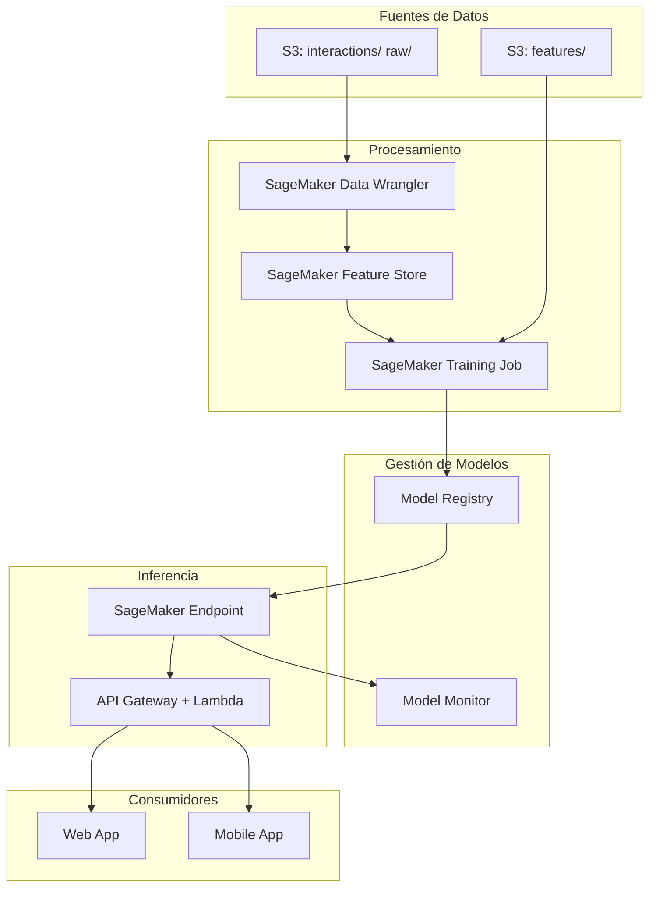

# Capítulo 8: Servicios de IA/ML en AWS

## Escenario Práctico: MLStartup - Sistema de Recomendaciones

**Contexto:** Una startup de e-commerce llamada "MLStartup" necesita implementar un sistema de recomendaciones de productos. Actualmente tienen:
- 500,000 usuarios activos
- 50,000 productos en catálogo
- 10 millones de interacciones usuario-producto al mes
- Presupuesto: $3,000/mes para infraestructura ML

**Objetivo:** Construir un pipeline ML completo que genere recomendaciones personalizadas en tiempo real.

---

## Arquitectura del Pipeline ML



---

## Paso 1: Preparación de Datos en S3

### Estructura de Buckets

```bash
# Crear buckets para el pipeline
aws s3 mb s3://mlstartup-ml-data-$(date +%s)
aws s3 mb s3://mlstartup-ml-models-$(date +%s)
aws s3 mb s3://mlstartup-ml-artifacts-$(date +%s)

# Estructura de carpetas
aws s3api put-object --bucket mlstartup-ml-data --key raw/interactions/
aws s3api put-object --bucket mlstartup-ml-data --key processed/features/
aws s3api put-object --bucket mlstartup-ml-data --key train/
aws s3api put-object --bucket mlstartup-ml-data --key validation/
aws s3api put-object --bucket mlstartup-ml-data --key test/
```

### Formato de Datos de Entrada

```python
# datos_interacciones.csv
# user_id,product_id,rating,timestamp,category,price
# U123,P456,4.5,2024-01-15T10:30:00,electronics,299.99
# U124,P789,3.0,2024-01-15T11:45:00,clothing,49.99

# productos.csv
# product_id,name,category,price,brand,popularity_score
# P456,Smartphone XYZ,electronics,299.99,BrandA,0.85
```

### Script de Preparación Inicial

```python
# prepare_data.py - Ejecutar en SageMaker Studio
import boto3
import pandas as pd
import numpy as np
from sklearn.model_selection import train_test_split

# Configuración
S3_BUCKET = 'mlstartup-ml-data'
RAW_PREFIX = 'raw/interactions/'

def load_and_validate_data(s3_path):
    """Carga datos desde S3 y realiza validación inicial"""
    df = pd.read_csv(s3_path)

    # Validaciones
    assert df['user_id'].notna().all(), "user_id no puede ser nulo"
    assert df['product_id'].notna().all(), "product_id no puede ser nulo"
    assert (df['rating'] >= 0).all() & (df['rating'] <= 5).all(), "rating debe estar entre 0 y 5"

    return df

def create_feature_matrix(df):
    """Crea matriz usuario-producto para filtrado colaborativo"""
    interaction_matrix = df.pivot_table(
        index='user_id',
        columns='product_id',
        values='rating',
        fill_value=0
    )
    return interaction_matrix

# Ejecución
if __name__ == "__main__":
    # Cargar datos
    df = load_and_validate_data(f's3://{S3_BUCKET}/{RAW_PREFIX}interactions.csv')

    # Split 70/15/15
    train_df, temp_df = train_test_split(df, test_size=0.3, random_state=42)
    val_df, test_df = train_test_split(temp_df, test_size=0.5, random_state=42)

    # Guardar particiones
    train_df.to_csv(f's3://{S3_BUCKET}/train/train.csv', index=False)
    val_df.to_csv(f's3://{S3_BUCKET}/validation/validation.csv', index=False)
    test_df.to_csv(f's3://{S3_BUCKET}/test/test.csv', index=False)

    print(f"Dataset preparado:")
    print(f"  Train: {len(train_df)} registros")
    print(f"  Validation: {len(val_df)} registros")
    print(f"  Test: {len(test_df)} registros")
```

---

## Paso 2: Feature Store - Almacenamiento Centralizado

### Definición de Feature Groups

```python
# feature_store_setup.py
import boto3
from sagemaker.feature_store.feature_group import FeatureGroup
from sagemaker.feature_store.inputs import TableFormatEnum

# Feature Group: Usuarios
user_feature_group = FeatureGroup(
    name='user-features',
    sagemaker_session=sagemaker_session
)

user_schema = [
    {'FeatureName': 'user_id', 'FeatureType': 'string'},
    {'FeatureName': 'avg_rating', 'FeatureType': 'fractional'},
    {'FeatureName': 'num_interactions', 'FeatureType': 'integral'},
    {'FeatureName': 'favorite_category', 'FeatureType': 'string'},
    {'FeatureName': 'account_age_days', 'FeatureType': 'integral'},
    {'FeatureName': 'event_time', 'FeatureType': 'string'}
]

# Crear feature group
user_feature_group.create(
    s3_uri=f's3://{S3_BUCKET}/features/users/',
    record_identifier_name='user_id',
    event_time_feature_name='event_time',
    role_arn=sagemaker_execution_role,
    enable_online_store=True,  # Para inferencia en tiempo real
    offline_store_kms_key_id=None,
    table_format=TableFormatEnum.ICEBERG
)

# Feature Group: Productos
product_feature_group = FeatureGroup(
    name='product-features',
    sagemaker_session=sagemaker_session
)

product_schema = [
    {'FeatureName': 'product_id', 'FeatureType': 'string'},
    {'FeatureName': 'category', 'FeatureType': 'string'},
    {'FeatureName': 'price', 'FeatureType': 'fractional'},
    {'FeatureName': 'popularity_score', 'FeatureType': 'fractional'},
    {'FeatureName': 'avg_rating', 'FeatureType': 'fractional'},
    {'FeatureName': 'num_reviews', 'FeatureType': 'integral'},
    {'FeatureName': 'event_time', 'FeatureType': 'string'}
]
```

### Ingesta de Features

```python
# ingest_features.py
from sagemaker.feature_store.feature_store import FeatureStore

featurestore = FeatureStore(
    sagemaker_session=sagemaker_session
)

# Calcular features de usuario
user_features = df.groupby('user_id').agg({
    'rating': 'mean',
    'product_id': 'count',
    'category': lambda x: x.mode()[0] if not x.mode().empty else 'unknown'
}).reset_index()

user_features.columns = ['user_id', 'avg_rating', 'num_interactions', 'favorite_category']
user_features['event_time'] = pd.Timestamp.now().strftime('%Y-%m-%dT%H:%M:%SZ')

# Ingesta batch a Feature Store
featurestore.ingest_data(
    feature_group_name='user-features',
    data_frame=user_features,
    max_workers=4
)
```

---

## Paso 3: Entrenamiento del Modelo

### Script de Entrenamiento (XGBoost)

```python
# train_recommender.py - Script para SageMaker Training Job
import xgboost as xgb
import pandas as pd
import numpy as np
import boto3
import os
import json

# Variables de entorno de SageMaker
TRAIN_PATH = os.environ.get('SM_CHANNEL_TRAIN', '/opt/ml/input/data/train')
VALIDATION_PATH = os.environ.get('SM_CHANNEL_VALIDATION', '/opt/ml/input/data/validation')
MODEL_PATH = os.environ.get('SM_MODEL_DIR', '/opt/ml/model')
OUTPUT_PATH = os.environ.get('SM_OUTPUT_DATA_DIR', '/opt/ml/output')

def load_and_preprocess():
    """Carga y prepara datos para entrenamiento"""
    train_df = pd.read_csv(f'{TRAIN_PATH}/train.csv')
    val_df = pd.read_csv(f'{VALIDATION_PATH}/validation.csv')

    # Features engineering
    feature_cols = ['user_encoded', 'product_encoded', 'category_encoded', 'price_normalized']

    # Crear mappings
    user_to_idx = {u: i for i, u in enumerate(train_df['user_id'].unique())}
    product_to_idx = {p: i for i, p in enumerate(train_df['product_id'].unique())}

    # Transformar
    train_df['user_encoded'] = train_df['user_id'].map(user_to_idx)
    train_df['product_encoded'] = train_df['product_id'].map(product_to_idx)
    val_df['user_encoded'] = val_df['user_id'].map(user_to_idx)
    val_df['product_encoded'] = val_df['product_id'].map(product_to_idx)

    return train_df, val_df, user_to_idx, product_to_idx

def train_model(train_df, val_df):
    """Entrena modelo XGBoost de recomendación"""
    feature_cols = ['user_encoded', 'product_encoded']

    dtrain = xgb.DMatrix(
        train_df[feature_cols],
        label=train_df['rating'],
        enable_categorical=True
    )
    dval = xgb.DMatrix(
        val_df[feature_cols],
        label=val_df['rating'],
        enable_categorical=True
    )

    params = {
        'objective': 'reg:squarederror',
        'eval_metric': 'rmse',
        'max_depth': 8,
        'eta': 0.1,
        'subsample': 0.8,
        'colsample_bytree': 0.8,
        'min_child_weight': 3,
        'seed': 42
    }

    model = xgb.train(
        params,
        dtrain,
        num_boost_round=1000,
        evals=[(dtrain, 'train'), (dval, 'validation')],
        early_stopping_rounds=50,
        verbose_eval=100
    )

    return model

def save_model(model, user_to_idx, product_to_idx):
    """Guarda modelo y artefactos"""
    # Guardar modelo XGBoost
    model.save_model(f'{MODEL_PATH}/xgboost-model.json')

    # Guardar mappings
    mappings = {
        'user_to_idx': user_to_idx,
        'product_to_idx': product_to_idx
    }
    with open(f'{MODEL_PATH}/mappings.json', 'w') as f:
        json.dump(mappings, f)

    print(f"Modelo guardado en {MODEL_PATH}")

if __name__ == '__main__':
    train_df, val_df, user_to_idx, product_to_idx = load_and_preprocess()
    model = train_model(train_df, val_df)
    save_model(model, user_to_idx, product_to_idx)
```

### Configuración del Job de Entrenamiento

```python
# launch_training_job.py
import sagemaker
from sagemaker.xgboost import XGBoost

# Configuración del estimator
xgb_estimator = XGBoost(
    entry_point='train_recommender.py',
    framework_version='1.7-1',
    instance_type='ml.m5.xlarge',  # $0.192/hora
    instance_count=1,
    output_path=f's3://{S3_BUCKET}/models/',
    code_location=f's3://{S3_BUCKET}/code/',
    role=role,
    sagemaker_session=sagemaker_session,
    hyperparameters={
        'max_depth': 8,
        'eta': 0.1,
        'subsample': 0.8,
        'colsample_bytree': 0.8
    }
)

# Lanzar entrenamiento
xgb_estimator.fit({
    'train': f's3://{S3_BUCKET}/train/',
    'validation': f's3://{S3_BUCKET}/validation/'
})

print(f"Modelo entrenado: {xgb_estimator.latest_training_job.name}")
```

---

## Paso 4: Despliegue y Endpoints

### Opciones de Despliegue

| Opción | Latencia | Costo/1K req | Caso de Uso |
|--------|----------|--------------|-------------|
| **Real-time Endpoint** | <100ms | $0.05-$0.20 | Recs síncronas web |
| **Serverless Inference** | <500ms | $0.0001/invocación | Tráfico variable |
| **Batch Transform** | N/A | $0.05/hr | Recs pre-computadas |
| **Async Inference** | Minutos | $0.05/hr | Procesamiento masivo |

### Despliegue Real-time Endpoint

```python
# deploy_endpoint.py
from sagemaker.model import Model
from sagemaker.serializers import CSVSerializer
from sagemaker.deserializers import JSONDeserializer

# Crear modelo
model = Model(
    model_data='s3://mlstartup-ml-data/models/model.tar.gz',
    image_uri=xgb_estimator.image_uri,
    role=role,
    sagemaker_session=sagemaker_session
)

# Desplegar endpoint
predictor = model.deploy(
    initial_instance_count=1,
    instance_type='ml.m5.large',  # $0.115/hora
    endpoint_name='recommender-endpoint-v1',
    serializer=CSVSerializer(),
    deserializer=JSONDeserializer()
)

print(f"Endpoint desplegado: {predictor.endpoint_name}")
```

### Script de Inferencia Personalizado

```python
# inference.py - Script de inference para el endpoint
import json
import numpy as np
import os
import xgboost as xgb

def model_fn(model_dir):
    """Carga el modelo al iniciar el endpoint"""
    model = xgb.Booster()
    model.load_model(os.path.join(model_dir, 'xgboost-model.json'))

    # Cargar mappings
    with open(os.path.join(model_dir, 'mappings.json'), 'r') as f:
        mappings = json.load(f)

    return {'model': model, 'mappings': mappings}

def input_fn(request_body, request_content_type):
    """Parsea input del request"""
    if request_content_type == 'application/json':
        data = json.loads(request_body)
        return data
    raise ValueError(f"Content type {request_content_type} no soportado")

def predict_fn(input_data, model_dict):
    """Realiza predicción"""
    model = model_dict['model']
    mappings = model_dict['mappings']

    user_id = input_data['user_id']
    n_recommendations = input_data.get('n', 5)

    # Obtener índice de usuario
    user_idx = mappings['user_to_idx'].get(user_id)
    if user_idx is None:
        return {'error': 'Usuario no encontrado', 'recommendations': []}

    # Generar predicciones para todos los productos
    product_ids = list(mappings['product_to_idx'].keys())
    product_indices = [mappings['product_to_idx'][p] for p in product_ids]

    # Crear matriz de features
    features = [[user_idx, p_idx] for p_idx in product_indices]
    dmatrix = xgb.DMatrix(features)

    predictions = model.predict(dmatrix)

    # Top N recomendaciones
    top_indices = np.argsort(predictions)[-n_recommendations:][::-1]
    recommendations = [
        {
            'product_id': product_ids[i],
            'predicted_rating': float(predictions[i])
        }
        for i in top_indices
    ]

    return {
        'user_id': user_id,
        'recommendations': recommendations
    }

def output_fn(prediction, response_content_type):
    """Formatea output"""
    return json.dumps(prediction), response_content_type
```

---

## Paso 5: Comparativa - Dónde Correr ML en AWS

### Matriz de Decisión

```
¿Necesitas entrenar modelo personalizado?
│
├─ SÍ → ¿Dataset > 100GB?
│   │
│   ├─ SÍ → SageMaker Training con Spot Instances
│   │   └─ Descuento hasta 90% en instancias de entrenamiento
│   │
│   └─ NO → SageMaker Training estándar
│       │
│       ├─ ¿Framework conocido? (TensorFlow, PyTorch, XGBoost)
│       │   ├─ SÍ → Usar imágenes built-in
│       │   └─ NO → Contenedor personalizado con Docker
│       │
│       └─ ¿Necesitas distributed training?
│           ├─ SÍ → SageMaker Distributed Training
│           └─ NO → Single instance training
│
└─ NO → ¿Necesitas modelo pre-entrenado?
    │
    ├─ SÍ → Amazon AI Services (Rekognition, Comprehend, Personalize)
    │   └─ Solo llamar API - sin gestión de infraestructura
    │
    └─ NO → ¿Inferencia custom simple?
        ├─ SÍ → Lambda + EFS (modelos pequeños <500MB)
        └─ NO → EC2 con GPU propia
```

### Comparativa Detallada: Opciones de Inferencia

| Característica | SageMaker Endpoint | Lambda + EFS | EC2 Auto Scaling | ECS Fargate |
|----------------|-------------------|--------------|------------------|-------------|
| **Setup** | Simple (API/SDK) | Medio | Complejo | Medio |
| **Escalado** | Automático | Automático | Manual/Auto | Automático |
| **Cold Start** | Segundos | ~1s | Minutos | Segundos |
| **Costo Idle** | $/hora instancia | $0 | $/hora instancia | $0 |
| **Model Size** | Ilimitado | <10GB | Ilimitado | Ilimitado |
| **GPU** | Sí | No | Sí | Sí |
| **Multi-model** | Sí (Multi-Model Endpoint) | No | Sí | Sí |
| **Best For** | Producción ML | Modelos ligeros | Control total | Containerizado |

### Costos Estimados (1M predicciones/mes)

```
SageMaker Endpoint (ml.m5.large):
  - Instancia: $0.115/hora × 730 horas = $83.95/mes
  - 1M invocaciones ≈ $10/mes (data processing)
  - TOTAL: ~$94/mes

Lambda + EFS:
  - 1M invocaciones (1s avg): $20/mes
  - EFS (5GB modelo): $3.75/mes
  - TOTAL: ~$24/mes

EC2 Auto Scaling (t3.medium):
  - 2 instancias always-on: $60/mes
  - ALB: $16/mes
  - TOTAL: ~$76/mes
```

---

## Paso 6: MLOps - Pipelines de Despliegue

### SageMaker Pipeline

```python
# mlops_pipeline.py
from sagemaker.workflow.pipeline import Pipeline
from sagemaker.workflow.steps import TrainingStep, ProcessingStep, ConditionStep
from sagemaker.workflow.conditions import ConditionGreaterThanOrEqualTo
from sagemaker.workflow.model_step import ModelStep
from sagemaker.model import Model

# Paso 1: Preprocesamiento
processor = SKLearnProcessor(
    framework_version='1.2-1',
    role=role,
    instance_type='ml.m5.xlarge',
    instance_count=1
)

preprocess_step = ProcessingStep(
    name='PreprocessData',
    processor=processor,
    inputs=[...],
    outputs=[...]
)

# Paso 2: Entrenamiento
train_step = TrainingStep(
    name='TrainModel',
    estimator=xgb_estimator,
    inputs={
        'train': preprocess_step.outputs[0],
        'validation': preprocess_step.outputs[1]
    }
)

# Paso 3: Evaluación
condition_step = ConditionStep(
    name='EvaluateModel',
    conditions=[
        ConditionGreaterThanOrEqualTo(
            left=train_step.properties.ModelMetrics,
            right=0.8
        )
    ],
    if_steps=[deploy_step],
    else_steps=[fail_step]
)

# Pipeline completo
pipeline = Pipeline(
    name='recommender-pipeline',
    steps=[preprocess_step, train_step, condition_step],
    sagemaker_session=sagemaker_session
)

pipeline.upsert(role_arn=role)
```

### Model Monitor - Detección de Drift

```python
# model_monitor.py
from sagemaker.model_monitor import DataCaptureConfig, ModelMonitor

# Configurar captura de datos en endpoint
 data_capture_config = DataCaptureConfig(
    enable_capture=True,
    sampling_percentage=10,  # Capturar 10% de requests
    destination_s3_uri=f's3://{S3_BUCKET}/monitoring/data-capture/'
)

# Actualizar endpoint con data capture
predictor.update_data_capture_config(data_capture_config=data_capture_config)

# Crear baseline para drift detection
from sagemaker.model_monitor import DefaultModelMonitor

monitor = DefaultModelMonitor(
    role=role,
    instance_count=1,
    instance_type='ml.m5.xlarge',
    max_runtime_in_seconds=3600
)

# Generar baseline desde datos de entrenamiento
monitor.suggest_baseline(
    baseline_dataset=f's3://{S3_BUCKET}/train/baseline.csv',
    dataset_format=DatasetFormat.csv(header=True),
    output_s3_uri=f's3://{S3_BUCKET}/monitoring/baseline/',
    wait=True
)

# Schedule de monitoreo
monitor.create_monitoring_schedule(
    monitor_schedule_name='recommender-drift-schedule',
    endpoint_input=predictor.endpoint_name,
    output_s3_uri=f's3://{S3_BUCKET}/monitoring/reports/',
    statistics=monitor.baseline_statistics(),
    constraints=monitor.suggested_constraints(),
    schedule_cron_expression='cron(0 * ? * * *)',  # Cada hora
    enable_cloudwatch_metrics=True
)
```

---

## Paso 7: Debugger - Optimización de Entrenamiento

### Configuración de Debugger

```python
# debugger_config.py
from sagemaker.debugger import DebuggerHookConfig, Rule, rule_configs

# Configurar hooks de debugging
debugger_hook_config = DebuggerHookConfig(
    hook_parameters={
        "train.save_interval": "100",
        "eval.save_interval": "10"
    },
    collection_configs=[
        CollectionConfig(
            name="weights",
            parameters={"save_interval": "500"}
        ),
        CollectionConfig(
            name="gradients",
            parameters={"save_interval": "100"}
        ),
        CollectionConfig(
            name="losses",
            parameters={"save_interval": "10"}
        )
    ]
)

# Reglas automáticas de detección de problemas
rules = [
    Rule.sagemaker(rule_configs.vanishing_gradient()),
    Rule.sagemaker(rule_configs.overfitting()),
    Rule.sagemaker(rule_configs.poor_weight_initialization()),
    Rule.sagemaker(rule_configs.loss_not_decreasing()),
    Rule.sagemaker(
        rule_configs.tensor_variance(),
        rule_parameters={"threshold": "20.0"}
    )
]

# Estimator con debugger
estimator = XGBoost(
    ...,
    debugger_hook_config=debugger_hook_config,
    rules=rules
)
```

### Análisis de Debugging

```python
# analyze_debugging.py
import smdebug.pytorch as smd

# Cargar trial de debugging
trial = smd.create_trial('s3://bucket/debugger-output/')

# Ver tensores disponibles
print(trial.tensor_names())

# Analizar gradientes
gradients = trial.tensor('gradient/fully_connected')
print(f"Gradient stats: min={gradients.min()}, max={gradients.max()}")

# Detectar vanishing gradients
for step in trial.steps():
    grad = gradients.value(step)
    if abs(grad.mean()) < 1e-7:
        print(f"WARNING: Vanishing gradient at step {step}")
```

---

## Checklist de Implementación ML

### Pre-Entrenamiento
- [ ] Datos limpios y validados
- [ ] Feature Store configurado con online/offline store
- [ ] IAM roles con mínimos privilegios
- [ ] Buckets S3 con encriptación
- [ ] Dataset versionado (DVC o SageMaker Experiments)

### Durante Entrenamiento
- [ ] Debugger activado
- [ ] Checkpoints guardados cada N epochs
- [ ] Métricas logueadas en CloudWatch
- [ ] Spot Instances configurados (para ahorro)
- [ ] Early stopping configurado

### Post-Entrenamiento
- [ ] Modelo registrado en Model Registry
- [ ] Métricas de evaluación > threshold
- [ ] A/B testing configurado (si aplica)
- [ ] Model Monitor configurado
- [ ] Rollback plan definido

### Producción
- [ ] Endpoint con auto-scaling
- [ ] Data capture habilitado
- [ ] Alertas de latencia configuradas
- [ ] Backup de endpoints
- [ ] Documentación de modelo

---

## Anti-Patrones Comunes

### ❌ Anti-Patrón 1: Entrenar en Notebook sin Versionado
```python
# MAL - Sin reproducibilidad
df = pd.read_csv('data.csv')
model = RandomForestRegressor()
model.fit(df[features], df[target])
# Guardar manualmente...
```

### ✅ Solución: Training Jobs Versionados
```python
# BIEN - Reproducible y auditado
estimator.fit(
    inputs={'train': 's3://bucket/train/'},
    experiment_config={
        'ExperimentName': 'recommender-v2',
        'TrialName': 'trial-001'
    }
)
```

### ❌ Anti-Patrón 2: Endpoint Sin Auto-scaling
```python
# MAL - Capacidad fija
predictor = model.deploy(initial_instance_count=1, instance_type='ml.m5.xlarge')
# No hay auto-scaling - durante picos se cae o se paga de más
```

### ✅ Solución: Auto-scaling Configurado
```python
# BIEN - Escalado automático
client = boto3.client('application-autoscaling')
client.register_scalable_target(...)
client.put_scaling_policy(
    PolicyName='InvocationsScaling',
    PolicyType='TargetTrackingScaling',
    TargetTrackingScalingPolicyConfiguration={
        'TargetValue': 500.0,  # 500 invocaciones por instancia
        'PredefinedMetricSpecification': {
            'PredefinedMetricType': 'SageMakerVariantInvocationsPerInstance'
        }
    }
)
```

### ❌ Anti-Patrón 3: Feature Engineering en Inferencia
```python
# MAL - Lento y inconsistent
def predict(user_id):
    # Query database cada vez
    user_data = db.query(f"SELECT * FROM users WHERE id={user_id}")
    features = calculate_features(user_data)  # Lento
    return model.predict(features)
```

### ✅ Solución: Feature Store Online
```python
# BIEN - Features pre-computadas y rápidas
from sagemaker.feature_store.feature_store import FeatureStore

featurestore = FeatureStore(sagemaker_session)
features = featurestore.get_record(
    feature_group_name='user-features',
    record_identifier_value_as_string=user_id
)
return model.predict(features)
```

---

## Troubleshooting

### Problema: Entrenamiento Falla por Memoria
```
Error: OOM (Out of Memory) en instancia ml.m5.xlarge
```
**Solución:**
```python
# Reducir batch size o usar instancia con más RAM
# Opciones: ml.m5.2xlarge (32GB), ml.r5.large (16GB)

# O usar distributed training
from sagemaker.xgboost import XGBoost

estimator = XGBoost(
    instance_count=2,  # Distribuir carga
    instance_type='ml.m5.xlarge',
    distribution={'parameter_server': {'enabled': True}}
)
```

### Problema: Latencia Alta en Endpoint
```
P99 latency > 500ms para recomendaciones
```
**Solución:**
```python
# 1. Usar instancia más grande
# 2. Habilitar Elastic Inference
predictor = model.deploy(
    initial_instance_count=1,
    instance_type='ml.m5.large',
    accelerator_type='ml.eia2.medium'  # GPU acelerada
)

# 3. Multi-model endpoint para compartir instancia
# 4. Cache de predicciones frecuentes en ElastiCache
```

### Problema: Model Drift No Detectado
```
Predicciones degradándose gradualmente
```
**Solución:**
```python
# Configurar baseline con datos recientes
monitor.suggest_baseline(
    baseline_dataset='s3://bucket/baseline-current.csv',
    dataset_format=DatasetFormat.csv(header=True)
)

# Alertas en CloudWatch
# Threshold de 0.1 en PSI (Population Stability Index)
```

---

## Ejercicio Práctico: Sistema de Recomendaciones Completo

### Objetivo
Construir un sistema end-to-end que recomiende productos basado en:
- Historial de compras del usuario
- Productos similares (content-based)
- Popularidad en tiempo real

### Requisitos
1. Pipeline de datos con Glue
2. Feature Store para embeddings
3. Modelo híbrido (collaborative + content)
4. Endpoint con A/B testing
5. Dashboard de métricas

### Solución Framework

```python
# Ejercicio: Implementar sistema híbrido

# Paso 1: Preparar embeddings con SageMaker Processing
# (Implementar script de feature engineering)

# Paso 2: Feature Store para user/product embeddings
# (Configurar feature groups)

# Paso 3: Entrenar modelo híbrido
# (Neural Collaborative Filtering + content features)

# Paso 4: Deploy con 2 variantes para A/B testing
# (80/20 traffic split)

# Paso 5: CloudWatch dashboard
# (CTR, conversion rate, latency)
```

### Criterios de Éxito
- [ ] Latencia P99 < 100ms
- [ ] Modelo versionado y reproducible
- [ ] Drift detection activo
- [ ] Costo < $150/mes para 100K usuarios

---

## Referencias

- [SageMaker Developer Guide](https://docs.aws.amazon.com/sagemaker/)
- [Feature Store Best Practices](https://docs.aws.amazon.com/sagemaker/latest/dg/feature-store.html)
- [SageMaker Debugger](https://docs.aws.amazon.com/sagemaker/latest/dg/train-debugger.html)
- [MLOps with SageMaker](https://docs.aws.amazon.com/sagemaker/latest/dg/sagemaker-mlops.html)
