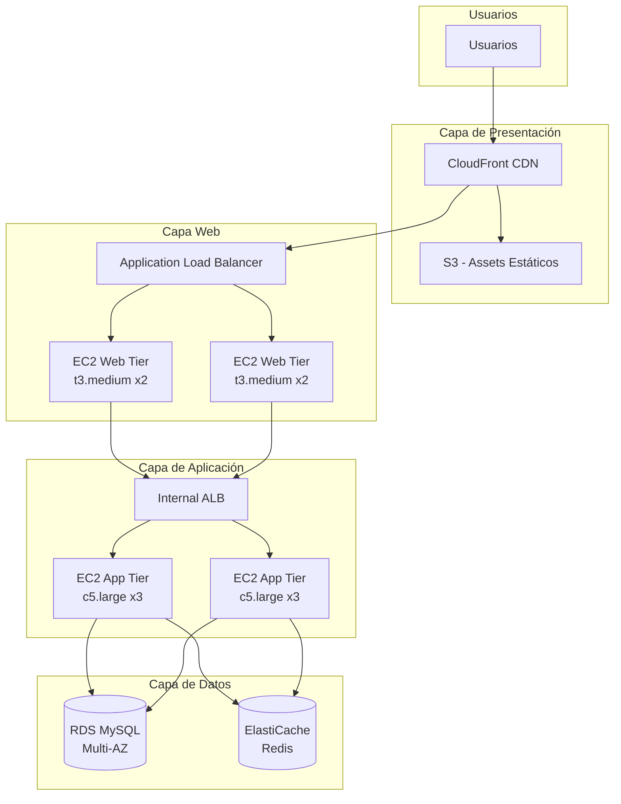
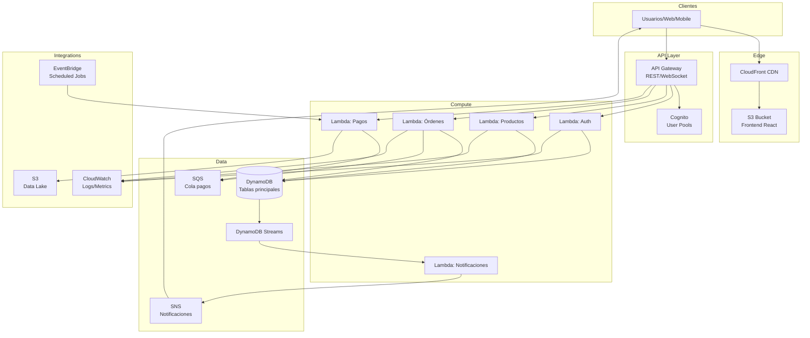
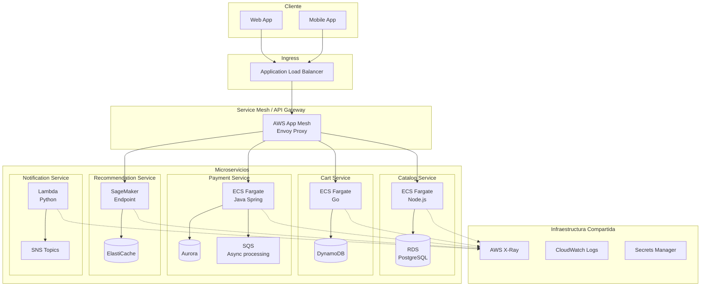
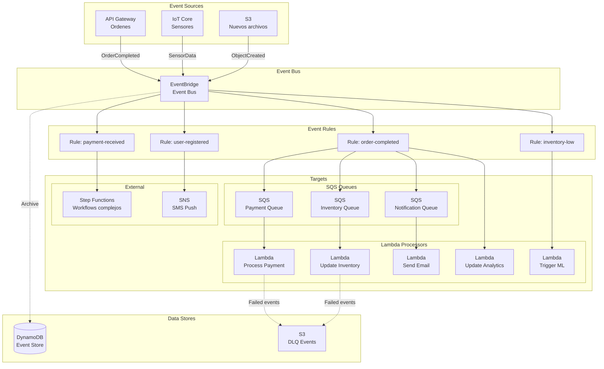
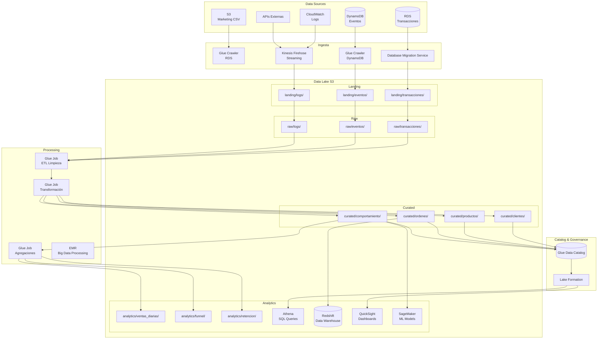

# Capítulo 9: Arquitecturas de Referencia y Casos de Uso en AWS

## Escenario: E-commerce "ShopFast" que necesita evolucionar su arquitectura

**Situación actual:** ShopFast es una tienda online con 50,000 usuarios diarios, 2,000 transacciones/hora en horas pico. Su infraestructura monolítica en un único servidor está mostrando:
- Latencia de 4-8 segundos en checkout
- 3 outages en el último mes durante campañas
- Costo fijo de $8,000/mes sin correlación con tráfico real
- Imposibilidad de escalar componentes individualmente

**Objetivo:** Diseñar arquitecturas modernas que resuelvan estos problemas con patrones probados.

---

## Patrón 1: Arquitectura Web de 3 Niveles (3-Tier)

### Problema Real
El monolito actual tiene frontend, backend y base de datos en una sola instancia EC2. Cuando hay pico de tráfico en el frontend (usuarios navegando), el backend de pagos se ralentiza afectando a todos.

### Solución Arquitectónica
Separación física en tres capas independientes:
- **Nivel Web (Presentación):** Maneja sesiones de usuario, sirve HTML/CSS/JS
- **Nivel Aplicación (Lógica):** Procesa reglas de negocio, APIs
- **Nivel Datos:** Persistencia y consultas

Cada nivel escala independientemente según su cuello de botella específico.

### Diagrama de Arquitectura



### Implementación con CloudFormation

```yaml
# three-tier-architecture.yaml
AWSTemplateFormatVersion: '2010-09-09'
Description: 'Arquitectura 3-Tier para ShopFast'

Parameters:
  VpcCIDR:
    Type: String
    Default: 10.0.0.0/16
    Description: CIDR Block para la VPC
  
  Environment:
    Type: String
    Default: production
    AllowedValues: [development, staging, production]

Resources:
  # VPC y Networking
  VPC:
    Type: AWS::EC2::VPC
    Properties:
      CidrBlock: !Ref VpcCIDR
      EnableDnsHostnames: true
      EnableDnsSupport: true
      Tags:
        - Key: Name
          Value: ShopFast-VPC

  # Subnets públicas (Web Tier)
  PublicSubnet1:
    Type: AWS::EC2::Subnet
    Properties:
      VpcId: !Ref VPC
      CidrBlock: 10.0.1.0/24
      AvailabilityZone: !Select [0, !GetAZs '']
      MapPublicIpOnLaunch: true
      Tags:
        - Key: Name
          Value: Public-1a

  PublicSubnet2:
    Type: AWS::EC2::Subnet
    Properties:
      VpcId: !Ref VPC
      CidrBlock: 10.0.2.0/24
      AvailabilityZone: !Select [1, !GetAZs '']
      MapPublicIpOnLaunch: true
      Tags:
        - Key: Name
          Value: Public-1b

  # Subnets privadas (App Tier)
  PrivateAppSubnet1:
    Type: AWS::EC2::Subnet
    Properties:
      VpcId: !Ref VPC
      CidrBlock: 10.0.3.0/24
      AvailabilityZone: !Select [0, !GetAZs '']
      Tags:
        - Key: Name
          Value: Private-App-1a

  PrivateAppSubnet2:
    Type: AWS::EC2::Subnet
    Properties:
      VpcId: !Ref VPC
      CidrBlock: 10.0.4.0/24
      AvailabilityZone: !Select [1, !GetAZs '']
      Tags:
        - Key: Name
          Value: Private-App-1b

  # Subnets privadas (Data Tier)
  PrivateDataSubnet1:
    Type: AWS::EC2::Subnet
    Properties:
      VpcId: !Ref VPC
      CidrBlock: 10.0.5.0/24
      AvailabilityZone: !Select [0, !GetAZs '']
      Tags:
        - Key: Name
          Value: Private-Data-1a

  PrivateDataSubnet2:
    Type: AWS::EC2::Subnet
    Properties:
      VpcId: !Ref VPC
      CidrBlock: 10.0.6.0/24
      AvailabilityZone: !Select [1, !GetAZs '']
      Tags:
        - Key: Name
          Value: Private-Data-1b

  # Internet Gateway
  InternetGateway:
    Type: AWS::EC2::InternetGateway
    Properties:
      Tags:
        - Key: Name
          Value: ShopFast-IGW

  AttachGateway:
    Type: AWS::EC2::VPCGatewayAttachment
    Properties:
      VpcId: !Ref VPC
      InternetGatewayId: !Ref InternetGateway

  # NAT Gateway para App Tier
  NatEIP:
    Type: AWS::EC2::EIP
    DependsOn: AttachGateway
    Properties:
      Domain: vpc

  NatGateway:
    Type: AWS::EC2::NatGateway
    Properties:
      AllocationId: !GetAtt NatEIP.AllocationId
      SubnetId: !Ref PublicSubnet1
      Tags:
        - Key: Name
          Value: ShopFast-NAT

  # Route Tables
  PublicRouteTable:
    Type: AWS::EC2::RouteTable
    Properties:
      VpcId: !Ref VPC
      Tags:
        - Key: Name
          Value: Public-RT

  PublicRoute:
    Type: AWS::EC2::Route
    DependsOn: AttachGateway
    Properties:
      RouteTableId: !Ref PublicRouteTable
      DestinationCidrBlock: 0.0.0.0/0
      GatewayId: !Ref InternetGateway

  PrivateRouteTable:
    Type: AWS::EC2::RouteTable
    Properties:
      VpcId: !Ref VPC
      Tags:
        - Key: Name
          Value: Private-RT

  PrivateRoute:
    Type: AWS::EC2::Route
    Properties:
      RouteTableId: !Ref PrivateRouteTable
      DestinationCidrBlock: 0.0.0.0/0
      NatGatewayId: !Ref NatGateway

  # Security Groups
  WebTierSecurityGroup:
    Type: AWS::EC2::SecurityGroup
    Properties:
      GroupDescription: Security group para Web Tier
      VpcId: !Ref VPC
      SecurityGroupIngress:
        - IpProtocol: tcp
          FromPort: 80
          ToPort: 80
          CidrIp: 0.0.0.0/0
        - IpProtocol: tcp
          FromPort: 443
          ToPort: 443
          CidrIp: 0.0.0.0/0
      Tags:
        - Key: Name
          Value: WebTier-SG

  AppTierSecurityGroup:
    Type: AWS::EC2::SecurityGroup
    Properties:
      GroupDescription: Security group para App Tier
      VpcId: !Ref VPC
      SecurityGroupIngress:
        - IpProtocol: tcp
          FromPort: 8080
          ToPort: 8080
          SourceSecurityGroupId: !Ref WebTierSecurityGroup
      Tags:
        - Key: Name
          Value: AppTier-SG

  DatabaseSecurityGroup:
    Type: AWS::EC2::SecurityGroup
    Properties:
      GroupDescription: Security group para Database Tier
      VpcId: !Ref VPC
      SecurityGroupIngress:
        - IpProtocol: tcp
          FromPort: 3306
          ToPort: 3306
          SourceSecurityGroupId: !Ref AppTierSecurityGroup
      Tags:
        - Key: Name
          Value: Database-SG

  # Application Load Balancer (Web Tier)
  WebALB:
    Type: AWS::ElasticLoadBalancingV2::LoadBalancer
    Properties:
      Name: ShopFast-Web-ALB
      Scheme: internet-facing
      Type: application
      Subnets:
        - !Ref PublicSubnet1
        - !Ref PublicSubnet2
      SecurityGroups:
        - !Ref WebTierSecurityGroup
      Tags:
        - Key: Name
          Value: ShopFast-Web-ALB

  WebTargetGroup:
    Type: AWS::ElasticLoadBalancingV2::TargetGroup
    Properties:
      Name: ShopFast-Web-TG
      Port: 80
      Protocol: HTTP
      VpcId: !Ref VPC
      HealthCheckPath: /health
      HealthCheckIntervalSeconds: 30
      HealthCheckTimeoutSeconds: 5
      HealthyThresholdCount: 2
      UnhealthyThresholdCount: 3

  WebALBListener:
    Type: AWS::ElasticLoadBalancingV2::Listener
    Properties:
      LoadBalancerArn: !Ref WebALB
      Port: 80
      Protocol: HTTP
      DefaultActions:
        - Type: forward
          TargetGroupArn: !Ref WebTargetGroup

  # Launch Template para Web Tier
  WebLaunchTemplate:
    Type: AWS::EC2::LaunchTemplate
    Properties:
      LaunchTemplateName: ShopFast-Web-Template
      LaunchTemplateData:
        ImageId: ami-0c55b159cbfafe1f0  # Amazon Linux 2
        InstanceType: t3.medium
        SecurityGroupIds:
          - !Ref WebTierSecurityGroup
        UserData:
          Fn::Base64: |
            #!/bin/bash
            yum update -y
            yum install -y httpd
            systemctl start httpd
            systemctl enable httpd
            echo "<h1>ShopFast Web Server</h1>" > /var/www/html/index.html
        TagSpecifications:
          - ResourceType: instance
            Tags:
              - Key: Name
                Value: ShopFast-Web
              - Key: Tier
                Value: Web

  # Auto Scaling Group Web Tier
  WebASG:
    Type: AWS::AutoScaling::AutoScalingGroup
    Properties:
      AutoScalingGroupName: ShopFast-Web-ASG
      LaunchTemplate:
        LaunchTemplateId: !Ref WebLaunchTemplate
        Version: !GetAtt WebLaunchTemplate.LatestVersionNumber
      MinSize: 2
      MaxSize: 6
      DesiredCapacity: 2
      TargetGroupARNs:
        - !Ref WebTargetGroup
      VPCZoneIdentifier:
        - !Ref PublicSubnet1
        - !Ref PublicSubnet2
      HealthCheckType: ELB
      HealthCheckGracePeriod: 300
      Tags:
        - Key: Name
          Value: ShopFast-Web
          PropagateAtLaunch: true

  WebScalingPolicy:
    Type: AWS::AutoScaling::ScalingPolicy
    Properties:
      AutoScalingGroupName: !Ref WebASG
      PolicyType: TargetTrackingScaling
      TargetTrackingConfiguration:
        PredefinedMetricSpecification:
          PredefinedMetricType: ASGAverageCPUUtilization
        TargetValue: 60.0

  # RDS MySQL Multi-AZ
  DBSubnetGroup:
    Type: AWS::RDS::DBSubnetGroup
    Properties:
      DBSubnetGroupDescription: Subnet group para RDS
      SubnetIds:
        - !Ref PrivateDataSubnet1
        - !Ref PrivateDataSubnet2

  RDSInstance:
    Type: AWS::RDS::DBInstance
    Properties:
      DBInstanceIdentifier: shopfast-database
      DBInstanceClass: db.t3.medium
      Engine: mysql
      EngineVersion: '8.0'
      MasterUsername: admin
      MasterUserPassword: '{{resolve:secretsmanager:shopfast-db-password:SecretString:password}}'
      AllocatedStorage: 100
      MaxAllocatedStorage: 500
      StorageType: gp3
      MultiAZ: true
      VPCSecurityGroups:
        - !Ref DatabaseSecurityGroup
      DBSubnetGroupName: !Ref DBSubnetGroup
      BackupRetentionPeriod: 7
      PreferredBackupWindow: 03:00-04:00
      PreferredMaintenanceWindow: Mon:04:00-Mon:05:00
      Tags:
        - Key: Name
          Value: ShopFast-Database

  # ElastiCache Redis
  ElastiCacheSubnetGroup:
    Type: AWS::ElastiCache::SubnetGroup
    Properties:
      Description: Subnet group para ElastiCache
      SubnetIds:
        - !Ref PrivateDataSubnet1
        - !Ref PrivateDataSubnet2

  ElastiCacheCluster:
    Type: AWS::ElastiCache::CacheCluster
    Properties:
      CacheClusterId: shopfast-redis
      Engine: redis
      EngineVersion: '7.0'
      CacheNodeType: cache.t3.micro
      NumCacheNodes: 1
      CacheSubnetGroupName: !Ref ElastiCacheSubnetGroup
      SecurityGroupIds:
        - !Ref DatabaseSecurityGroup
      Tags:
        - Key: Name
          Value: ShopFast-Redis

Outputs:
  WebALBDNS:
    Description: DNS del Application Load Balancer
    Value: !GetAtt WebALB.DNSName
  
  RDSEndpoint:
    Description: Endpoint de la base de datos RDS
    Value: !GetAtt RDSInstance.Endpoint.Address
  
  RedisEndpoint:
    Description: Endpoint de ElastiCache Redis
    Value: !GetAtt ElastiCacheCluster.RedisEndpoint
```

### Comandos de Despliegue

```bash
# 1. Crear secret para la contraseña de la BD
aws secretsmanager create-secret \
  --name shopfast-db-password \
  --secret-string '{"password":"MySecurePassword123!"}' \
  --region us-east-1

# 2. Validar template
aws cloudformation validate-template \
  --template-body file://three-tier-architecture.yaml

# 3. Crear stack
aws cloudformation create-stack \
  --stack-name shopfast-three-tier \
  --template-body file://three-tier-architecture.yaml \
  --capabilities CAPABILITY_IAM \
  --region us-east-1

# 4. Monitorear creación
aws cloudformation describe-stacks \
  --stack-name shopfast-three-tier \
  --query 'Stacks[0].StackStatus'

# 5. Obtener outputs
aws cloudformation describe-stacks \
  --stack-name shopfast-three-tier \
  --query 'Stacks[0].Outputs'
```

### Trade-offs de 3-Tier

| Aspecto | Ventaja | Desventaja | Cuándo usar |
|---------|---------|------------|-------------|
| **Escalabilidad** | Cada nivel escala independientemente | Costo de múltiples instancias | Tráfico con picos variables por componente |
| **Seguridad** | Redes privadas aíslan datos | Complejidad de networking | Datos sensibles, compliance PCI-DSS |
| **Disponibilidad** | Multi-AZ por diseño | Mayor costo operativo | SLA > 99.9% requerido |
| **Performance** | Cache en cada nivel | Latencia entre niveles | Aplicaciones con hotspots claros |

---

## Patrón 2: Arquitectura Serverless

### Problema Real
ShopFast paga $3,000/mes por servidores que están ociosos el 70% del tiempo. Durante la madrugada tienen 100 usuarios, pero pagan el mismo costo que durante horas pico con 10,000 usuarios.

### Solución Arquitectónica
Eliminar servidores permanentes. Usar:
- **Lambda** para procesamiento bajo demanda (pago por milisegundo)
- **API Gateway** como punto de entrada
- **DynamoDB** como base de datos serverless
- **S3 + CloudFront** para contenido estático
- **Cognito** para autenticación

### Diagrama de Arquitectura



### Implementación con Terraform

```hcl
# serverless-shopfast/main.tf
terraform {
  required_version = ">= 1.0"
  required_providers {
    aws = {
      source  = "hashicorp/aws"
      version = "~> 5.0"
    }
  }
}

provider "aws" {
  region = var.aws_region
}

# Variables
variable "aws_region" {
  description = "AWS Region"
  default     = "us-east-1"
}

variable "project_name" {
  description = "Nombre del proyecto"
  default     = "shopfast-serverless"
}

variable "environment" {
  description = "Ambiente"
  default     = "production"
}

# S3 Bucket para frontend
resource "aws_s3_bucket" "frontend" {
  bucket = "${var.project_name}-frontend-${random_id.bucket_suffix.hex}"
}

resource "aws_s3_bucket_website_configuration" "frontend" {
  bucket = aws_s3_bucket.frontend.id

  index_document {
    suffix = "index.html"
  }

  error_document {
    key = "error.html"
  }
}

resource "aws_s3_bucket_public_access_block" "frontend" {
  bucket = aws_s3_bucket.frontend.id

  block_public_acls       = false
  block_public_policy     = false
  ignore_public_acls      = false
  restrict_public_buckets = false
}

resource "aws_s3_bucket_policy" "frontend" {
  bucket = aws_s3_bucket.frontend.id
  policy = jsonencode({
    Version = "2012-10-17"
    Statement = [{
      Sid       = "PublicReadGetObject"
      Effect    = "Allow"
      Principal = "*"
      Action    = "s3:GetObject"
      Resource  = "${aws_s3_bucket.frontend.arn}/*"
    }]
  })
}

resource "random_id" "bucket_suffix" {
  byte_length = 4
}

# CloudFront Distribution
resource "aws_cloudfront_distribution" "cdn" {
  enabled             = true
  is_ipv6_enabled     = true
  default_root_object = "index.html"
  price_class         = "PriceClass_100"

  origin {
    domain_name = aws_s3_bucket_website_configuration.frontend.website_endpoint
    origin_id   = "S3-frontend"

    custom_origin_config {
      http_port              = 80
      https_port             = 443
      origin_protocol_policy = "http-only"
      origin_ssl_protocols   = ["TLSv1.2"]
    }
  }

  default_cache_behavior {
    allowed_methods  = ["GET", "HEAD"]
    cached_methods   = ["GET", "HEAD"]
    target_origin_id = "S3-frontend"

    forwarded_values {
      query_string = false
      cookies {
        forward = "none"
      }
    }

    viewer_protocol_policy = "redirect-to-https"
    min_ttl                = 0
    default_ttl            = 3600
    max_ttl                = 86400
    compress               = true
  }

  restrictions {
    geo_restriction {
      restriction_type = "none"
    }
  }

  viewer_certificate {
    cloudfront_default_certificate = true
  }

  tags = {
    Name        = "${var.project_name}-cdn"
    Environment = var.environment
  }
}

# Cognito User Pool
resource "aws_cognito_user_pool" "main" {
  name = "${var.project_name}-users"

  auto_verified_attributes = ["email"]
  
  password_policy {
    minimum_length    = 8
    require_lowercase = true
    require_numbers   = true
    require_symbols   = true
    require_uppercase = true
  }

  schema {
    attribute_data_type = "String"
    name                = "email"
    required            = true
    mutable             = false
  }
}

resource "aws_cognito_user_pool_client" "app_client" {
  name         = "${var.project_name}-app-client"
  user_pool_id = aws_cognito_user_pool.main.id

  explicit_auth_flows = [
    "ALLOW_USER_SRP_AUTH",
    "ALLOW_REFRESH_TOKEN_AUTH",
    "ALLOW_USER_PASSWORD_AUTH"
  ]

  generate_secret = false
}

# DynamoDB Tables
resource "aws_dynamodb_table" "products" {
  name         = "${var.project_name}-products"
  billing_mode = "PAY_PER_REQUEST"
  hash_key     = "productId"

  attribute {
    name = "productId"
    type = "S"
  }

  attribute {
    name = "category"
    type = "S"
  }

  global_secondary_index {
    name            = "CategoryIndex"
    hash_key        = "category"
    projection_type = "ALL"
  }

  point_in_time_recovery {
    enabled = true
  }

  tags = {
    Name = "${var.project_name}-products"
  }
}

resource "aws_dynamodb_table" "orders" {
  name         = "${var.project_name}-orders"
  billing_mode = "PAY_PER_REQUEST"
  hash_key     = "orderId"
  range_key    = "userId"

  attribute {
    name = "orderId"
    type = "S"
  }

  attribute {
    name = "userId"
    type = "S"
  }

  attribute {
    name = "status"
    type = "S"
  }

  global_secondary_index {
    name            = "StatusIndex"
    hash_key        = "userId"
    range_key       = "status"
    projection_type = "ALL"
  }

  stream_enabled   = true
  stream_view_type = "NEW_AND_OLD_IMAGES"

  tags = {
    Name = "${var.project_name}-orders"
  }
}

# Lambda Function - Products
resource "aws_lambda_function" "products" {
  filename         = "lambda-products.zip"
  function_name    = "${var.project_name}-products"
  role             = aws_iam_role.lambda_role.arn
  handler          = "index.handler"
  runtime          = "nodejs20.x"
  timeout          = 10
  memory_size      = 256
  source_code_hash = filebase64sha256("lambda-products.zip")

  environment {
    variables = {
      PRODUCTS_TABLE = aws_dynamodb_table.products.name
      REGION         = var.aws_region
    }
  }
}

# Lambda Function - Orders
resource "aws_lambda_function" "orders" {
  filename         = "lambda-orders.zip"
  function_name    = "${var.project_name}-orders"
  role             = aws_iam_role.lambda_role.arn
  handler          = "index.handler"
  runtime          = "nodejs20.x"
  timeout          = 30
  memory_size      = 512
  source_code_hash = filebase64sha256("lambda-orders.zip")

  environment {
    variables = {
      ORDERS_TABLE = aws_dynamodb_table.orders.name
      SQS_QUEUE_URL = aws_sqs_queue.payments.id
      REGION       = var.aws_region
    }
  }
}

# Lambda Code (Products) - Inline para ejemplo
resource "local_file" "lambda_products_code" {
  filename = "lambda-products.js"
  content  = <<EOF
const AWS = require('aws-sdk');
const dynamodb = new AWS.DynamoDB.DocumentClient();

exports.handler = async (event) => {
    const tableName = process.env.PRODUCTS_TABLE;
    
    try {
        switch (event.httpMethod) {
            case 'GET':
                if (event.pathParameters && event.pathParameters.id) {
                    // Get single product
                    const result = await dynamodb.get({
                        TableName: tableName,
                        Key: { productId: event.pathParameters.id }
                    }).promise();
                    
                    return {
                        statusCode: 200,
                        headers: { 'Content-Type': 'application/json' },
                        body: JSON.stringify(result.Item)
                    };
                } else {
                    // List products
                    const result = await dynamodb.scan({
                        TableName: tableName,
                        Limit: 50
                    }).promise();
                    
                    return {
                        statusCode: 200,
                        headers: { 'Content-Type': 'application/json' },
                        body: JSON.stringify(result.Items)
                    };
                }
                
            case 'POST':
                const product = JSON.parse(event.body);
                product.productId = Date.now().toString();
                product.createdAt = new Date().toISOString();
                
                await dynamodb.put({
                    TableName: tableName,
                    Item: product
                }).promise();
                
                return {
                    statusCode: 201,
                    headers: { 'Content-Type': 'application/json' },
                    body: JSON.stringify(product)
                };
                
            default:
                return {
                    statusCode: 405,
                    body: JSON.stringify({ error: 'Method not allowed' })
                };
        }
    } catch (error) {
        console.error('Error:', error);
        return {
            statusCode: 500,
            headers: { 'Content-Type': 'application/json' },
            body: JSON.stringify({ error: error.message })
        };
    }
};
EOF
}

# IAM Role para Lambda
resource "aws_iam_role" "lambda_role" {
  name = "${var.project_name}-lambda-role"

  assume_role_policy = jsonencode({
    Version = "2012-10-17"
    Statement = [{
      Action = "sts:AssumeRole"
      Effect = "Allow"
      Principal = {
        Service = "lambda.amazonaws.com"
      }
    }]
  })
}

resource "aws_iam_role_policy" "lambda_policy" {
  name = "${var.project_name}-lambda-policy"
  role = aws_iam_role.lambda_role.id

  policy = jsonencode({
    Version = "2012-10-17"
    Statement = [
      {
        Effect = "Allow"
        Action = [
          "logs:CreateLogGroup",
          "logs:CreateLogStream",
          "logs:PutLogEvents"
        ]
        Resource = "arn:aws:logs:*:*:*"
      },
      {
        Effect = "Allow"
        Action = [
          "dynamodb:GetItem",
          "dynamodb:PutItem",
          "dynamodb:UpdateItem",
          "dynamodb:DeleteItem",
          "dynamodb:Scan",
          "dynamodb:Query"
        ]
        Resource = [
          aws_dynamodb_table.products.arn,
          aws_dynamodb_table.orders.arn,
          "${aws_dynamodb_table.products.arn}/index/*",
          "${aws_dynamodb_table.orders.arn}/index/*"
        ]
      },
      {
        Effect = "Allow"
        Action = [
          "sqs:SendMessage",
          "sqs:GetQueueAttributes"
        ]
        Resource = aws_sqs_queue.payments.arn
      }
    ]
  })
}

# API Gateway
resource "aws_api_gateway_rest_api" "main" {
  name        = "${var.project_name}-api"
  description = "ShopFast API"

  endpoint_configuration {
    types = ["REGIONAL"]
  }
}

# API Gateway Resources
resource "aws_api_gateway_resource" "products" {
  rest_api_id = aws_api_gateway_rest_api.main.id
  parent_id   = aws_api_gateway_rest_api.main.root_resource_id
  path_part   = "products"
}

resource "aws_api_gateway_resource" "product" {
  rest_api_id = aws_api_gateway_rest_api.main.id
  parent_id   = aws_api_gateway_resource.products.id
  path_part   = "{id}"
}

# API Gateway Methods
resource "aws_api_gateway_method" "products_get" {
  rest_api_id   = aws_api_gateway_rest_api.main.id
  resource_id   = aws_api_gateway_resource.products.id
  http_method   = "GET"
  authorization_type = "COGNITO_USER_POOLS"
  authorizer_id = aws_api_gateway_authorizer.cognito.id
}

resource "aws_api_gateway_method" "products_post" {
  rest_api_id   = aws_api_gateway_rest_api.main.id
  resource_id   = aws_api_gateway_resource.products.id
  http_method   = "POST"
  authorization_type = "COGNITO_USER_POOLS"
  authorizer_id = aws_api_gateway_authorizer.cognito.id
}

resource "aws_api_gateway_authorizer" "cognito" {
  name          = "${var.project_name}-cognito"
  type          = "COGNITO_USER_POOLS"
  rest_api_id   = aws_api_gateway_rest_api.main.id
  provider_arns = [aws_cognito_user_pool.main.arn]
}

# Lambda Integrations
resource "aws_api_gateway_integration" "products_get" {
  rest_api_id = aws_api_gateway_rest_api.main.id
  resource_id = aws_api_gateway_resource.products.id
  http_method = aws_api_gateway_method.products_get.http_method

  integration_http_method = "POST"
  type                    = "AWS_PROXY"
  uri                     = aws_lambda_function.products.invoke_arn
}

resource "aws_api_gateway_integration" "products_post" {
  rest_api_id = aws_api_gateway_rest_api.main.id
  resource_id = aws_api_gateway_resource.products.id
  http_method = aws_api_gateway_method.products_post.http_method

  integration_http_method = "POST"
  type                    = "AWS_PROXY"
  uri                     = aws_lambda_function.products.invoke_arn
}

# Lambda Permissions
resource "aws_lambda_permission" "api_gateway_products" {
  statement_id  = "AllowAPIGatewayInvoke"
  action        = "lambda:InvokeFunction"
  function_name = aws_lambda_function.products.function_name
  principal     = "apigateway.amazonaws.com"
  source_arn    = "${aws_api_gateway_rest_api.main.execution_arn}/*/*"
}

# API Gateway Deployment
resource "aws_api_gateway_deployment" "prod" {
  depends_on = [
    aws_api_gateway_integration.products_get,
    aws_api_gateway_integration.products_post
  ]

  rest_api_id = aws_api_gateway_rest_api.main.id
  stage_name  = "prod"

  lifecycle {
    create_before_destroy = true
  }
}

# SQS Queue para pagos
resource "aws_sqs_queue" "payments" {
  name                      = "${var.project_name}-payments-queue"
  delay_seconds             = 0
  max_message_size          = 262144
  message_retention_seconds = 345600
  receive_wait_time_seconds = 20
  visibility_timeout_seconds = 300

  redrive_policy = jsonencode({
    deadLetterTargetArn = aws_sqs_queue.payments_dlq.arn
    maxReceiveCount     = 3
  })
}

resource "aws_sqs_queue" "payments_dlq" {
  name = "${var.project_name}-payments-dlq"
}

# Outputs
output "cloudfront_domain" {
  value = aws_cloudfront_distribution.cdn.domain_name
}

output "api_endpoint" {
  value = aws_api_gateway_deployment.prod.invoke_url
}

output "cognito_user_pool_id" {
  value = aws_cognito_user_pool.main.id
}

output "cognito_app_client_id" {
  value = aws_cognito_user_pool_client.app_client.id
}
```

### Comandos de Despliegue

```bash
# 1. Inicializar Terraform
cd serverless-shopfast
terraform init

# 2. Crear archivo de variables (opcional)
cat > terraform.tfvars <<EOF
aws_region   = "us-east-1"
project_name = "shopfast-serverless"
environment  = "production"
EOF

# 3. Validar configuración
terraform validate

# 4. Ver cambios planificados
terraform plan

# 5. Aplicar infraestructura
terraform apply

# 6. Ver outputs	erraform output

# 7. Subir frontend a S3 (ejemplo con React build)
aws s3 sync ./build s3://$(terraform output -raw bucket_name) --delete

# 8. Invalidar cache de CloudFront
aws cloudfront create-invalidation \
  --distribution-id $(terraform output -raw cloudfront_distribution_id) \
  --paths "/*"
```

### Trade-offs Serverless

| Aspecto | Ventaja | Desventaja | Cuándo usar |
|---------|---------|------------|-------------|
| **Costo** | Pago por uso real | Latencia de cold start | Tráfico muy variable, startups |
| **Escalabilidad** | Automática infinita | Límites de concurrencia | Picos impredecibles, eventos |
| **Operación** | Sin gestión de servidores | Menor control del entorno | Equipos pequeños, MVP |
| **Tiempo** | Despliegue en segundos | Timeout 15 min (Lambda) | Microservicios, APIs rápidas |

---

## Patrón 3: Arquitectura de Microservicios

### Problema Real
El monolito de ShopFast tiene un módulo de "recomendaciones" que consume 80% de CPU. Cuando se actualiza el módulo de "inventario", todo el sistema se reinicia. Los equipos se bloquean esperando releases coordinadas.

### Solución Arquitectónica
Separar por dominios de negocio:
- **Servicio de Catálogo:** Productos, búsqueda, filtros
- **Servicio de Carrito:** Items, cantidades, cálculos
- **Servicio de Pagos:** Procesamiento, fraud detection
- **Servicio de Recomendaciones:** ML, personalización
- **Servicio de Notificaciones:** Email, SMS, push

Cada servicio tiene su propio equipo, tecnología, base de datos y ciclo de vida.

### Diagrama de Arquitectura



### Implementación con ECS Fargate

```yaml
# microservices-shopfast.yaml
AWSTemplateFormatVersion: '2010-09-09'
Description: 'Microservicios ShopFast con ECS Fargate'

Parameters:
  Environment:
    Type: String
    Default: production
    AllowedValues: [development, staging, production]
  
  ImageCatalog:
    Type: String
    Default: 'your-account.dkr.ecr.us-east-1.amazonaws.com/catalog-service:latest'
  
  ImageCart:
    Type: String
    Default: 'your-account.dkr.ecr.us-east-1.amazonaws.com/cart-service:latest'

Resources:
  # VPC y Networking (igual que 3-tier)
  VPC:
    Type: AWS::EC2::VPC
    Properties:
      CidrBlock: 10.0.0.0/16
      EnableDnsHostnames: true
      EnableDnsSupport: true

  PublicSubnet1:
    Type: AWS::EC2::Subnet
    Properties:
      VpcId: !Ref VPC
      CidrBlock: 10.0.1.0/24
      AvailabilityZone: !Select [0, !GetAZs '']
      MapPublicIpOnLaunch: true

  PublicSubnet2:
    Type: AWS::EC2::Subnet
    Properties:
      VpcId: !Ref VPC
      CidrBlock: 10.0.2.0/24
      AvailabilityZone: !Select [1, !GetAZs '']
      MapPublicIpOnLaunch: true

  PrivateSubnet1:
    Type: AWS::EC2::Subnet
    Properties:
      VpcId: !Ref VPC
      CidrBlock: 10.0.3.0/24
      AvailabilityZone: !Select [0, !GetAZs '']

  PrivateSubnet2:
    Type: AWS::EC2::Subnet
    Properties:
      VpcId: !Ref VPC
      CidrBlock: 10.0.4.0/24
      AvailabilityZone: !Select [1, !GetAZs '']

  # ECS Cluster
  ECSCluster:
    Type: AWS::ECS::Cluster
    Properties:
      ClusterName: shopfast-microservices
      CapacityProviders:
        - FARGATE
        - FARGATE_SPOT
      DefaultCapacityProviderStrategy:
        - Base: 2
          Weight: 1
          CapacityProvider: FARGATE
        - Weight: 3
          CapacityProvider: FARGATE_SPOT
      ClusterSettings:
        - Name: containerInsights
          Value: enabled

  # CloudWatch Log Groups
  CatalogLogGroup:
    Type: AWS::Logs::LogGroup
    Properties:
      LogGroupName: /ecs/catalog-service
      RetentionInDays: 7

  CartLogGroup:
    Type: AWS::Logs::LogGroup
    Properties:
      LogGroupName: /ecs/cart-service
      RetentionInDays: 7

  # IAM Roles para ECS
  ECSExecutionRole:
    Type: AWS::IAM::Role
    Properties:
      AssumeRolePolicyDocument:
        Version: '2012-10-17'
        Statement:
          - Effect: Allow
            Principal:
              Service: ecs-tasks.amazonaws.com
            Action: sts:AssumeRole
      ManagedPolicyArns:
        - arn:aws:iam::aws:policy/service-role/AmazonECSTaskExecutionRolePolicy

  ECSTaskRole:
    Type: AWS::IAM::Role
    Properties:
      AssumeRolePolicyDocument:
        Version: '2012-10-17'
        Statement:
          - Effect: Allow
            Principal:
              Service: ecs-tasks.amazonaws.com
            Action: sts:AssumeRole
      Policies:
        - PolicyName: XRayAccess
          PolicyDocument:
            Version: '2012-10-17'
            Statement:
              - Effect: Allow
                Action:
                  - xray:PutTraceSegments
                  - xray:PutTelemetryRecords
                Resource: '*'
        - PolicyName: DynamoDBAccess
          PolicyDocument:
            Version: '2012-10-17'
            Statement:
              - Effect: Allow
                Action:
                  - dynamodb:GetItem
                  - dynamodb:PutItem
                  - dynamodb:UpdateItem
                  - dynamodb:Query
                Resource: !GetAtt CartTable.Arn

  # Security Groups
  ALBSecurityGroup:
    Type: AWS::EC2::SecurityGroup
    Properties:
      GroupDescription: ALB Security Group
      VpcId: !Ref VPC
      SecurityGroupIngress:
        - IpProtocol: tcp
          FromPort: 80
          ToPort: 80
          CidrIp: 0.0.0.0/0
        - IpProtocol: tcp
          FromPort: 443
          ToPort: 443
          CidrIp: 0.0.0.0/0

  ServiceSecurityGroup:
    Type: AWS::EC2::SecurityGroup
    Properties:
      GroupDescription: Security Group para servicios ECS
      VpcId: !Ref VPC
      SecurityGroupIngress:
        - IpProtocol: tcp
          FromPort: 8080
          ToPort: 8080
          SourceSecurityGroupId: !Ref ALBSecurityGroup

  # Application Load Balancer
  ALB:
    Type: AWS::ElasticLoadBalancingV2::LoadBalancer
    Properties:
      Name: shopfast-alb
      Scheme: internet-facing
      Type: application
      Subnets:
        - !Ref PublicSubnet1
        - !Ref PublicSubnet2
      SecurityGroups:
        - !Ref ALBSecurityGroup

  # Target Groups para cada servicio
  CatalogTargetGroup:
    Type: AWS::ElasticLoadBalancingV2::TargetGroup
    Properties:
      Name: catalog-tg
      Port: 8080
      Protocol: HTTP
      VpcId: !Ref VPC
      TargetType: ip
      HealthCheckPath: /health
      HealthCheckIntervalSeconds: 30
      HealthyThresholdCount: 2

  CartTargetGroup:
    Type: AWS::ElasticLoadBalancingV2::TargetGroup
    Properties:
      Name: cart-tg
      Port: 8080
      Protocol: HTTP
      VpcId: !Ref VPC
      TargetType: ip
      HealthCheckPath: /health

  # Listener y Routing Rules
  ALBListener:
    Type: AWS::ElasticLoadBalancingV2::Listener
    Properties:
      LoadBalancerArn: !Ref ALB
      Port: 80
      Protocol: HTTP
      DefaultActions:
        - Type: fixed-response
          FixedResponseConfig:
            StatusCode: 404
            ContentType: text/plain
            MessageBody: 'Not Found'

  CatalogListenerRule:
    Type: AWS::ElasticLoadBalancingV2::ListenerRule
    Properties:
      ListenerArn: !Ref ALBListener
      Priority: 1
      Conditions:
        - Field: path-pattern
          PathPatternConfig:
            Values: ['/catalog/*', '/products/*']
      Actions:
        - Type: forward
          TargetGroupArn: !Ref CatalogTargetGroup

  CartListenerRule:
    Type: AWS::ElasticLoadBalancingV2::ListenerRule
    Properties:
      ListenerArn: !Ref ALBListener
      Priority: 2
      Conditions:
        - Field: path-pattern
          PathPatternConfig:
            Values: ['/cart/*', '/items/*']
      Actions:
        - Type: forward
          TargetGroupArn: !Ref CartTargetGroup

  # Task Definitions
  CatalogTaskDefinition:
    Type: AWS::ECS::TaskDefinition
    Properties:
      Family: catalog-service
      NetworkMode: awsvpc
      RequiresCompatibilities:
        - FARGATE
      Cpu: 256
      Memory: 512
      ExecutionRoleArn: !GetAtt ECSExecutionRole.Arn
      TaskRoleArn: !GetAtt ECSTaskRole.Arn
      ContainerDefinitions:
        - Name: catalog-service
          Image: !Ref ImageCatalog
          Essential: true
          PortMappings:
            - ContainerPort: 8080
              Protocol: tcp
          Environment:
            - Name: SERVICE_NAME
              Value: catalog-service
            - Name: DATABASE_URL
              Value: !Sub 'postgresql://user:pass@${CatalogDB.Endpoint.Address}:5432/catalog'
          LogConfiguration:
            LogDriver: awslogs
            Options:
              awslogs-group: !Ref CatalogLogGroup
              awslogs-region: !Ref AWS::Region
              awslogs-stream-prefix: ecs

  CartTaskDefinition:
    Type: AWS::ECS::TaskDefinition
    Properties:
      Family: cart-service
      NetworkMode: awsvpc
      RequiresCompatibilities:
        - FARGATE
      Cpu: 256
      Memory: 512
      ExecutionRoleArn: !GetAtt ECSExecutionRole.Arn
      TaskRoleArn: !GetAtt ECSTaskRole.Arn
      ContainerDefinitions:
        - Name: cart-service
          Image: !Ref ImageCart
          Essential: true
          PortMappings:
            - ContainerPort: 8080
          Environment:
            - Name: SERVICE_NAME
              Value: cart-service
            - Name: DYNAMODB_TABLE
              Value: !Ref CartTable
          LogConfiguration:
            LogDriver: awslogs
            Options:
              awslogs-group: !Ref CartLogGroup
              awslogs-region: !Ref AWS::Region
              awslogs-stream-prefix: ecs

  # ECS Services
  CatalogService:
    Type: AWS::ECS::Service
    Properties:
      ServiceName: catalog-service
      Cluster: !Ref ECSCluster
      TaskDefinition: !Ref CatalogTaskDefinition
      DesiredCount: 2
      LaunchType: FARGATE
      NetworkConfiguration:
        AwsvpcConfiguration:
          SecurityGroups:
            - !Ref ServiceSecurityGroup
          Subnets:
            - !Ref PrivateSubnet1
            - !Ref PrivateSubnet2
      LoadBalancers:
        - ContainerName: catalog-service
          ContainerPort: 8080
          TargetGroupArn: !Ref CatalogTargetGroup
      DeploymentConfiguration:
        MaximumPercent: 200
        MinimumHealthyPercent: 100
        DeploymentCircuitBreaker:
          Enable: true
          Rollback: true

  CartService:
    Type: AWS::ECS::Service
    Properties:
      ServiceName: cart-service
      Cluster: !Ref ECSCluster
      TaskDefinition: !Ref CartTaskDefinition
      DesiredCount: 2
      LaunchType: FARGATE
      NetworkConfiguration:
        AwsvpcConfiguration:
          SecurityGroups:
            - !Ref ServiceSecurityGroup
          Subnets:
            - !Ref PrivateSubnet1
            - !Ref PrivateSubnet2
      LoadBalancers:
        - ContainerName: cart-service
          ContainerPort: 8080
          TargetGroupArn: !Ref CartTargetGroup

  # Auto Scaling
  CatalogScalableTarget:
    Type: AWS::ApplicationAutoScaling::ScalableTarget
    Properties:
      MaxCapacity: 10
      MinCapacity: 2
      ResourceId: !Sub 'service/${ECSCluster}/${CatalogService}'
      RoleARN: !Sub 'arn:aws:iam::${AWS::AccountId}:role/aws-service-role/ecs.application-autoscaling.amazonaws.com/AWSServiceRoleForApplicationAutoScaling_ECSService'
      ScalableDimension: ecs:service:DesiredCount
      ServiceNamespace: ecs

  CatalogScalingPolicy:
    Type: AWS::ApplicationAutoScaling::ScalingPolicy
    Properties:
      PolicyName: catalog-cpu-scaling
      PolicyType: TargetTrackingScaling
      ScalingTargetId: !Ref CatalogScalableTarget
      TargetTrackingScalingPolicyConfiguration:
        PredefinedMetricSpecification:
          PredefinedMetricType: ECSServiceAverageCPUUtilization
        TargetValue: 70.0
        ScaleInCooldown: 300
        ScaleOutCooldown: 60

  # Base de datos para Catalog Service
  CatalogDB:
    Type: AWS::RDS::DBInstance
    Properties:
      DBInstanceIdentifier: catalog-db
      DBInstanceClass: db.t3.micro
      Engine: postgres
      EngineVersion: '14.9'
      MasterUsername: catalogadmin
      MasterUserPassword: 'CatalogDB123!'
      AllocatedStorage: 20
      StorageType: gp2
      VPCSecurityGroups:
        - !Ref DBSecurityGroup
      DBSubnetGroupName: !Ref DBSubnetGroup

  DBSubnetGroup:
    Type: AWS::RDS::DBSubnetGroup
    Properties:
      DBSubnetGroupDescription: Subnet group para microservicios
      SubnetIds:
        - !Ref PrivateSubnet1
        - !Ref PrivateSubnet2

  DBSecurityGroup:
    Type: AWS::EC2::SecurityGroup
    Properties:
      GroupDescription: Security Group para RDS
      VpcId: !Ref VPC
      SecurityGroupIngress:
        - IpProtocol: tcp
          FromPort: 5432
          ToPort: 5432
          SourceSecurityGroupId: !Ref ServiceSecurityGroup

  # DynamoDB para Cart Service
  CartTable:
    Type: AWS::DynamoDB::Table
    Properties:
      TableName: cart-items
      BillingMode: PAY_PER_REQUEST
      AttributeDefinitions:
        - AttributeName: userId
          AttributeType: S
        - AttributeName: itemId
          AttributeType: S
      KeySchema:
        - AttributeName: userId
          KeyType: HASH
        - AttributeName: itemId
          KeyType: RANGE

  # Service Discovery (Cloud Map)
  Namespace:
    Type: AWS::ServiceDiscovery::PrivateDnsNamespace
    Properties:
      Name: shopfast.local
      Vpc: !Ref VPC

Outputs:
  ALBURL:
    Description: URL del Application Load Balancer
    Value: !Sub 'http://${ALB.DNSName}'
  
  CatalogEndpoint:
    Description: Endpoint del servicio de catálogo
    Value: !Sub 'http://${ALB.DNSName}/catalog'
  
  CartEndpoint:
    Description: Endpoint del servicio de carrito
    Value: !Sub 'http://${ALB.DNSName}/cart'
  
  ECSClusterName:
    Description: Nombre del cluster ECS
    Value: !Ref ECSCluster
```

### Dockerfile de Ejemplo (Catalog Service)

```dockerfile
# catalog-service/Dockerfile
FROM node:20-alpine

WORKDIR /app

# Instalar dependencias
COPY package*.json ./
RUN npm ci --only=production

# Copiar código
COPY . .

# Health check
HEALTHCHECK --interval=30s --timeout=3s --start-period=5s --retries=3 \
  CMD curl -f http://localhost:8080/health || exit 1

EXPOSE 8080

USER node

CMD ["node", "server.js"]
```

### Código del Servicio (Node.js + Express)

```javascript
// catalog-service/server.js
const express = require('express');
const { Pool } = require('pg');
const AWSXRay = require('aws-xray-sdk-core');
const AWS = AWSXRay.captureAWS(require('aws-sdk'));

const app = express();
app.use(express.json());

// X-Ray tracing
app.use(AWSXRay.express.openSegment('catalog-service'));

// Database connection
const pool = new Pool({
  connectionString: process.env.DATABASE_URL,
  ssl: process.env.NODE_ENV === 'production' ? { rejectUnauthorized: false } : false
});

// Health check
app.get('/health', (req, res) => {
  res.json({ status: 'healthy', service: 'catalog' });
});

// List products with pagination
app.get('/catalog/products', async (req, res) => {
  const page = parseInt(req.query.page) || 1;
  const limit = parseInt(req.query.limit) || 20;
  const offset = (page - 1) * limit;

  try {
    const result = await pool.query(
      'SELECT * FROM products ORDER BY created_at DESC LIMIT $1 OFFSET $2',
      [limit, offset]
    );

    res.json({
      products: result.rows,
      pagination: { page, limit, total: result.rowCount }
    });
  } catch (error) {
    console.error('Error fetching products:', error);
    res.status(500).json({ error: 'Failed to fetch products' });
  }
});

// Get single product
app.get('/catalog/products/:id', async (req, res) => {
  try {
    const result = await pool.query(
      'SELECT * FROM products WHERE id = $1',
      [req.params.id]
    );

    if (result.rows.length === 0) {
      return res.status(404).json({ error: 'Product not found' });
    }

    res.json(result.rows[0]);
  } catch (error) {
    console.error('Error fetching product:', error);
    res.status(500).json({ error: 'Failed to fetch product' });
  }
});

// Search products
app.get('/catalog/search', async (req, res) => {
  const { q, category } = req.query;

  try {
    let query = 'SELECT * FROM products WHERE 1=1';
    const params = [];

    if (q) {
      params.push(`%${q}%`);
      query += ` AND (name ILIKE $${params.length} OR description ILIKE $${params.length})`;
    }

    if (category) {
      params.push(category);
      query += ` AND category = $${params.length}`;
    }

    query += ' ORDER BY name';

    const result = await pool.query(query, params);
    res.json({ products: result.rows, count: result.rowCount });
  } catch (error) {
    console.error('Error searching products:', error);
    res.status(500).json({ error: 'Search failed' });
  }
});

app.use(AWSXRay.express.closeSegment());

const PORT = process.env.PORT || 8080;
app.listen(PORT, () => {
  console.log(`Catalog service running on port ${PORT}`);
});
```

### Trade-offs Microservicios

| Aspecto | Ventaja | Desventaja | Cuándo usar |
|---------|---------|------------|-------------|
| **Escalabilidad organizacional** | Equipos autónomos | Complejidad de coordinación | >5 desarrolladores, múltiples equipos |
| **Tecnología** | Cada servicio usa lo mejor | Fragmentación de stack | Requisitos variados por dominio |
| **Despliegue** | Cambios independientes | Orquestación compleja | Release frecuentes (>1/día) |
| **Resiliencia** | Aislamiento de fallos | Distribución de fallos | SLA crítico, zero-downtime |

---

## Patrón 4: Arquitectura Event-Driven

### Problema Real
En ShopFast, cuando un usuario completa una compra, el sistema debe: actualizar inventario, enviar email, actualizar métricas, notificar al servicio de envíos, y actualizar el modelo de recomendaciones. Actualmente hace 5 llamadas síncronas bloqueantes. Si el servicio de email falla, toda la orden falla.

### Solución Arquitectónica
Comunicación asíncrona mediante eventos:
- **EventBridge:** Bus de eventos central
- **SNS:** Notificaciones pub/sub
- **SQS:** Colas para procesamiento
- **Lambda:** Procesadores de eventos

El flujo: OrderCompleted → EventBridge → Múltiples suscriptores procesan en paralelo.

### Diagrama de Arquitectura



### Implementación con EventBridge

```yaml
# event-driven-shopfast.yaml
AWSTemplateFormatVersion: '2010-09-09'
Description: 'Arquitectura Event-Driven para ShopFast'

Resources:
  # Event Bus Personalizado
  ShopFastEventBus:
    Type: AWS::Events::EventBus
    Properties:
      Name: shopfast-events

  # SQS Queues con DLQ
  PaymentDLQ:
    Type: AWS::SQS::Queue
    Properties:
      QueueName: payment-dlq
      MessageRetentionPeriod: 1209600  # 14 días

  PaymentQueue:
    Type: AWS::SQS::Queue
    Properties:
      QueueName: payment-queue
      VisibilityTimeout: 300
      RedrivePolicy:
        deadLetterTargetArn: !GetAtt PaymentDLQ.Arn
        maxReceiveCount: 3

  InventoryDLQ:
    Type: AWS::SQS::Queue
    Properties:
      QueueName: inventory-dlq

  InventoryQueue:
    Type: AWS::SQS::Queue
    Properties:
      QueueName: inventory-queue
      VisibilityTimeout: 180
      RedrivePolicy:
        deadLetterTargetArn: !GetAtt InventoryDLQ.Arn
        maxReceiveCount: 3

  NotificationDLQ:
    Type: AWS::SQS::Queue
    Properties:
      QueueName: notification-dlq

  NotificationQueue:
    Type: AWS::SQS::Queue
    Properties:
      QueueName: notification-queue
      VisibilityTimeout: 120
      RedrivePolicy:
        deadLetterTargetArn: !GetAtt NotificationDLQ.Arn
        maxReceiveCount: 3

  # SNS Topics
  OrderEventsTopic:
    Type: AWS::SNS::Topic
    Properties:
      TopicName: order-events
      DisplayName: ShopFast Order Events

  # EventBridge Rules
  OrderCompletedRule:
    Type: AWS::Events::Rule
    Properties:
      Name: order-completed-rule
      Description: 'Procesar eventos de orden completada'
      EventBusName: !Ref ShopFastEventBus
      EventPattern:
        source:
          - shopfast.orders
        detail-type:
          - Order Completed
        detail:
          status:
            - confirmed
      Targets:
        - Id: PaymentQueue
          Arn: !GetAtt PaymentQueue.Arn
          SqsParameters:
            MessageGroupId: payment-group
        - Id: InventoryQueue
          Arn: !GetAtt InventoryQueue.Arn
          SqsParameters:
            MessageGroupId: inventory-group
        - Id: NotificationQueue
          Arn: !GetAtt NotificationQueue.Arn

  InventoryLowRule:
    Type: AWS::Events::Rule
    Properties:
      Name: inventory-low-rule
      Description: 'Alertar cuando el inventario es bajo'
      EventBusName: !Ref ShopFastEventBus
      EventPattern:
        source:
          - shopfast.inventory
        detail-type:
          - Inventory Low
      Targets:
        - Id: SNSNotification
          Arn: !Ref OrderEventsTopic

  PaymentReceivedRule:
    Type: AWS::Events::Rule
    Properties:
      Name: payment-received-rule
      Description: 'Procesar pagos recibidos'
      EventBusName: !Ref ShopFastEventBus
      EventPattern:
        source:
          - shopfast.payments
        detail-type:
          - Payment Received
      Targets:
        - Id: StepFunction
          Arn: !Ref OrderProcessingWorkflow
          RoleArn: !GetAtt EventBridgeRole.Arn

  # Step Function para workflow complejo
  OrderProcessingWorkflow:
    Type: AWS::StepFunctions::StateMachine
    Properties:
      StateMachineName: order-processing-workflow
      RoleArn: !GetAtt StepFunctionsRole.Arn
      Definition:
        Comment: 'Procesamiento completo de orden'
        StartAt: ValidateOrder
        States:
          ValidateOrder:
            Type: Task
            Resource: !GetAtt ValidateOrderFunction.Arn
            Next: CheckInventory
            Catch:
              - ErrorEquals: ['ValidationError']
                ResultPath: '$.error'
                Next: OrderFailed
          
          CheckInventory:
            Type: Task
            Resource: !GetAtt CheckInventoryFunction.Arn
            Next: ProcessPayment
            Catch:
              - ErrorEquals: ['InventoryError']
                ResultPath: '$.error'
                Next: OrderFailed
          
          ProcessPayment:
            Type: Task
            Resource: !GetAtt ProcessPaymentFunction.Arn
            Next: SendConfirmation
            Catch:
              - ErrorEquals: ['PaymentError']
                ResultPath: '$.error'
                Next: OrderFailed
          
          SendConfirmation:
            Type: Task
            Resource: !GetAtt SendEmailFunction.Arn
            Next: OrderCompleted
          
          OrderCompleted:
            Type: Task
            Resource: !GetAtt UpdateAnalyticsFunction.Arn
            End: true
          
          OrderFailed:
            Type: Task
            Resource: !GetAtt CompensateOrderFunction.Arn
            End: true

  # Lambda Functions
  ValidateOrderFunction:
    Type: AWS::Lambda::Function
    Properties:
      FunctionName: shopfast-validate-order
      Runtime: nodejs20.x
      Handler: index.handler
      Role: !GetAtt LambdaExecutionRole.Arn
      Timeout: 30
      Code:
        ZipFile: |
          exports.handler = async (event) => {
            console.log('Validating order:', JSON.stringify(event));
            
            if (!event.orderId || !event.userId || !event.items) {
              throw new Error('ValidationError');
            }
            
            return { valid: true, orderId: event.orderId };
          };

  ProcessPaymentFunction:
    Type: AWS::Lambda::Function
    Properties:
      FunctionName: shopfast-process-payment
      Runtime: nodejs20.x
      Handler: index.handler
      Role: !GetAtt LambdaExecutionRole.Arn
      Timeout: 60
      Code:
        ZipFile: |
          exports.handler = async (event) => {
            console.log('Processing payment:', event.orderId);
            
            // Simular procesamiento de pago
            await new Promise(resolve => setTimeout(resolve, 1000));
            
            return {
              paymentId: `pay_${Date.now()}`,
              status: 'completed',
              orderId: event.orderId,
              amount: event.amount
            };
          };

  CheckInventoryFunction:
    Type: AWS::Lambda::Function
    Properties:
      FunctionName: shopfast-check-inventory
      Runtime: python3.11
      Handler: index.handler
      Role: !GetAtt LambdaExecutionRole.Arn
      Timeout: 30
      Code:
        ZipFile: |
          import json
          import boto3
          
          dynamodb = boto3.resource('dynamodb')
          
          def handler(event, context):
              print(f"Checking inventory for order: {event}")
              
              table = dynamodb.Table('inventory')
              items = event.get('items', [])
              
              for item in items:
                  response = table.get_item(Key={'productId': item['id']})
                  stock = response.get('Item', {}).get('quantity', 0)
                  
                  if stock < item['quantity']:
                      raise Exception('InventoryError')
              
              return {'available': True, 'orderId': event['orderId']}

  SendEmailFunction:
    Type: AWS::Lambda::Function
    Properties:
      FunctionName: shopfast-send-email
      Runtime: nodejs20.x
      Handler: index.handler
      Role: !GetAtt LambdaExecutionRole.Arn
      Environment:
        Variables:
          FROM_EMAIL: orders@shopfast.com
      Timeout: 30
      Code:
        ZipFile: |
          const AWS = require('aws-sdk');
          const ses = new AWS.SES({ region: 'us-east-1' });
          
          exports.handler = async (event) => {
            const params = {
              Destination: {
                ToAddresses: [event.userEmail]
              },
              Message: {
                Body: {
                  Html: {
                    Data: `<h1>Orden Confirmada #${event.orderId}</h1><p>Gracias por tu compra!</p>`
                  }
                },
                Subject: {
                  Data: 'ShopFast - Confirmación de Orden'
                }
              },
              Source: process.env.FROM_EMAIL
            };
            
            try {
              await ses.sendEmail(params).promise();
              return { sent: true, orderId: event.orderId };
            } catch (error) {
              console.error('Error sending email:', error);
              // No fallamos el workflow si el email falla
              return { sent: false, orderId: event.orderId, error: error.message };
            }
          };

  UpdateAnalyticsFunction:
    Type: AWS::Lambda::Function
    Properties:
      FunctionName: shopfast-update-analytics
      Runtime: nodejs20.x
      Handler: index.handler
      Role: !GetAtt LambdaExecutionRole.Arn
      Timeout: 30
      Code:
        ZipFile: |
          const AWS = require('aws-sdk');
          const firehose = new AWS.Firehose();
          
          exports.handler = async (event) => {
            const record = {
              Data: JSON.stringify({
                eventType: 'order_completed',
                orderId: event.orderId,
                timestamp: new Date().toISOString(),
                amount: event.amount,
                userId: event.userId
              }) + '\n'
            };
            
            await firehose.putRecord({
              DeliveryStreamName: process.env.FIREHOSE_STREAM,
              Record: record
            }).promise();
            
            return { recorded: true };
          };

  CompensateOrderFunction:
    Type: AWS::Lambda::Function
    Properties:
      FunctionName: shopfast-compensate-order
      Runtime: nodejs20.x
      Handler: index.handler
      Role: !GetAtt LambdaExecutionRole.Arn
      Timeout: 60
      Code:
        ZipFile: |
          exports.handler = async (event) => {
            console.log('Compensating failed order:', event);
            
            // Liberar inventario reservado
            // Cancelar pago si se procesó
            // Enviar email de cancelación
            
            return { compensated: true, orderId: event.orderId };
          };

  # IAM Roles
  LambdaExecutionRole:
    Type: AWS::IAM::Role
    Properties:
      AssumeRolePolicyDocument:
        Version: '2012-10-17'
        Statement:
          - Effect: Allow
            Principal:
              Service: lambda.amazonaws.com
            Action: sts:AssumeRole
      ManagedPolicyArns:
        - arn:aws:iam::aws:policy/service-role/AWSLambdaBasicExecutionRole
      Policies:
        - PolicyName: EventDrivenAccess
          PolicyDocument:
            Version: '2012-10-17'
            Statement:
              - Effect: Allow
                Action:
                  - dynamodb:GetItem
                  - dynamodb:UpdateItem
                  - dynamodb:PutItem
                Resource: '*'
              - Effect: Allow
                Action:
                  - ses:SendEmail
                  - ses:SendRawEmail
                Resource: '*'
              - Effect: Allow
                Action:
                  - firehose:PutRecord
                  - firehose:PutRecordBatch
                Resource: '*'
              - Effect: Allow
                Action:
                  - events:PutEvents
                Resource: !GetAtt ShopFastEventBus.Arn

  EventBridgeRole:
    Type: AWS::IAM::Role
    Properties:
      AssumeRolePolicyDocument:
        Version: '2012-10-17'
        Statement:
          - Effect: Allow
            Principal:
              Service: events.amazonaws.com
            Action: sts:AssumeRole
      Policies:
        - PolicyName: EventBridgeInvokeStepFunction
          PolicyDocument:
            Version: '2012-10-17'
            Statement:
              - Effect: Allow
                Action:
                  - states:StartExecution
                Resource: !Ref OrderProcessingWorkflow

  StepFunctionsRole:
    Type: AWS::IAM::Role
    Properties:
      AssumeRolePolicyDocument:
        Version: '2012-10-17'
        Statement:
          - Effect: Allow
            Principal:
              Service: states.amazonaws.com
            Action: sts:AssumeRole
      Policies:
        - PolicyName: StepFunctionsInvokeLambda
          PolicyDocument:
            Version: '2012-10-17'
            Statement:
              - Effect: Allow
                Action:
                  - lambda:InvokeFunction
                Resource: '*'

  # Event Archive
  EventArchive:
    Type: AWS::Events::Archive
    Properties:
      ArchiveName: shopfast-event-archive
      EventBusName: !Ref ShopFastEventBus
      RetentionDays: 30
      EventPattern:
        source:
          - shopfast.orders
          - shopfast.payments
          - shopfast.inventory

  # CloudWatch Alarms
  DLQAlarm:
    Type: AWS::CloudWatch::Alarm
    Properties:
      AlarmName: ShopFast-DQL-Messages
      AlarmDescription: 'Alerta cuando hay mensajes en DLQ'
      MetricName: ApproximateNumberOfMessagesVisible
      Namespace: AWS/SQS
      Statistic: Sum
      Period: 300
      EvaluationPeriods: 1
      Threshold: 0
      ComparisonOperator: GreaterThanThreshold
      Dimensions:
        - Name: QueueName
          Value: !GetAtt PaymentDLQ.QueueName

Outputs:
  EventBusName:
    Description: 'Nombre del Event Bus'
    Value: !Ref ShopFastEventBus
  
  EventBusArn:
    Description: 'ARN del Event Bus'
    Value: !GetAtt ShopFastEventBus.Arn
  
  StepFunctionArn:
    Description: 'ARN del Workflow de órdenes'
    Value: !Ref OrderProcessingWorkflow
```

### Código para Publicar Eventos

```javascript
// Ejemplo: Publicar evento desde API
const { EventBridgeClient, PutEventsCommand } = require('@aws-sdk/client-eventbridge');

const eventBridge = new EventBridgeClient({ region: 'us-east-1' });

async function publishOrderCompleted(order) {
  const params = {
    Entries: [
      {
        Source: 'shopfast.orders',
        DetailType: 'Order Completed',
        Detail: JSON.stringify({
          orderId: order.id,
          userId: order.userId,
          userEmail: order.email,
          amount: order.total,
          items: order.items.map(item => ({
            id: item.productId,
            quantity: item.quantity
          })),
          status: 'confirmed',
          timestamp: new Date().toISOString()
        }),
        EventBusName: 'shopfast-events'
      }
    ]
  };

  try {
    const result = await eventBridge.send(new PutEventsCommand(params));
    console.log('Event published:', result.Entries[0].EventId);
    return result;
  } catch (error) {
    console.error('Error publishing event:', error);
    throw error;
  }
}

// Ejemplo: Lambda consumidor de SQS
exports.handler = async (event) => {
  for (const record of event.Records) {
    // Parsear el mensaje de EventBridge enviado a SQS
    const body = JSON.parse(record.body);
    const detail = JSON.parse(body.detail);
    
    console.log('Processing order:', detail.orderId);
    
    try {
      // Procesar el pago
      await processPayment(detail);
      
      // Eliminar mensaje exitosamente (SQS auto-delete al success)
    } catch (error) {
      console.error('Payment processing failed:', error);
      // Lanzar error para que SQS reintente o mande a DLQ
      throw error;
    }
  }
};
```

### Trade-offs Event-Driven

| Aspecto | Ventaja | Desventaja | Cuándo usar |
|---------|---------|------------|-------------|
| **Acoplamiento** | Desacoplamiento total | Debugging distribuido | Múltiples sistemas deben reaccionar |
| **Resiliencia** | Fallos aislados | Complejidad de retries | No se puede perder ningún evento |
| **Escalabilidad** | Procesamiento paralelo | Eventual consistency | Alto volumen de eventos |
| **Flexibilidad** | Nuevos consumidores sin cambiar productor | Schema evolution | Evolución frecuente del sistema |

---

## Patrón 5: Arquitectura Data Lake

### Problema Real
ShopFast tiene datos distribuidos: logs de aplicación en CloudWatch, transacciones en RDS, comportamiento de usuarios en DynamoDB, logs de marketing en CSV. No pueden analizar "¿Qué productos ven los usuarios antes de comprar?" porque requiere unir 4 fuentes de datos.

### Solución Arquitectónica
Centralizar todos los datos en S3 con estructura de Data Lake:
- **Landing Zone:** Datos crudos (formato original)
- **Raw Zone:** Datos validados y comprimidos
- **Curated Zone:** Datos limpios y enriquecidos
- **Analytics Zone:** Agregados para BI

**Componentes:**
- **S3:** Almacenamiento de datos (formato Parquet)
- **Glue:** ETL, catalogación (Crawler, Jobs)
- **Athena:** Queries SQL serverless
- **Lake Formation:** Gobernanza y seguridad
- **QuickSight:** Visualización y dashboards

### Diagrama de Arquitectura



### Implementación con Terraform

```hcl
# data-lake-shopfast/main.tf
terraform {
  required_version = ">= 1.0"
  required_providers {
    aws = {
      source  = "hashicorp/aws"
      version = "~> 5.0"
    }
  }
}

provider "aws" {
  region = var.aws_region
}

# Variables
variable "aws_region" {
  default = "us-east-1"
}

variable "project_name" {
  default = "shopfast-datalake"
}

variable "environment" {
  default = "production"
}

# S3 Buckets para Data Lake
resource "aws_s3_bucket" "data_lake" {
  bucket = "${var.project_name}-${var.environment}"
}

resource "aws_s3_bucket_versioning" "data_lake" {
  bucket = aws_s3_bucket.data_lake.id
  versioning_configuration {
    status = "Enabled"
  }
}

resource "aws_s3_bucket_lifecycle_configuration" "data_lake" {
  bucket = aws_s3_bucket.data_lake.id

  rule {
    id     = "transition-to-ia"
    status = "Enabled"

    transition {
      days          = 90
      storage_class = "STANDARD_IA"
    }
  }

  rule {
    id     = "transition-to-glacier"
    status = "Enabled"

    transition {
      days          = 365
      storage_class = "GLACIER"
    }
  }
}

# Carpetas del Data Lake (usando objetos dummy)
locals {
  zones = ["landing", "raw", "curated", "analytics"]
}

resource "aws_s3_object" "zones" {
  for_each = toset(local.zones)

  bucket  = aws_s3_bucket.data_lake.id
  key     = "${each.value}/.keep"
  content = ""
}

# Glue Data Catalog Database
resource "aws_glue_catalog_database" "shopfast" {
  name = "${var.project_name}_db"
}

# Glue Crawler para RDS
resource "aws_glue_crawler" "rds_crawler" {
  name          = "${var.project_name}-rds-crawler"
  role          = aws_iam_role.glue_role.arn
  database_name = aws_glue_catalog_database.shopfast.name

  jdbc_target {
    connection_name = aws_glue_connection.rds_connection.name
    path            = "shopfast/%"
  }

  schedule = "cron(0 2 * * ? *)"  # 2 AM UTC diario
}

# Glue Connection para RDS
resource "aws_glue_connection" "rds_connection" {
  name = "${var.project_name}-rds-connection"

  connection_properties = {
    JDBC_CONNECTION_URL = "jdbc:postgresql://${aws_db_instance.shopfast.endpoint}/shopfast"
    USERNAME            = "datalake_user"
    PASSWORD            = "SecurePassword123!"
  }

  physical_connection_requirements {
    availability_zone      = data.aws_availability_zones.available.names[0]
    security_group_id_list = [aws_security_group.glue.id]
    subnet_id              = aws_subnet.private[0].id
  }
}

# Glue Crawler para S3
resource "aws_glue_crawler" "s3_crawler" {
  name          = "${var.project_name}-s3-crawler"
  role          = aws_iam_role.glue_role.arn
  database_name = aws_glue_catalog_database.shopfast.name

  s3_target {
    path = "s3://${aws_s3_bucket.data_lake.bucket}/curated/"
  }

  schedule = "cron(0 3 * * ? *)"  # 3 AM UTC diario
}

# Glue ETL Job - Transformación de órdenes
resource "aws_glue_job" "transform_orders" {
  name     = "${var.project_name}-transform-orders"
  role_arn = aws_iam_role.glue_role.arn

  command {
    name            = "glueetl"
    script_location = "s3://${aws_s3_bucket.data_lake.bucket}/scripts/transform-orders.py"
    python_version  = "3.9"
  }

  default_arguments = {
    "--job-language"              = "python"
    "--enable-metrics"            = "true"
    "--enable-continuous-cloudwatch-log" = "true"
    "--enable-spark-ui"           = "true"
    "--job-bookmark-option"       = "job-bookmark-enable"
    "--source-path"               = "s3://${aws_s3_bucket.data_lake.bucket}/raw/ordenes/"
    "--target-path"               = "s3://${aws_s3_bucket.data_lake.bucket}/curated/ordenes/"
    "--TempDir"                   = "s3://${aws_s3_bucket.data_lake.bucket}/temp/"
  }

  max_retries  = 1
  timeout      = 2880  # 48 horas
  worker_type  = "G.1X"
  number_of_workers = 2

  glue_version = "4.0"
}

# Script ETL de ejemplo (subir a S3)
resource "aws_s3_object" "etl_script" {
  bucket = aws_s3_bucket.data_lake.id
  key    = "scripts/transform-orders.py"
  content = <<EOF
import sys
from awsglue.transforms import *
from awsglue.utils import getResolvedOptions
from pyspark.context import SparkContext
from awsglue.context import GlueContext
from awsglue.job import Job
from awsglue.dynamicframe import DynamicFrame

args = getResolvedOptions(sys.argv, ['JOB_NAME', 'source-path', 'target-path'])

sc = SparkContext()
glueContext = GlueContext(sc)
spark = glueContext.spark_session
job = Job(glueContext)
job.init(args['JOB_NAME'], args)

# Leer datos raw desde S3
source_path = args['source_path']
target_path = args['target_path']

# Leer datos JSON
raw_df = spark.read.json(f"{source_path}*/*/*.json")

# Transformaciones
from pyspark.sql.functions import col, to_date, year, month, dayofmonth

cleaned_df = raw_df \
    .filter(col("order_id").isNotNull()) \
    .filter(col("total_amount") > 0) \
    .withColumn("order_date", to_date(col("created_at"))) \
    .withColumn("year", year(col("order_date"))) \
    .withColumn("month", month(col("order_date"))) \
    .withColumn("day", dayofmonth(col("order_date")))

# Guardar en formato Parquet particionado
cleaned_df.write \
    .mode("overwrite") \
    .partitionBy("year", "month", "day") \
    .parquet(target_path)

# Actualizar Glue Catalog
glueContext.write_dynamic_frame.from_options(
    frame=DynamicFrame.fromDF(cleaned_df, glueContext, "cleaned"),
    connection_type="s3",
    connection_options={
        "path": target_path,
        "partitionKeys": ["year", "month", "day"]
    },
    format="parquet"
)

job.commit()
EOF
}

# Athena Workgroup
resource "aws_athena_workgroup" "shopfast" {
  name = "${var.project_name}-workgroup"

  configuration {
    enforce_workgroup_configuration    = true
    publish_cloudwatch_metrics_enabled = true

    result_configuration {
      output_location = "s3://${aws_s3_bucket.data_lake.bucket}/athena-results/"

      encryption_configuration {
        encryption_option = "SSE_S3"
      }
    }
  }
}

# Athena Named Query - Ejemplo
resource "aws_athena_named_query" "daily_sales" {
  name        = "daily-sales-report"
  workgroup   = aws_athena_workgroup.shopfast.name
  database    = aws_glue_catalog_database.shopfast.name
  query       = <<-EOF
    SELECT 
      DATE(order_date) as date,
      COUNT(*) as total_orders,
      SUM(total_amount) as total_revenue,
      AVG(total_amount) as avg_order_value
    FROM curated_ordenes
    WHERE year = year(current_date)
      AND month = month(current_date)
    GROUP BY DATE(order_date)
    ORDER BY date DESC
  EOF
}

# Lake Formation Permissions
resource "aws_lakeformation_permissions" "analysts" {
  principal   = "arn:aws:iam::${data.aws_caller_identity.current.account_id}:role/AnalystRole"
  permissions = ["SELECT", "DESCRIBE"]

  table {
    database_name = aws_glue_catalog_database.shopfast.name
    name          = "curated_ordenes"
  }
}

# IAM Role para Glue
resource "aws_iam_role" "glue_role" {
  name = "${var.project_name}-glue-role"

  assume_role_policy = jsonencode({
    Version = "2012-10-17"
    Statement = [{
      Action = "sts:AssumeRole"
      Effect = "Allow"
      Principal = {
        Service = "glue.amazonaws.com"
      }
    }]
  })
}

resource "aws_iam_role_policy" "glue_policy" {
  name = "${var.project_name}-glue-policy"
  role = aws_iam_role.glue_role.id

  policy = jsonencode({
    Version = "2012-10-17"
    Statement = [
      {
        Effect = "Allow"
        Action = [
          "s3:GetObject",
          "s3:PutObject",
          "s3:DeleteObject"
        ]
        Resource = [
          aws_s3_bucket.data_lake.arn,
          "${aws_s3_bucket.data_lake.arn}/*"
        ]
      },
      {
        Effect = "Allow"
        Action = [
          "glue:*",
          "athena:*"
        ]
        Resource = "*"
      },
      {
        Effect = "Allow"
        Action = [
          "logs:CreateLogGroup",
          "logs:CreateLogStream",
          "logs:PutLogEvents"
        ]
        Resource = "arn:aws:logs:*:*:*"
      }
    ]
  })
}

# Data sources
resource "aws_db_instance" "shopfast" {
  identifier     = "shopfast-source-db"
  engine         = "postgres"
  engine_version = "14.9"
  instance_class = "db.t3.micro"
  
  allocated_storage = 20
  storage_type      = "gp2"
  
  db_name  = "shopfast"
  username = "postgres"
  password = "SourceDBPassword123!"
  
  publicly_accessible = false
  skip_final_snapshot = true
}

# Data para queries
resource "aws_default_vpc" "default" {}

data "aws_availability_zones" "available" {
  state = "available"
}

resource "aws_subnet" "private" {
  count             = 2
  vpc_id            = aws_default_vpc.default.id
  cidr_block        = "172.31.${count.index + 100}.0/24"
  availability_zone = data.aws_availability_zones.available.names[count.index]
}

resource "aws_security_group" "glue" {
  name        = "${var.project_name}-glue-sg"
  description = "Security group for Glue connections"
  vpc_id      = aws_default_vpc.default.id

  egress {
    from_port   = 0
    to_port     = 0
    protocol    = "-1"
    cidr_blocks = ["0.0.0.0/0"]
  }
}

data "aws_caller_identity" "current" {}

# Outputs
output "data_lake_bucket" {
  value = aws_s3_bucket.data_lake.bucket
}

output "glue_database" {
  value = aws_glue_catalog_database.shopfast.name
}

output "athena_workgroup" {
  value = aws_athena_workgroup.shopfast.name
}
```

### Ejemplo de Query Athena

```sql
-- Crear tabla de órdenes
CREATE EXTERNAL TABLE IF NOT EXISTS curated_ordenes (
  order_id string,
  user_id string,
  total_amount decimal(10,2),
  status string,
  items array<struct<product_id:string, quantity:int, price:decimal(10,2)>>,
  shipping_address struct<street:string, city:string, country:string>
)
PARTITIONED BY (year int, month int, day int)
STORED AS PARQUET
LOCATION 's3://shopfast-datalake-production/curated/ordenes/';

-- Reparar particiones
MSCK REPAIR TABLE curated_ordenes;

-- Query: Ventas por categoría en últimos 30 días
SELECT 
  i.product_id,
  COUNT(*) as total_sales,
  SUM(i.quantity) as total_quantity,
  SUM(i.quantity * i.price) as total_revenue
FROM curated_ordenes
CROSS JOIN UNNEST(items) as t(i)
WHERE order_date >= date_add('day', -30, current_date)
  AND status = 'completed'
GROUP BY i.product_id
ORDER BY total_revenue DESC
LIMIT 100;

-- Query: Funnel de conversión
WITH funnel AS (
  SELECT 
    user_id,
    COUNT(DISTINCT CASE WHEN event_type = 'product_view' THEN product_id END) as products_viewed,
    COUNT(DISTINCT CASE WHEN event_type = 'add_to_cart' THEN product_id END) as products_added,
    COUNT(DISTINCT CASE WHEN event_type = 'checkout_started' THEN session_id END) as checkouts_started,
    COUNT(DISTINCT CASE WHEN event_type = 'order_completed' THEN order_id END) as orders_completed
  FROM curated_comportamiento
  WHERE event_date >= date_add('day', -7, current_date)
  GROUP BY user_id
)
SELECT 
  COUNT(*) as total_users,
  AVG(products_viewed) as avg_views,
  AVG(products_added) as avg_added,
  AVG(checkouts_started) as avg_checkouts,
  AVG(orders_completed) as avg_orders,
  -- Tasas de conversión
  SUM(CASE WHEN products_added > 0 THEN 1.0 ELSE 0 END) / COUNT(*) as view_to_cart_rate,
  SUM(CASE WHEN orders_completed > 0 THEN 1.0 ELSE 0 END) / COUNT(*) as overall_conversion_rate
FROM funnel;
```

### Trade-offs Data Lake

| Aspecto | Ventaja | Desventaja | Cuándo usar |
|---------|---------|------------|-------------|
| **Flexibilidad** | Schema-on-read | Governance compleja | Datos heterogéneos, exploración |
| **Costo** | Almacenamiento barato (S3) | Query costs pueden escalar | Grandes volúmenes de datos históricos |
| **Escalabilidad** | Escala a petabytes | Latencia en queries ad-hoc | Analytics, ML, reporting |
| **Agilidad** | Nuevas fuentes sin cambios | Calidad de datos variada | Ingesta rápida de nuevas fuentes |

---

## Comparación de Patrones

| Criterio | 3-Tier | Serverless | Microservicios | Event-Driven | Data Lake |
|----------|--------|------------|----------------|--------------|-----------|
| **Complejidad** | Media | Baja | Alta | Media-Alta | Media |
| **Costo inicial** | $$ | $ | $$$ | $$ | $$ |
| **Escalabilidad** | Manual | Automática | Independiente | Eventual | Query-based |
| **Time to market** | Medio | Rápido | Lento | Medio | Medio |
| **Equipo mínimo** | 3-5 | 1-2 | 8+ | 4-6 | 3-5 |
| **Casos de uso** | E-commerce tradicional | Startups, MVP | Grandes empresas | Sistemas distribuidos | Analytics, ML |

---

## Anti-patrones y Troubleshooting

### Anti-patrones

```markdown
## ❌ Anti-patrón: Monolito distribuido
**Problema:** Servicios acoplados que siempre se llaman síncronamente.
**Síntoma:** Un servicio lento afecta a todos.
**Solución:** Usar eventos asíncronos entre dominios independientes.

## ❌ Anti-patrón: Data Lake como Data Swamp
**Problema:** Guardar datos sin estructura ni documentación.
**Síntoma:** Nadie sabe qué datos existen ni qué significan.
**Solución:** Implementar Data Catalog, tags, y documentación obligatoria.

## ❌ Anti-patrón: Serverless para todo
**Problema:** Usar Lambda para procesos de larga duración.
**Síntoma:** Timeouts, costos inesperados, debugging difícil.
**Solución:** Fargate para procesos >15 min, Lambda para eventos.

## ❌ Anti-patrón: Microservicios prematuros
**Problema:** Dividir antes de entender el dominio.
**Síntoma:** Servicios compartidos, deployments coordinados.
**Solución:** Monolito modular primero, extraer cuando haya fricción real.
```

### Troubleshooting Común

```markdown
## Problema: Latencia en 3-Tier
### Diagnóstico:
1. Ver CloudWatch Latency por tier
2. Revisar conexiones a base de datos
3. Verificar cache hit ratio

### Soluciones:
- Implementar Redis entre app y DB
- Usar RDS Proxy para connection pooling
- Agregar read replicas

## Problema: Cold starts en Lambda
### Diagnóstico:
1. Revisar CloudWatch Logs init duration
2. Verificar tamaño del package
3. Revisar configuración de VPC

### Soluciones:
- Usar Provisioned Concurrency
- Reducir tamaño del deployment
- Evitar VPC para funciones simples
- Usar SnapStart (Java)

## Problema: Throttling en DynamoDB
### Diagnóstico:
1. Revisar métricas Consumed vs Provisioned
2. Verificar hot keys
3. Revisar patrones de acceso

### Soluciones:
- Cambiar a On-Demand
- Implementar DAX (cache)
- Re-diseñar partition keys
- Usar SQS para buffer de escrituras
```

---

## Ejercicio Práctico

### Laboratorio: Migrar ShopFast desde monolito

**Escenario:** Tienes una aplicación monolítica en EC2 que maneja todo: productos, carrito, pagos, usuarios. Debes migrarla usando uno de los patrones.

#### Paso 1: Análisis actual
```bash
# Identificar endpoints y tráfico
aws cloudwatch get-metric-statistics \
  --namespace AWS/ApplicationELB \
  --metric-name RequestCount \
  --dimensions Name=LoadBalancer,Value=app/shopfast/50dc6c495c0c9188 \
  --start-time 2024-01-01T00:00:00Z \
  --end-time 2024-01-31T23:59:59Z \
  --period 86400 \
  --statistics Sum
```

#### Paso 2: Diseñar la arquitectura objetivo
Dibuja:
- Qué componentes separar
- Cómo se comunicarán
- Dónde estarán los datos
- Cómo manejarás la migración

#### Paso 3: Implementar MVP
Elige UN servicio para extraer primero (ej: catálogo de productos) y:
1. Crear el nuevo servicio con el patrón elegido
2. Implementar API Gateway/ALB para routing
3. Configurar base de datos independiente
4. Migrar datos de prueba
5. Implementar feature flag para redirigir tráfico

#### Paso 4: Validar
```bash
# Pruebas de carga
ab -n 10000 -c 100 http://your-endpoint/products

# Verificar latencia
aws cloudwatch get-metric-statistics \
  --namespace AWS/ApiGateway \
  --metric-name Latency \
  --dimensions Name=ApiName,Value=shopfast-api \
  --start-time $(date -u -v-1H +%Y-%m-%dT%H:%M:%SZ) \
  --end-time $(date -u +%Y-%m-%dT%H:%M:%SZ) \
  --period 60 \
  --statistics Average
```

---

## Recursos adicionales

- **AWS Well-Architected Framework:** https://aws.amazon.com/architecture/well-architected/
- **AWS Reference Architectures:** https://aws.amazon.com/architecture/reference-architecture/
- **AWS Solutions Library:** https://aws.amazon.com/solutions/
- **AWS Patterns:** https://docs.aws.amazon.com/prescriptive-guidance/latest/patterns/welcome.html
